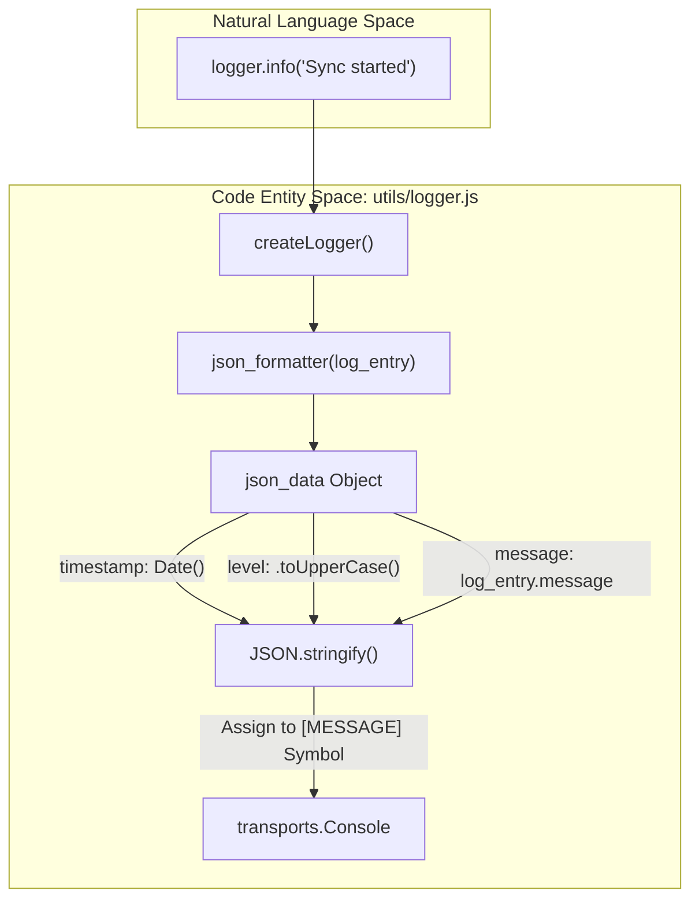
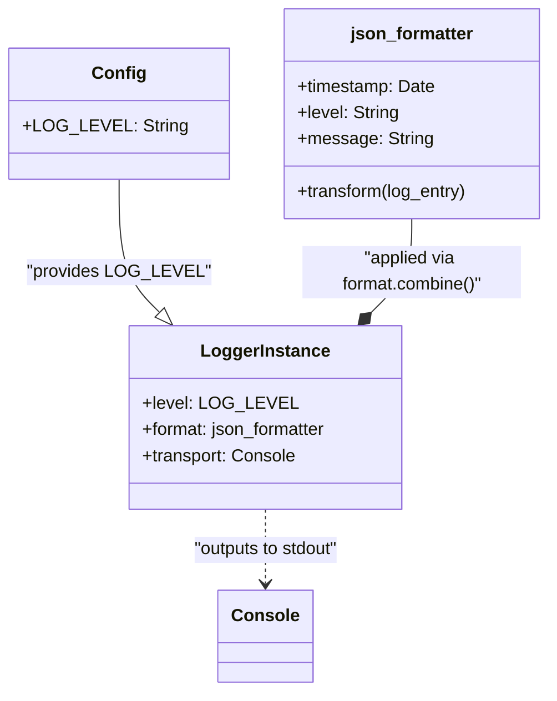

# Logger Implementation

Relevant source files

The following files were used as context for generating this wiki page:

- [config/config.js](config/config.js)
- [utils/logger.js](utils/logger.js)

The Ingenium Data Sync Service utilizes a structured logging architecture built on the `winston` library. This implementation is designed specifically for containerized environments, prioritizing machine-readable JSON output and `stdout` delivery to facilitate log aggregation and observability.

## Overview and Configuration

The logger is initialized in `utils/logger.js` and is consumed throughout the application to track synchronization progress, connection attempts, and error states.

### Configuration Injection
The logger's verbosity is controlled by the `LOG_LEVEL` constant, which is imported from the central configuration module `[utils/logger.js:4-4]()`. In the default configuration, this is set to `'info'` `[config/config.js:14-14]()`.

### Transport Design
The service uses a single `Console` transport `[utils/logger.js:21-21]()`. This design choice follows cloud-native best practices where the application does not manage its own log files or rotation. Instead, it streams structured data to `stdout`, allowing the container runtime (e.g., Docker, Kubernetes) to capture, buffer, and forward logs to centralized logging stacks like ELK or Splunk.

## Structured Logging Pipeline

The logger uses a custom formatting pipeline to ensure every log entry follows a consistent JSON schema.

### The `json_formatter`
The core of the logging logic resides in the `json_formatter` function `[utils/logger.js:6-15]()`. This function intercepts the `log_entry` object and transforms it before it is emitted by the transport.

| Field | Source / Logic | Description |
| :--- | :--- | :--- |
| `timestamp` | `new Date()` | Generates an ISO timestamp at the moment of the log event `[utils/logger.js:7-7]()`. |
| `level` | `log_entry['level'].toUpperCase()` | Normalizes the Winston log level to uppercase (e.g., INFO, ERROR) `[utils/logger.js:8-8]()`. |
| `message` | `log_entry['message']` | The primary descriptive text provided by the caller `[utils/logger.js:9-9]()`. |

### MESSAGE Symbol Manipulation
Winston uses a unique internal symbol, `Symbol.for('message')`, to store the final string that will be printed to the output `[utils/logger.js:2-2]()`. The `json_formatter` explicitly overwrites this symbol by calling `JSON.stringify` on the constructed `json_data` object `[utils/logger.js:12-12]()`. This ensures that even if the input was a simple string, the output is always a valid JSON object.

### Data Flow Diagram: Log Entry Transformation
This diagram illustrates how a raw log call (Natural Language Space) is transformed into a structured JSON payload (Code Entity Space) by the `json_formatter`.

**Sources:** `[utils/logger.js:1-25]()`

## Implementation Details

The logger instance is created using `createLogger` and exported as a singleton for use across the service `[utils/logger.js:17-25]()`.

### Format Composition
The formatting pipeline is constructed using `format.combine`. It specifically wraps the `json_formatter` logic to ensure it executes for every log level defined by the `LOG_LEVEL` configuration `[utils/logger.js:18-19]()`.

### Code Entity Relationship
The following diagram shows the relationship between the configuration, the formatter, and the exported logger instance.

**Sources:** `[utils/logger.js:1-25]()`, `[config/config.js:14-14]()`

## Design Rationale

1.  **Stdout-Only Output**: By avoiding internal file logging, the service remains stateless regarding its observability data. This prevents disk space issues within containers and simplifies deployment across different environments.
2.  **JSON Uniformity**: By forcing all logs through `JSON.stringify` via the `MESSAGE` symbol `[utils/logger.js:12-12]()`, the service ensures that downstream log parsers do not encounter mixed-format data (e.g., plain text mixed with JSON), which often causes ingestion failures in log management systems.
3.  **Level Normalization**: Uppercasing the log levels `[utils/logger.js:8-8]()` provides a standard format that matches many common log visualizers' default filtering patterns.

**Sources:**
- `[utils/logger.js:1-25]()`
- `[config/config.js:14-14]()`
