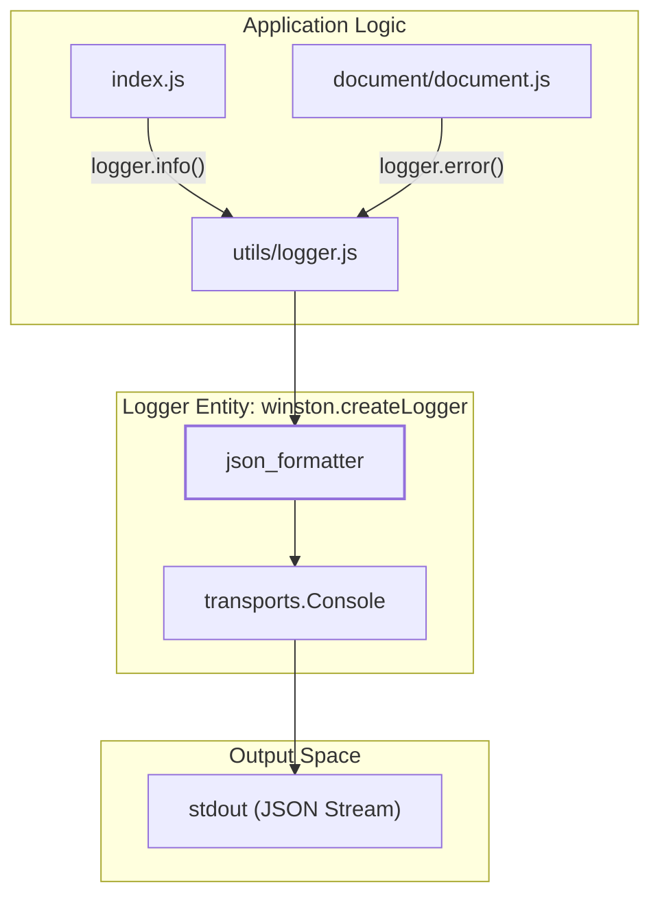
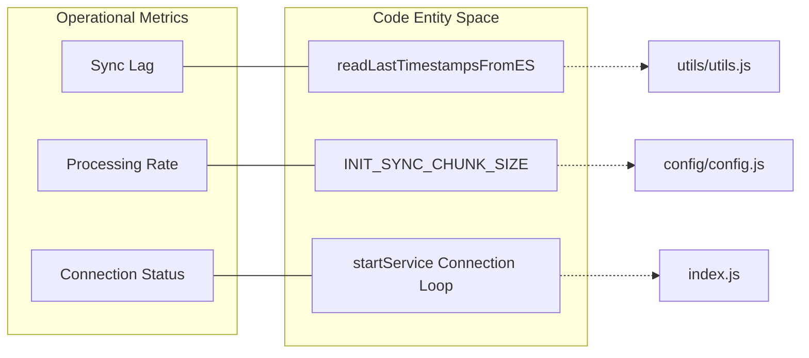

# Observability and Logging

Relevant source files

The following files were used as context for generating this wiki page:

- [README.md](README.md)
- [utils/logger.js](utils/logger.js)

The Ingenium Data Sync Service implements a structured observability strategy designed for containerized environments. It utilizes a centralized logging architecture that transforms application events into machine-readable JSON, ensuring that logs can be easily ingested, parsed, and indexed by log management systems like the Elastic Stack or CloudWatch.

### Logging Architecture

The service uses the `winston` library to manage log generation and distribution. The architecture is built around a single `Console` transport, which directs all output to `stdout`. This design aligns with Twelve-Factor App principles, where the application is not responsible for writing to or managing log files, but rather streams its event flow to the execution environment.

#### High-Level Log Flow
The following diagram illustrates how application events are transformed into structured JSON via the `json_formatter`.

**Log Transformation Pipeline**

Sources: [utils/logger.js:1-26](), [README.md:159-169]()

### Structured JSON Format

To ensure consistency across different service components, every log entry is processed by a custom formatter that enforces a strict schema. This schema includes a UTC timestamp, an uppercase severity level, and the descriptive message.

| Field | Description | Source/Format |
| :--- | :--- | :--- |
| `timestamp` | The exact time the log was generated | `new Date()` |
| `level` | Severity of the event (e.g., INFO, ERROR) | `log_entry['level'].toUpperCase()` |
| `message` | The human-readable description of the event | String |

For details on the implementation of the formatter and the configuration of the Winston logger, see **[Logger Implementation](#4.1)**.

Sources: [utils/logger.js:6-15](), [README.md:163-169]()

### Operational Health and Monitoring

The service emits specific log events during critical phases of the sync lifecycle. Monitoring these events allows operators to determine the health of the data pipeline without direct access to the underlying databases.

#### Key Lifecycle Events
The system logs transitions through the following states:
1.  **Connection Phase**: Attempts to reach ArangoDB and Elasticsearch.
2.  **Initial Sync**: Progress of the bulk load, including chunk processing.
3.  **Incremental Sync**: Periodic polling events and timestamp checkpoints.
4.  **Error States**: Detailed stack traces and recovery attempts.

**Entity Mapping: Monitoring to Code**

For a comprehensive list of log patterns and recommended monitoring thresholds, see **[Log Schema and Health Monitoring](#4.2)**.

Sources: [README.md:105-114](), [README.md:171-178]()

***

### Child Pages
- **[Logger Implementation](#4.1)**: Deep dive into `utils/logger.js`, custom Winston formats, and `LOG_LEVEL` configuration.
- **[Log Schema and Health Monitoring](#4.2)**: Documentation of the JSON schema, key event triggers, and operational metrics for health tracking.
