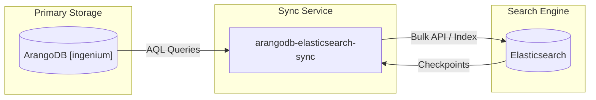
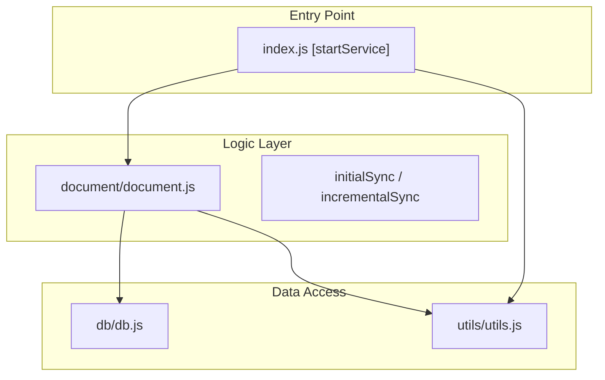

# Overview

Relevant source files

The following files were used as context for generating this wiki page:

- [LICENSE](LICENSE)
- [README.md](README.md)
- [package.json](package.json)

The **Ingenium Data Sync Service** is a robust, production-ready Node.js application designed to maintain real-time synchronization between ArangoDB and Elasticsearch. As a critical component of the **Ingenium** project ecosystem, it ensures that high-volume data stored in ArangoDB is efficiently indexed in Elasticsearch for advanced search and analytical capabilities [README.md:7-18]().

The service is built to handle large datasets (500K+ documents) using a two-phase synchronization strategy: an initial bulk load followed by continuous incremental updates based on ArangoDB revision timestamps [README.md:11-15]().

### System Context
The following diagram illustrates how the `arangodb-elasticsearch-sync` service bridges the primary data store and the search engine.

**Data Flow Overview**

**Sources:** [README.md:105-114](), [package.json:2-4]()

---

### Project Purpose and Features

The service exists to provide a resilient bridge between ArangoDB's multi-model storage and Elasticsearch's full-text search. It is licensed under the **Apache License 2.0** [LICENSE:1-3]().

Key technical capabilities include:
*   **Incremental Sync**: Uses `_rev` timestamps to sync only changed documents [README.md:11-11]().
*   **Connection Resilience**: Implements automatic reconnection logic for both databases [README.md:16-16]().
*   **Data Preprocessing**: Sanitizes dates and transforms fields specifically for the Ingenium schema before indexing [README.md:14-14]().
*   **Structured Logging**: Emits JSON logs via `winston` for compatibility with containerized logging aggregators [README.md:161-169]().

For a deeper dive into the business logic and feature set, see **[Project Purpose and Features](#1.1)**.

---

### High-Level Component Architecture

The service is organized into modular components that separate database connectivity, document transformation, and lifecycle management.

**Code Entity Mapping**

| Component | Responsibility | Key File |
| :--- | :--- | :--- |
| **Lifecycle Manager** | Orchestrates connection retries and the sync loop. | [index.js:1-55]() |
| **Document Pipeline** | Handles AQL fetching, data enrichment, and ES indexing. | [document/document.js:1-150]() |
| **Client Factory** | Manages `arangojs` and `@elastic/elasticsearch` instances. | [db/db.js:1-30]() |
| **State Manager** | Tracks sync progress via the `syncdata` index in ES. | [utils/utils.js:1-45]() |

**Sources:** [package.json:46-54](), [README.md:105-114]()

---

### Getting Started

The service requires **Node.js >= 14.0.0**, an **ArangoDB 3.7+** instance, and an **Elasticsearch 7.x/8.x** cluster [README.md:33-37](). Configuration is managed primarily through environment variables defined in a `.env` file, covering database credentials, sync intervals, and chunk sizes [README.md:54-77]().

Development and production workflows are supported via standard `npm` scripts:
*   `npm start`: Runs the service in production mode [package.json:7-7]().
*   `npm run dev`: Uses `nodemon` for automatic restarts during development [package.json:8-8]().
*   `npm test`: Executes the `jest` test suite [package.json:9-9]().

For step-by-step setup instructions and environment variable references, see **[Getting Started](#1.2)**.

**Sources:** [README.md:40-50](), [package.json:32-34]()
