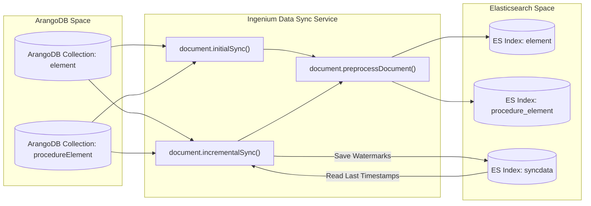
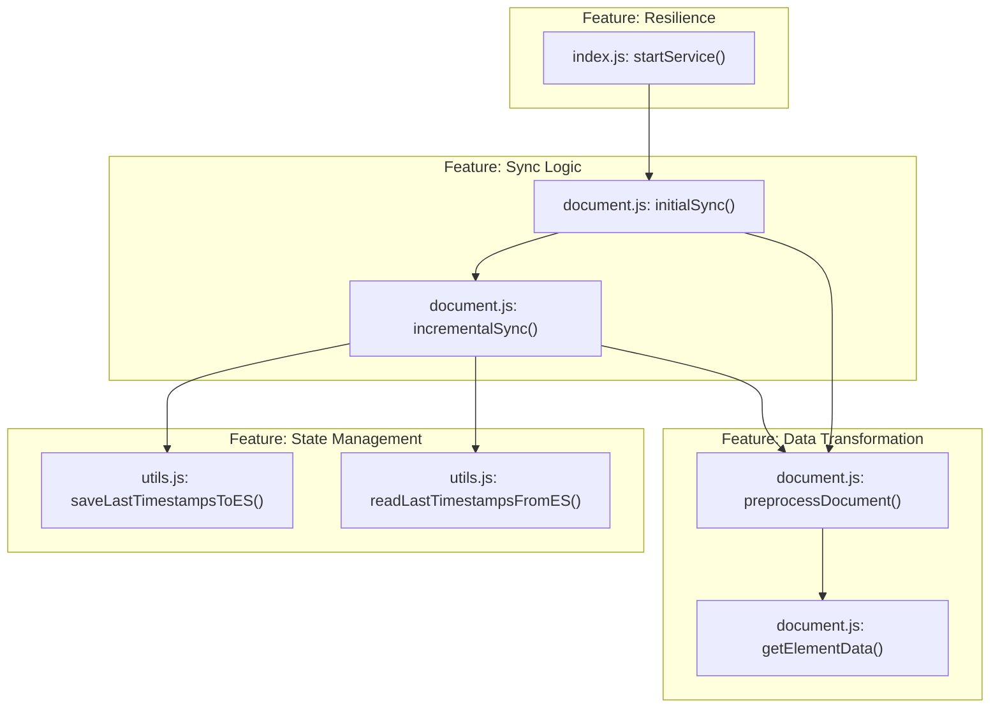

# Project Purpose and Features

Relevant source files

The following files were used as context for generating this wiki page:

- [LICENSE](LICENSE)
- [README.md](README.md)

The **Ingenium Data Sync Service** is a production-ready synchronization engine designed to maintain data parity between **ArangoDB** and **Elasticsearch**. As a critical component of the **Ingenium** project ecosystem, it enables high-performance full-text search and analytics by offloading query workloads from the primary graph database (ArangoDB) to a dedicated search engine (Elasticsearch) [README.md:7-7]().

The service is built on **Node.js** and utilizes a two-phase synchronization strategy—Initial and Incremental—to handle datasets exceeding 500,000 documents while maintaining near real-time updates [README.md:9-18]().

## System Role and Data Flow

The service acts as a bridge, polling ArangoDB for changes and pushing transformed documents into Elasticsearch indices. It is designed to be resilient, featuring automatic reconnection logic and chunked processing to prevent memory exhaustion during large migrations [README.md:15-16]().

### High-Level Data Flow
This diagram illustrates how the service interacts with the database entities and the transformation logic defined in the codebase.

| Component | Description |
| :--- | :--- |
| **ArangoDB** | The source of truth containing collections like `element` and `procedureElement` [README.md:81-83](). |
| **Sync Service** | The Node.js application executing `initialSync` and `incrementalSync` loops [index.js:46-64](). |
| **Elasticsearch** | The destination for processed documents and the storage for sync metadata in the `syncdata` index [README.md:179-184](). |

Title: Data Synchronization Flow

**Sources:** [README.md:105-114](), [README.md:179-184](), [document/document.js:13-15](), [index.js:46-64]()

---

## Key Features

### 1. Incremental Synchronization
The service avoids full-table scans by using ArangoDB's internal `_rev` (revision) timestamps. It tracks the last successfully synced timestamp in a dedicated Elasticsearch index (`syncdata`) and only requests documents modified after that point in subsequent polling cycles [README.md:11-11](), [README.md:183-183]().

### 2. Chunked Bulk Loading
To handle large-scale data transfers (e.g., initial migrations), the service implements a chunked loading strategy. If the document count exceeds the `INIT_SYNC_TRIGGER_ELEM_COUNT`, the service processes the data in batches defined by `INIT_SYNC_CHUNK_SIZE` (defaulting to 100,000 documents) [README.md:127-128]().

### 3. Connection Resilience
The service is designed for containerized environments where database availability may lag behind service start. It includes a connection retry loop that attempts to establish communication with both ArangoDB and Elasticsearch before initiating the sync lifecycle [README.md:16-16]().

### 4. Data Preprocessing and Sanitization
Before documents reach Elasticsearch, they undergo a transformation pipeline in `document.preprocessDocument()`:
*   **Date Sanitization**: Converts empty strings or invalid date formats into standard ISO strings or nulls to prevent Elasticsearch mapping explosions [README.md:110-111]().
*   **Field Stripping**: Removes unnecessary internal metadata or large specifications that are not required for search [README.md:112-112]().
*   **Enrichment**: Performs AQL joins to pull in related data for specific Ingenium collections, such as `execution` and `venue` data [README.md:113-113]().

### 5. Structured Logging
The service utilizes **Winston** to produce structured JSON logs. This format is optimized for log aggregation tools (like ELK or Splunk), providing consistent fields for `timestamp`, `level`, and `message` [README.md:161-169]().

---

## Technical Entity Mapping

The following diagram maps the logical features to the specific code entities responsible for their execution.

Title: Feature to Code Entity Mapping

**Sources:** [index.js:15-15](), [document/document.js:13-15](), [document/document.js:127-127](), [utils/utils.js:43-43](), [utils/utils.js:69-69]()

---

## License

The Ingenium Data Sync Service is released under the **Apache License 2.0**. This permissive license allows for:
*   **Commercial use**: Use the software for commercial purposes.
*   **Modification**: Modify the source code.
*   **Distribution**: Distribute the original or modified code.
*   **Sublicensing**: License the software to others.

Users must include a copy of the license and copyright notice in all distributions of the software [LICENSE:1-203]().

**Sources:** [README.md:3-3](), [README.md:201-203](), [LICENSE:1-203]()
