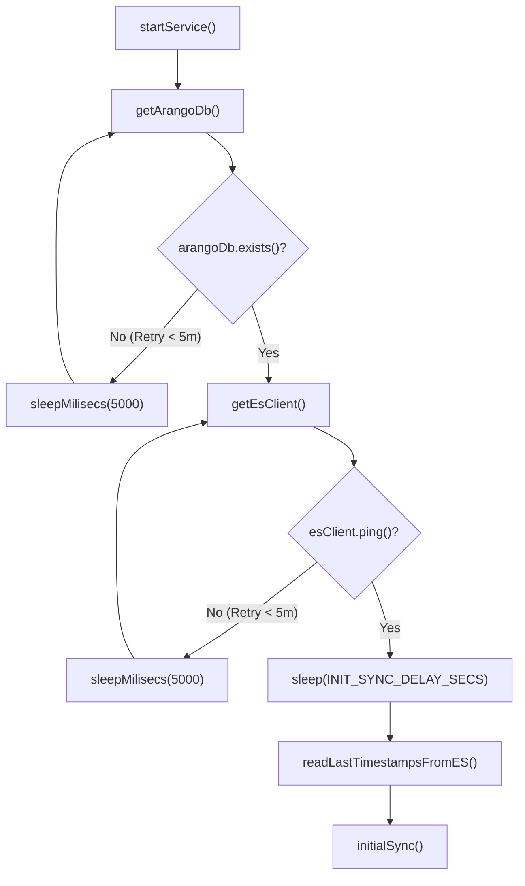
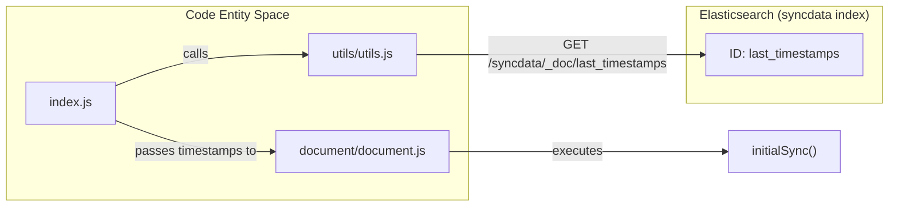

# Service Entrypoint and Sync Lifecycle

Relevant source files

The following files were used as context for generating this wiki page:

- [index.js](index.js)
- [utils/utils.js](utils/utils.js)

The `index.js` file serves as the main entrypoint for the Ingenium Data Sync Service. It manages the high-level orchestration of the synchronization process, including database connectivity establishment, state recovery, and the transition between the one-shot initial synchronization and the continuous incremental polling loop.

## Service Initialization and Connectivity

Before any data synchronization occurs, the service must establish stable connections to both ArangoDB and Elasticsearch. This is handled within the `startService()` function using a robust retry mechanism.

### Connection Retry Logic
The service implements a 5-minute timeout window for establishing connections `[index.js:17-17]()`. It attempts to connect to ArangoDB first, followed by Elasticsearch, using a 5-second delay between trials `[index.js:32-32, 46-46]()`.

| Feature | Implementation Detail |
| :--- | :--- |
| **Max Timeout** | 5 Minutes (`5 * 60 * 1000` ms) `[index.js:17-17]()` |
| **Retry Interval** | 5 Seconds `[index.js:32-32, 46-46]()` |
| **ArangoDB Check** | Uses `arangoDb.exists()` to verify database availability `[index.js:27-27]()` |
| **Elasticsearch Check** | Uses `esClient.ping()` to verify cluster health `[index.js:41-41]()` |
| **Failure Handling** | If either connection fails to stabilize within the timeout, the service logs an error and exits `[index.js:50-58]()`. |

### Startup Grace Period
Once connections are established, the service observes a grace period defined by `INIT_SYNC_DELAY_SECS` `[index.js:68-69]()`. This delay is intended to allow the Search Server (Elasticsearch) sufficient time to finalize index mappings before data ingestion begins, ensuring that documents are indexed with the correct types.

**Startup and Connectivity Flow**

*Sources: [index.js:12-78](), [utils/utils.js:2-2]()*

## State Recovery and Initial Sync

The service is designed to be stateless regarding its local memory; instead, it persists the synchronization progress (watermarks) in Elasticsearch.

### State Recovery
The service calls `readLastTimestampsFromES(esClient)` to retrieve the `last_timestamps` document from the `syncdata` index `[index.js:72-72]()`. 
*   **First Run:** If the `syncdata` index or the document does not exist (returning a 404), the utility returns an empty object `{}` `[utils/utils.js:28-31]()`.
*   **Resumption:** If a previous state exists, it returns the stored timestamps, allowing the service to skip documents already processed in prior runs.

### Initial Synchronization
The `initialSync()` function is called exactly once `[index.js:78-78]()`. It performs a bulk migration of data from the specified `ARANGO_COLLECTION_NAMES`. It uses the `lastTimestamps` object to determine the starting point for each collection, ensuring that the service can resume a partially completed initial sync.

**State Management Entities**

*Sources: [index.js:71-78](), [utils/utils.js:20-35]()*

## Incremental Sync Loop

After the `initialSync` completes, the service enters an infinite `while (true)` loop to perform incremental updates `[index.js:80-88]()`.

### Polling Mechanism
The loop triggers the `incrementalSync()` function, which queries ArangoDB for documents modified since the last recorded timestamp for each collection `[index.js:82-82]()`. Between each iteration, the service pauses for a duration defined by `SYNC_INTERVAL_SECS` `[index.js:87-87]()`.

### Error Isolation
The incremental sync process is wrapped in a `try...catch` block within the loop `[index.js:81-86]()`. This ensures that a transient failure (such as a network hiccup or a malformed document in one batch) does not crash the entire service. If an error occurs, it is logged, and the service proceeds to the next polling interval.

### Update Lifecycle
1.  **Sync Execution:** `incrementalSync` processes new/updated documents.
2.  **State Update:** Upon successful processing of a batch, the function returns an updated `lastTimestamps` object `[index.js:82-82]()`.
3.  **Persistence:** Although handled within the `document.js` logic, the updated state is persisted back to the `syncdata` index in Elasticsearch to ensure durability.
4.  **Interval Wait:** The service calls `sleep(1000 * SYNC_INTERVAL_SECS)` before the next check `[index.js:87-87]()`.

| Lifecycle Phase | Function / Variable | Purpose |
| :--- | :--- | :--- |
| **Entrypoint** | `startService()` | Main orchestrator `[index.js:12-12]()` |
| **State Load** | `readLastTimestampsFromES()` | Recovers progress from `syncdata` index `[utils/utils.js:20-20]()` |
| **One-shot Sync** | `initialSync()` | Bulk load of existing data `[index.js:78-78]()` |
| **Continuous Sync** | `incrementalSync()` | Polling for new changes `[index.js:82-82]()` |
| **Wait Utility** | `sleep()` | Promisified timeout for polling intervals `[utils/utils.js:2-2]()` |

*Sources: [index.js:80-88](), [utils/utils.js:2-2](), [utils/utils.js:8-18]()*
