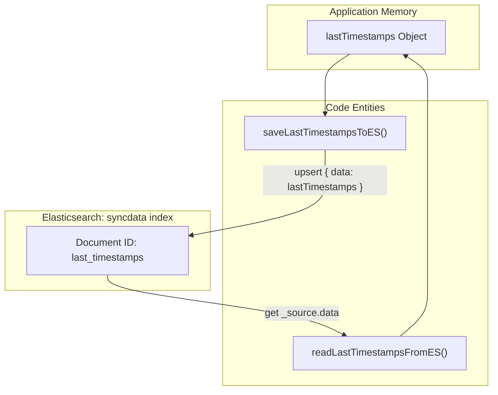
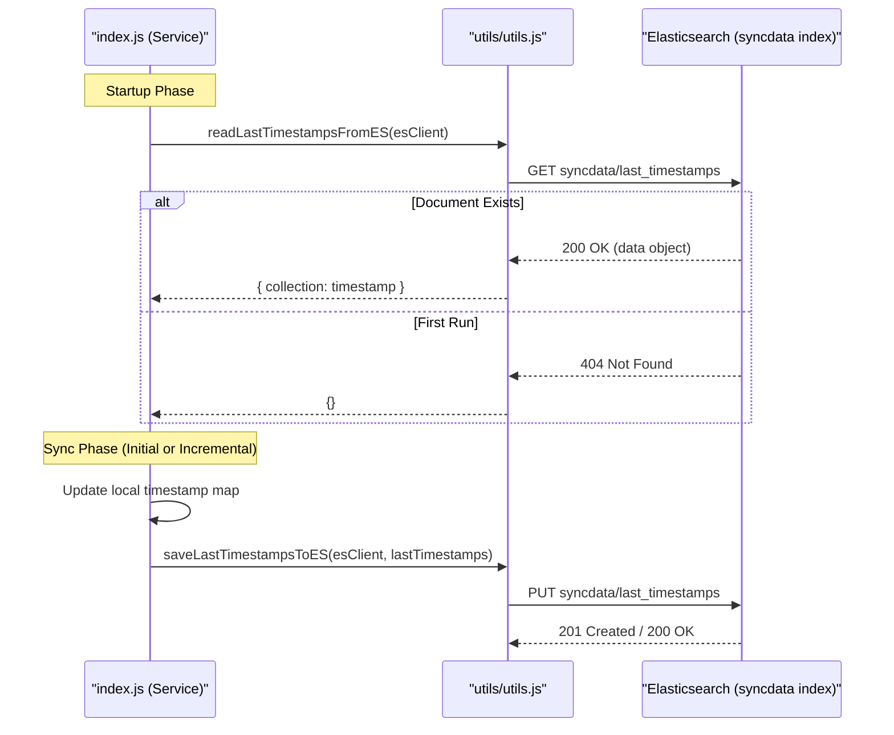

# Sync State Management

Relevant source files

The following files were used as context for generating this wiki page:

- [utils/utils.js](utils/utils.js)

The `utils/utils.js` module provides the core logic for maintaining synchronization state across service restarts and polling intervals. It utilizes a dedicated Elasticsearch index, `syncdata`, to store a persistent watermark of ArangoDB revision timestamps, ensuring that the service can resume incremental updates without re-scanning entire collections.

## Distributed State Store: `syncdata` Index

The service maintains its state within an Elasticsearch index named `syncdata` [utils/utils.js:11-11](). This index acts as a distributed key-value store, allowing multiple instances of the service (or a single instance across restarts) to access the current synchronization progress.

The primary document within this index is identified by the ID `last_timestamps` [utils/utils.js:12-12](). This document stores an object where keys are ArangoDB collection names and values are the highest `_rev` timestamps successfully processed by the service.

### State Persistence Flow

The following diagram illustrates how the `syncdata` index bridges the gap between the internal application state and persistent storage.

**State Persistence Architecture**

Sources: [utils/utils.js:8-18](), [utils/utils.js:20-35]()

## Key Functions

### `saveLastTimestampsToES(esClient, lastTimestamps)`
This function performs an upsert operation to persist the current sync progress.
*   **Implementation**: It uses the Elasticsearch client to index a document into `syncdata` with the ID `last_timestamps` [utils/utils.js:10-14]().
*   **Data Structure**: The `lastTimestamps` object is wrapped in a `data` field within the document body [utils/utils.js:13-13]().
*   **Error Handling**: If the operation fails, the error is caught and logged via the internal logger, but it does not throw, preventing a state-save failure from crashing the main sync loop [utils/utils.js:15-17]().

### `readLastTimestampsFromES(esClient)`
This function retrieves the watermark state during service initialization.
*   **Graceful 404 Handling**: A critical feature of this function is its handling of first-run scenarios. If the `syncdata` index or the `last_timestamps` document does not exist, Elasticsearch returns a `404` status code. The function catches this specific error and returns an empty object `{}` [utils/utils.js:28-31]().
*   **Data Retrieval**: On success, it extracts the nested `data` object from the Elasticsearch `_source` [utils/utils.js:26-26]().
*   **Fatal Errors**: Unlike the save function, if an error occurs that is *not* a 404, the function logs the error and re-throws, as the service cannot safely proceed without knowing its previous state [utils/utils.js:32-34]().

### `camelToSnakeCase(str)`
A utility used to transform naming conventions, typically for mapping JavaScript-style property names to the snake_case convention preferred in the Elasticsearch schema.
*   **Implementation**: Uses a regular expression `/[A-Z]/g` to identify uppercase letters and replaces them with an underscore followed by the lowercase version of the letter [utils/utils.js:4-6]().

### `sleep(ms)`
A Promise-based wrapper around `setTimeout`.
*   **Usage**: Primarily used in the main polling loop (`incrementalSync`) to respect the `SYNC_INTERVAL_SECS` configuration and prevent tight-looping [utils/utils.js:2-2]().

Sources: [utils/utils.js:1-42]()

## Data Flow: Sync State Lifecycle

The service follows a strict lifecycle for managing these timestamps to ensure data consistency between ArangoDB and Elasticsearch.

**Sync State Lifecycle**

Sources: [utils/utils.js:8-18](), [utils/utils.js:20-35]()

## Utility Summary Table

| Function | Input | Output | Purpose |
| :--- | :--- | :--- | :--- |
| `sleep` | `ms` (Number) | `Promise` | Pauses execution for polling intervals. |
| `camelToSnakeCase` | `str` (String) | `String` | Converts `camelCase` to `snake_case`. |
| `saveLastTimestampsToES` | `esClient`, `lastTimestamps` | `void` | Persists sync watermarks to Elasticsearch. |
| `readLastTimestampsFromES` | `esClient` | `Object` | Retrieves watermarks or returns `{}` on first run. |

Sources: [utils/utils.js:1-42]()
