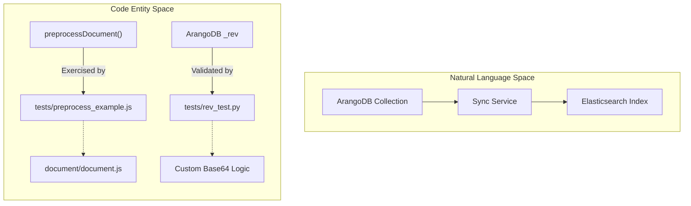
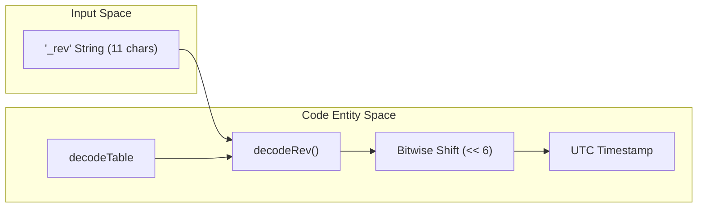

# Testing

Relevant source files

The following files were used as context for generating this wiki page:

- [tests/preprocess_example.js](tests/preprocess_example.js)
- [tests/rev_test.py](tests/rev_test.py)

The testing suite for the Ingenium Data Sync Service focuses on validating the two most critical data transformation and retrieval logic components: the sanitization of complex document structures and the decoding of ArangoDB internal revision strings into usable timestamps. These tests ensure that data flowing from ArangoDB to Elasticsearch remains consistent, searchable, and accurate.

### Test Suite Structure

The repository contains two primary test utilities:
1.  **Preprocessing Validation**: A JavaScript-based fixture that simulates the transformation of raw ArangoDB documents into Elasticsearch-compatible formats.
2.  **Revision Decoding**: A Python-based utility used to verify the bitwise logic required to extract nanosecond timestamps from ArangoDB `_rev` fields.

### Data Flow and Testing Points

The following diagram illustrates where the test utilities intersect with the production codebase.

**Testing Integration Points**

Sources: [tests/preprocess_example.js:1-1]() | [tests/rev_test.py:41-48]()

---

### Document Preprocessing Test Fixture

The file `tests/preprocess_example.js` serves as a functional test for the `preprocessDocument` function. It defines a complex `test_doc` object that mirrors the nested structure of aerospace telemetry and execution data found in the production database [tests/preprocess_example.js:3-52]().

The test validates several key behaviors:
*   **Empty String Sanitization**: Ensures that fields like `time_approved` or `time_updated` which contain empty strings are properly handled [tests/preprocess_example.js:5-10]().
*   **Telemetry Data Handling**: Validates the structure of `evr_data` and `products` arrays, including fields like `ert` (Earth Received Time), `scet` (Spacecraft Event Time), and `sclk` (Spacecraft Clock) [tests/preprocess_example.js:22-47]().
*   **Nested Array Processing**: Checks the `execution.results.entries` array to ensure deep nesting does not break the transformation logic [tests/preprocess_example.js:12-49]().

For details on the schema and expected transformations, see [Document Preprocessing Test Fixture](#5.1).

Sources: [tests/preprocess_example.js:1-58]()

---

### ArangoDB Revision Decoding Utility

The file `tests/rev_test.py` is a standalone utility used to reverse-engineer and validate how ArangoDB encodes timestamps into its `_rev` strings. This is critical for the service because the incremental sync logic relies on these revisions to determine which documents have changed since the last poll.

The utility implements:
*   **Custom Alphabet**: A specific 64-character alphabet used by ArangoDB: `-_ABCDEFGHIJKLMNOPQRSTUVWXYZabcdefghijklmnopqrstuvwxyz0123456789` [tests/rev_test.py:4]() .
*   **Bitwise Accumulation**: The `decodeRev()` function, which performs 6-bit shifts to reconstruct a 64-bit integer from an 11-character string [tests/rev_test.py:41-48]().
*   **Timestamp Conversion**: Logic to convert the resulting nanosecond integer into a human-readable UTC timestamp [tests/rev_test.py:52]().

For details on the decoding algorithm and lookup tables, see [ArangoDB Revision Decoding Utility](#5.2).

**Revision Decoding Logic**

Sources: [tests/rev_test.py:6-48]()

---

**Child Pages:**
- [Document Preprocessing Test Fixture](#5.1)
- [ArangoDB Revision Decoding Utility](#5.2)
