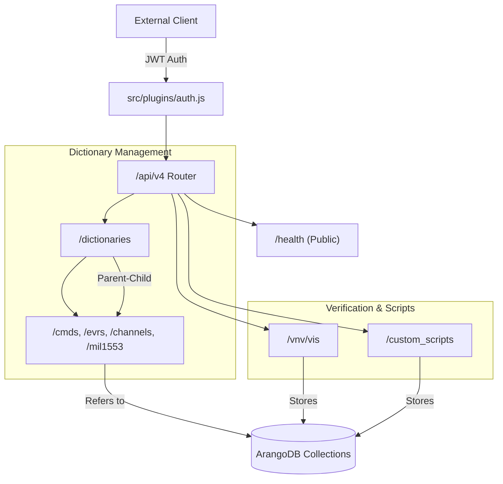
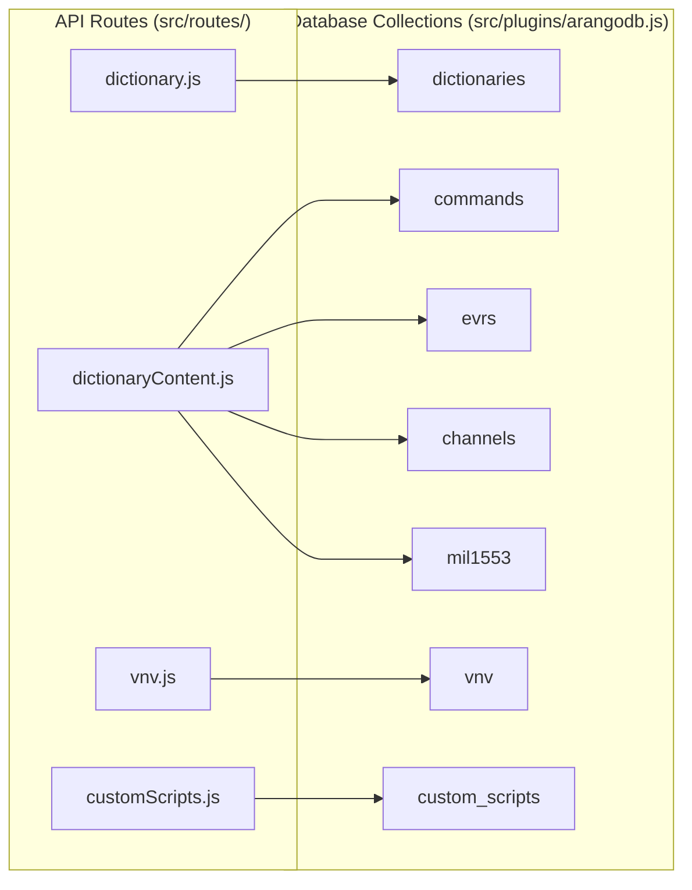

# Page: API Reference

# API Reference

Relevant source files

The following files were used as context for generating this wiki page:

- [dictionary_service.yaml](dictionary_service.yaml)
- [src/routes/health.js](src/routes/health.js)

The Ingenium Dictionary Service provides a RESTful interface under the `/api/v4` prefix for managing aerospace telemetry and command dictionaries, Verification and Validation (V&V) items, and custom scripts. The API is designed for high-performance querying and bulk data ingestion, supporting the Ingenium ground system's need for consistent data definitions.

### Base URL and Versioning
All endpoints documented here are prefixed with `/api/v4`. This versioning ensures backward compatibility as the Ingenium Project Configuration Service (PCS) evolves.

| Feature | Specification |
| :--- | :--- |
| **Protocol** | HTTPS (REST) |
| **Auth Strategy** | JWT Bearer Token |
| **Data Format** | JSON (Request/Response) |
| **Base Path** | `/api/v4` |

---

### Global Conventions

#### Authentication
Most endpoints require a valid JWT in the `Authorization` header. The service validates these tokens using a public key configured at startup.
*   **Header**: `Authorization: Bearer <token>`
*   **Source**: `src/plugins/auth.js` [src/plugins/auth.js:1-35]()

#### Pagination
For collection endpoints (listing dictionaries, commands, etc.), the service uses a standard limit/offset pattern.
*   **`limit`**: Maximum number of records to return (default: 100).
*   **`offset`**: Number of records to skip.
*   **`x-total-count`**: Every paginated response includes this header indicating the total number of resources matching the filter in the database.
*   **Source**: `dictionary_service.yaml` [dictionary_service.yaml:35-36](), [dictionary_service.yaml:69-72]()

#### Wildcard Search and Filtering
Many GET and bulk query endpoints support a `wild` flag.
*   **`wild=true`**: Enables partial matching (regex-based) for string fields like `command_stem` or `vi_name`.
*   **`wild=false`**: Performs exact string matching (default).
*   **Source**: `src/schemas/dictionaryContentSchema.js` [src/schemas/dictionaryContentSchema.js:131-135]()

#### Bulk Query Pattern
To support UI components like auto-complete or complex filtering, the service provides `POST /.../bulk_query` endpoints. These allow clients to send complex filter objects in the request body that would be too large for URL parameters.
*   **Source**: `src/routes/vnv.js` [src/routes/vnv.js:82-105]()

---

### API Interaction Flow

The following diagram illustrates how a client interacts with the various functional areas of the API.

**API Functional Map**

*Sources: [src/routes/health.js:4-11](), [dictionary_service.yaml:25-180]()*

---

### Functional Areas

The API is divided into four primary functional areas, each detailed in its own reference page.

#### 1. Dictionary Version Management
Manages the lifecycle of dictionary containers. Dictionaries are categorized by `dictionary_type` (`sse` or `flight`) and progress through states such as `NOT_PUBLISHED`, `PUBLISHED`, and `RETIRED`.
*   **Key Behavior**: Deleting a dictionary version triggers a cascade delete of all associated commands, EVRs, channels, and MIL-1553 data.
*   **For details, see [Dictionary Version Management](#3.1)**

#### 2. Dictionary Content (Commands, EVRs, Channels, MIL-1553)
The core data of the service. These endpoints allow for CRUD operations and bulk ingestion of telemetry and command definitions.
*   **Key Fields**: `command_stem`, `evr_id`, `channel_name`, `mil1553_name`.
*   **Duplicate Handling**: The service performs duplicate-check logic before bulk inserts to maintain data integrity.
*   **For details, see [Dictionary Content Endpoints (Commands, EVRs, Channels, MIL-1553)](#3.2)**

#### 3. Verification and Validation (V&V)
Endpoints for managing Verification Items (VIs). This includes the storage of Verification Activities (VAs) and Verification Acquirements (VACs) associated with mission requirements.
*   **Data Model**: Includes `vi_id`, `vi_owner`, and `vi_type`.
*   **For details, see [Verification and Validation (V&V) Endpoints](#3.3)**

#### 4. Custom Scripts
Registration and retrieval of script definitions used by the Ingenium UI step palette.
*   **Key Logic**: Uses SHA256 hashes of script paths as unique identifiers (`script_id`).
*   **For details, see [Custom Scripts Endpoints](#3.4)**

---

### Entity Relationship Mapping

This diagram bridges the API route space to the underlying database entities defined in the codebase.

**Code Entity Mapping**

*Sources: [src/plugins/arangodb.js:45-80](), [src/routes/dictionary.js:1-50](), [src/routes/dictionaryContent.js:1-50]()*

---
**Sources:**
*   `dictionary_service.yaml` [1-211]()
*   `src/routes/health.js` [1-13]()
*   `src/plugins/auth.js` [1-35]()
*   `src/schemas/dictionaryContentSchema.js` [131-135]()
*   `src/plugins/arangodb.js` [45-80]()
