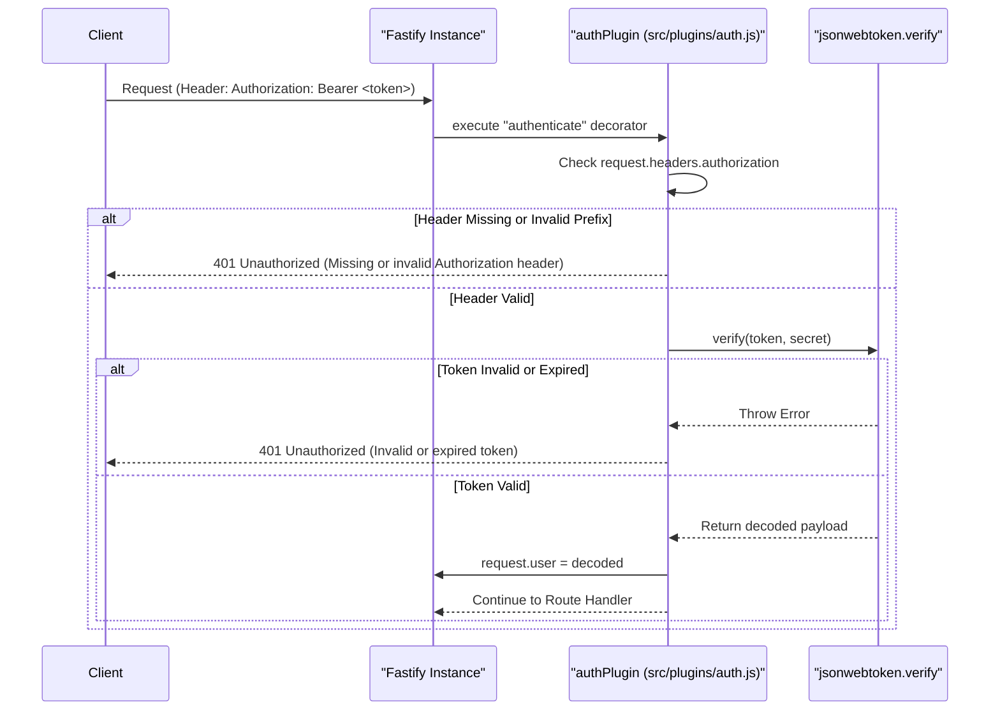
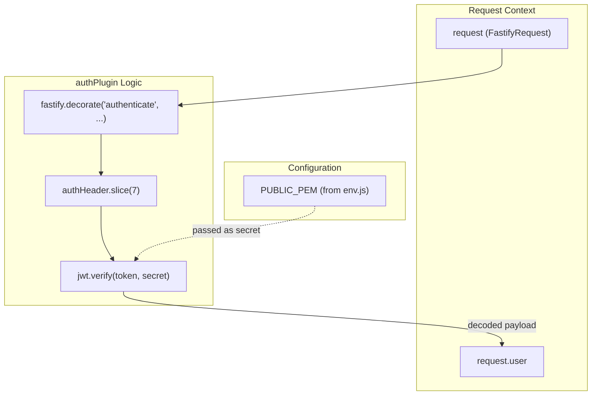

# Page: Authentication Plugin

# Authentication Plugin

<details>
<summary>Relevant source files</summary>

The following files were used as context for generating this wiki page:

- [src/config/env.js](src/config/env.js)
- [src/plugins/auth.js](src/plugins/auth.js)

</details>


The `authPlugin` is a core security component of the Ingenium Dictionary Service. It implements a JSON Web Token (JWT) verification strategy using the RSA algorithm. This plugin ensures that all protected routes are accessible only by requests containing a valid, signed token in the `Authorization` header.

## Overview

The authentication system is built on `fastify-plugin` and `jsonwebtoken`. It performs three primary tasks:
1.  **Extraction**: Pulls the JWT from the `Bearer` token in the request headers.
2.  **Verification**: Validates the token against a provided RSA public key (`PUBLIC_PEM`).
3.  **Context Injection**: Decodes the token payload and attaches it to the `request.user` object for downstream use in route handlers.

Sources: [src/plugins/auth.js:1-35](), [src/config/env.js:16-16]()

## Plugin Registration and Configuration

The plugin is exported as a wrapped Fastify plugin using `fp` (`fastify-plugin`), allowing the decorators defined within it to be accessible across the entire Fastify instance rather than being scoped to the plugin's registration block.

### Configuration Parameters
The plugin requires a `secret` option during registration. In this service, the `secret` is populated by the `PUBLIC_PEM` environment variable.

| Parameter | Source | Description |
| :--- | :--- | :--- |
| `secret` | `PUBLIC_PEM` | The RSA Public Key (PEM format) used to verify token signatures. |

If the `secret` is not provided during initialization, the plugin throws an error, preventing the server from starting in an insecure state.

Sources: [src/plugins/auth.js:2-10](), [src/config/env.js:16-16]()

## The `authenticate` Decorator

The plugin uses `fastify.decorate` to register a custom function named `authenticate`. This function is typically used as a `preHandler` hook on protected routes.

### Token Extraction and Validation Flow

The `authenticate` function follows a strict validation sequence:

1.  **Header Check**: It inspects `request.headers.authorization`. The header must exist and must start with the case-insensitive string `"bearer "`.
2.  **Token Slicing**: The "Bearer " prefix is stripped (the first 7 characters) to isolate the JWT string.
3.  **JWT Verification**: The `jwt.verify` method is called using the isolated token and the configured `secret`.
4.  **User Attachment**: If verification succeeds, the decoded payload (claims) is assigned to `request.user`.
5.  **Error Handling**: If the header is missing, malformed, or the token is expired/invalid, the request is intercepted, and a `401 Unauthorized` response is returned.

### Authentication Data Flow

The following diagram illustrates the flow from an incoming HTTP request to the population of the `request.user` object.

**Diagram: JWT Authentication Sequence**

Sources: [src/plugins/auth.js:13-31]()

## Code Entity Mapping

This diagram maps the logical authentication steps to the specific code entities within `src/plugins/auth.js`.

**Diagram: Authentication Code Mapping**

Sources: [src/plugins/auth.js:5-31](), [src/config/env.js:16-16]()

## Usage in Routes

Once registered, the `authenticate` decorator is used as a `preHandler` hook. This ensures that the logic in `auth.js` is executed before the actual route handler logic.

Example implementation pattern:
```javascript
// Example of how routes utilize the plugin
fastify.get('/protected-route', {
  preHandler: [fastify.authenticate]
}, async (request, reply) => {
  // request.user is now populated with JWT claims
  return { user: request.user };
});
```

Sources: [src/plugins/auth.js:13-13]()
