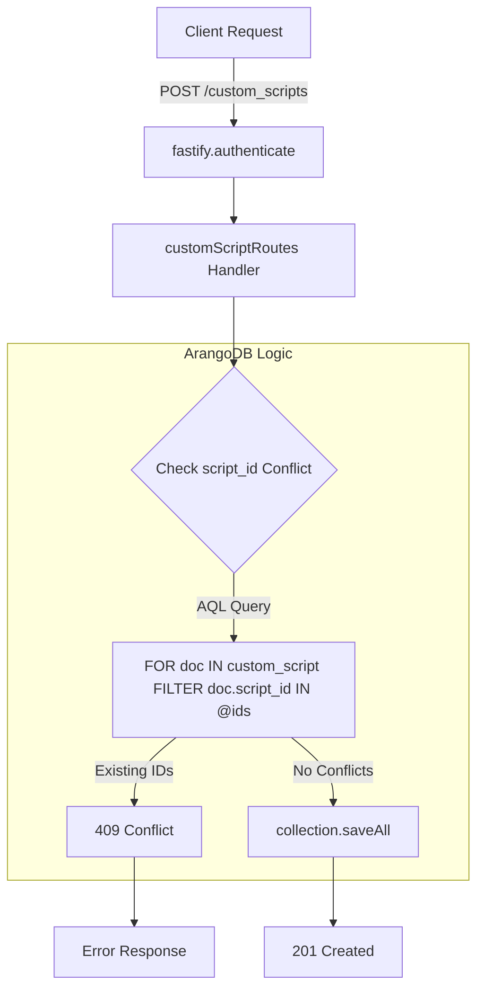
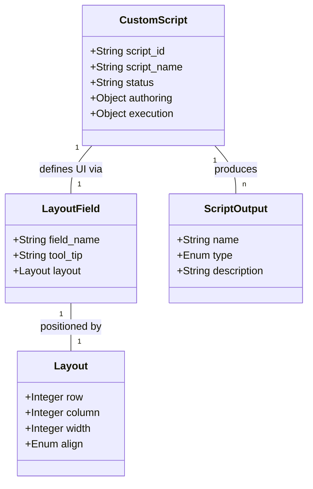

# Page: Custom Scripts Endpoints

# Custom Scripts Endpoints

Relevant source files

The following files were used as context for generating this wiki page:

- [dictionary_service.yaml](dictionary_service.yaml)
- [src/routes/customScript.js](src/routes/customScript.js)
- [src/schemas/customScriptSchema.js](src/schemas/customScriptSchema.js)

The Custom Scripts endpoints provide a centralized registry for script definitions used within the Ingenium ecosystem. These endpoints allow the Ingenium UI to populate its step palette with reusable logic, defining how scripts are authored and how their execution results should be rendered.

## Overview and Data Model

Custom scripts are identified by a `script_id`, which is typically a SHA256 hash of the script's file path [dictionary_service.yaml:1221-1225](). Each definition includes metadata for the authoring phase (inputs required to run the script) and the execution phase (how to display outputs) [src/schemas/customScriptSchema.js:321-332]().

### Key Fields
| Field | Type | Description |
| :--- | :--- | :--- |
| `script_id` | String | Unique identifier (SHA256 of path) [src/routes/customScript.js:23-25](). |
| `script_path` | String | Filesystem or repository path to the script [src/routes/customScript.js:69](). |
| `script_name` | String | Human-readable name displayed in the UI palette [src/routes/customScript.js:70](). |
| `status` | Enum | Current state: `AUTHORING` or `EXECUTION` [src/schemas/customScriptSchema.js:328-332](). |
| `description` | String | Detailed explanation of script functionality [src/routes/customScript.js:71](). |

### Layout Engine
The service stores complex UI layout definitions for both `headerlayout` (L2 view) and `contentlayout` (L3 view) [src/schemas/customScriptSchema.js:251-305](). This allows the Ingenium UI to dynamically build forms and display tables based on the script's specific input/output requirements.

**Sources:** [src/routes/customScript.js:1-230](), [src/schemas/customScriptSchema.js:1-350](), [dictionary_service.yaml:1200-1300]()

---

## Request Lifecycle and Data Flow

The following diagram illustrates the flow of a request to create or query custom scripts, showing the interaction between the Fastify route handlers and the ArangoDB layer.

### Custom Script Management Flow

**Sources:** [src/routes/customScript.js:15-57](), [src/plugins/auth.js:10-30]()

---

## Endpoint Reference

### 1. Create Custom Scripts
`POST /api/v4/custom_scripts`

Registers one or more new script definitions. The handler performs a bulk check to ensure no `script_id` already exists in the `custom_script` collection before proceeding with the insert [src/routes/customScript.js:22-42]().

*   **Pre-handler:** `fastify.authenticate` [src/routes/customScript.js:17]().
*   **Database Method:** `collection.saveAll(newCustomScripts, { returnNew: true })` [src/routes/customScript.js:45]().

### 2. List and Search Scripts
`GET /api/v4/custom_scripts`

Retrieves a paginated list of scripts. Supports "wildcard" search via the `wild` query parameter [src/routes/customScript.js:68]().

*   **Wildcard Logic:** If `wild=true`, the handler uses `CONTAINS(LOWER(...))` in AQL; otherwise, it performs an exact match [src/routes/customScript.js:81-87]().
*   **Pagination:** Returns the total count in the `x-total-count` header using the AQL `fullCount` statistic [src/routes/customScript.js:112-114]().

### 3. Bulk Query
`POST /api/v4/custom_scripts/bulk_query`

Accepts an array of `script_ids` and returns the full definitions for all matching scripts [src/routes/customScript.js:211-226](). This is primarily used by the Ingenium UI when loading a saved procedure containing multiple custom script steps.

### 4. Update and Delete
*   **PATCH `/custom_scripts/:script_id`**: Performs a partial update. It first locates the document by `script_id` using `byExample`, then updates via the internal ArangoDB `_key` [src/routes/customScript.js:160-171]().
*   **DELETE `/custom_scripts/:script_id`**: Removes the script definition from the registry [src/routes/customScript.js:183-200]().

**Sources:** [src/routes/customScript.js:59-226](), [src/schemas/customScriptSchema.js:380-450]()

---

## Schema Architecture

The `customScriptSchema.js` file defines the structure for inputs, outputs, and UI rendering.

### Entity Relationship: UI Layout to Code
This diagram maps the UI layout concepts defined in the schema to the JSON structures processed by the API.

### Script Status and Phases
The schema enforces two distinct phases for a script definition [src/schemas/customScriptSchema.js:328-332]():
1.  **AUTHORING**: Defines `input_fields` and `output_fields` used when a user adds a script to a procedure [src/schemas/customScriptSchema.js:311-318]().
2.  **EXECUTION**: Defines how `headerlayout` and `contentlayout` should render once the script has finished running and produced data [src/schemas/customScriptSchema.js:321-326]().

**Sources:** [src/schemas/customScriptSchema.js:102-131](), [src/schemas/customScriptSchema.js:174-197](), [src/schemas/customScriptSchema.js:308-335]()
