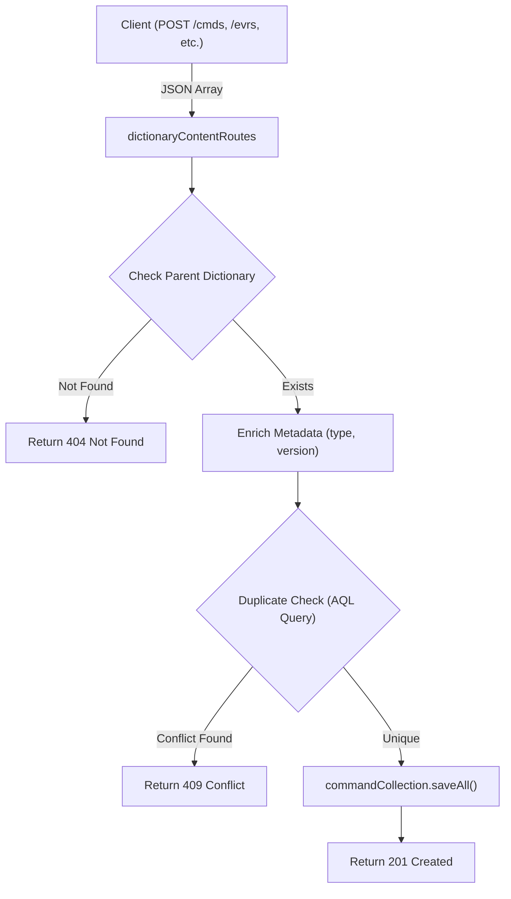
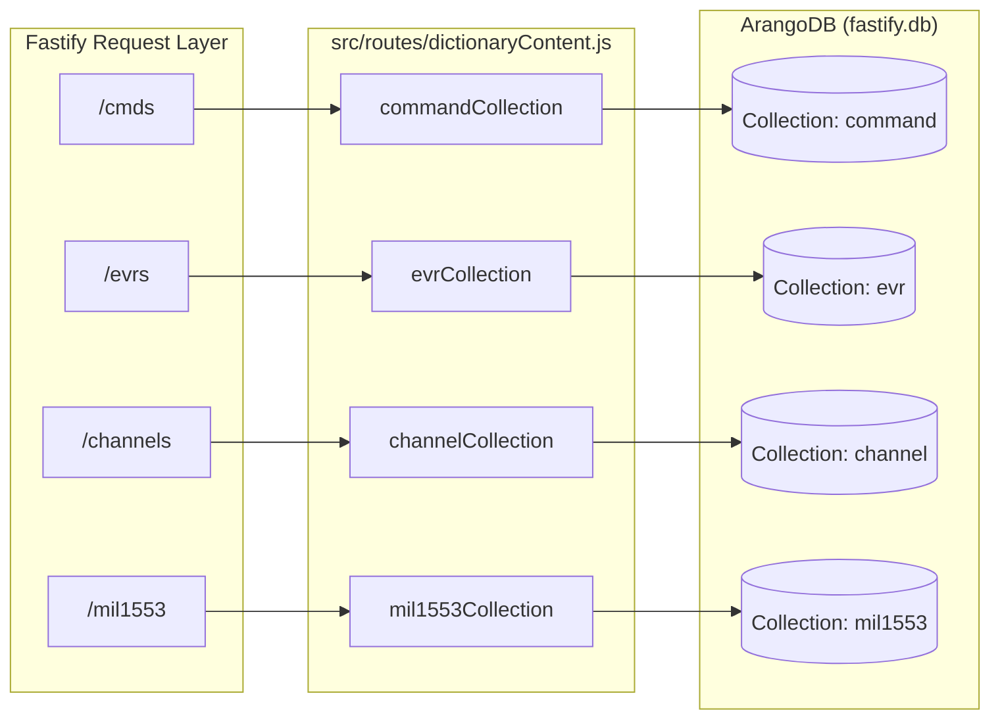

# Page: Dictionary Content Endpoints (Commands, EVRs, Channels, MIL-1553)

# Dictionary Content Endpoints (Commands, EVRs, Channels, MIL-1553)

Relevant source files

The following files were used as context for generating this wiki page:

- [dictionary_service.yaml](dictionary_service.yaml)
- [src/routes/dictionaryContent.js](src/routes/dictionaryContent.js)
- [src/schemas/dictionaryContentSchema.js](src/schemas/dictionaryContentSchema.js)

This page provides a technical reference for the four content resource types nested under a specific dictionary version. These endpoints allow for the management and retrieval of aerospace-specific data definitions used within the Ingenium ground system [dictionary_service.yaml:9-17]().

## Overview of Content Resources

The Dictionary Service manages four primary content types, each stored in its own ArangoDB collection but logically linked to a parent dictionary by `dictionary_type` and `dictionary_version` [src/routes/dictionaryContent.js:30-34]().

| Resource Type | ArangoDB Collection | Key Identifier | Description |
| :--- | :--- | :--- | :--- |
| **Commands** | `command` | `command_stem` | Command mnemonics and argument definitions. |
| **EVRs** | `evr` | `evr_id` / `evr_name` | Event Record log message definitions. |
| **Channels** | `channel` | `channel_id` / `channel_name` | Telemetry channel (EH&A) definitions. |
| **MIL-1553** | `mil1553` | `mil1553_name` | MIL-STD-1553 bus variable definitions. |

### Data Flow: Content Creation
The following diagram illustrates the logic applied during a bulk insert (POST) of dictionary content, specifically highlighting the duplicate-check mechanism.

**Content Insertion and Validation Flow**

Sources: [src/routes/dictionaryContent.js:41-92](), [src/routes/dictionaryContent.js:284-335]()

---

## Shared Filtering Logic

All content `GET` endpoints support advanced filtering via query parameters. The implementation uses a helper function `addFilter` to dynamically construct AQL `FILTER` clauses [src/routes/dictionaryContent.js:128-135]().

### Wildcard vs. Exact Match
The `wild` boolean parameter toggles the search behavior:
*   **`wild=false` (Default):** Performs an exact match using the `==` operator [src/routes/dictionaryContent.js:132]().
*   **`wild=true`:** Performs a case-insensitive partial match using `CONTAINS(LOWER(TO_STRING(doc.field)), LOWER(@value))` [src/routes/dictionaryContent.js:130]().

### Pagination and Sorting
*   **`limit` / `offset`:** Standard pagination. The service returns the total matching count in the `x-total-count` header using ArangoDB's `fullCount` feature [src/routes/dictionaryContent.js:151-156]().
*   **`sort`:** Typically defaults to `ASC` on the primary identifier (e.g., `command_stem`) [src/routes/dictionaryContent.js:111-118]().

---

## Commands (/cmds)

Commands define the instructions that can be sent to a spacecraft or system.

### Key Fields
*   **`command_stem`**: The unique mnemonic for the command [src/schemas/dictionaryContentSchema.js:75-78]().
*   **`arguments`**: An array of objects defining `argument_type` (INT, FLOAT, ENUM, etc.), `argument_size`, and `allowable_ranges` [src/schemas/dictionaryContentSchema.js:36-69]().
*   **`operations_category`**: Used for filtering via the `ops_cat` query parameter [src/schemas/dictionaryContentSchema.js:79-82]().

### Bulk Query
`POST .../cmds/bulk_query` accepts an array of `command_stems` in the request body and returns the full definitions for all matches within that specific dictionary version [src/routes/dictionaryContent.js:169-200]().

Sources: [src/routes/dictionaryContent.js:36-102](), [src/schemas/dictionaryContentSchema.js:72-111]()

---

## Event Records (/evrs)

EVRs define log messages or events emitted by the system.

### Key Fields
*   **`evr_id`**: Numeric identifier for the event [src/schemas/dictionaryContentSchema.js:260-263]().
*   **`evr_name`**: String name for the event [src/schemas/dictionaryContentSchema.js:264-267]().
*   **`evr_message_format`**: The string template used to render the event [src/schemas/dictionaryContentSchema.js:272-275]().

### Implementation Detail
The `GET /evrs` endpoint allows filtering by `evr_id`, `evr_name`, and `ops_cat` [src/routes/dictionaryContent.js:347-353]().

Sources: [src/routes/dictionaryContent.js:338-403](), [src/schemas/dictionaryContentSchema.js:256-291]()

---

## Channels (/channels)

Channels represent telemetry points or "EH&A" (Engineering Health and Accountability) data.

### Key Fields
*   **`channel_id`**: Unique numeric ID [src/schemas/dictionaryContentSchema.js:452-455]().
*   **`channel_name`**: Unique string identifier [src/schemas/dictionaryContentSchema.js:456-459]().
*   **`derived`**: A boolean flag indicating if the channel is calculated from other telemetry [src/schemas/dictionaryContentSchema.js:476-479]().

Sources: [src/routes/dictionaryContent.js:587-652](), [src/schemas/dictionaryContentSchema.js:448-485]()

---

## MIL-1553 Variables (/mil1553)

Defines variables associated with the MIL-STD-1553 data bus.

### Key Fields
*   **`mil1553_name`**: The primary identifier for the 1553 variable [src/schemas/dictionaryContentSchema.js:639-642]().
*   **`bus`**: Identifies which bus the variable resides on [src/schemas/dictionaryContentSchema.js:647-650]().

Sources: [src/routes/dictionaryContent.js:833-898](), [src/schemas/dictionaryContentSchema.js:635-665]()

---

## Entity Mapping: Routes to Database

The following diagram maps the API route structure to the internal Fastify collection decorators and the underlying ArangoDB collections.

**System Entity Map**

Sources: [src/routes/dictionaryContent.js:30-34](), [src/plugins/arangodb.js:48-51]()
