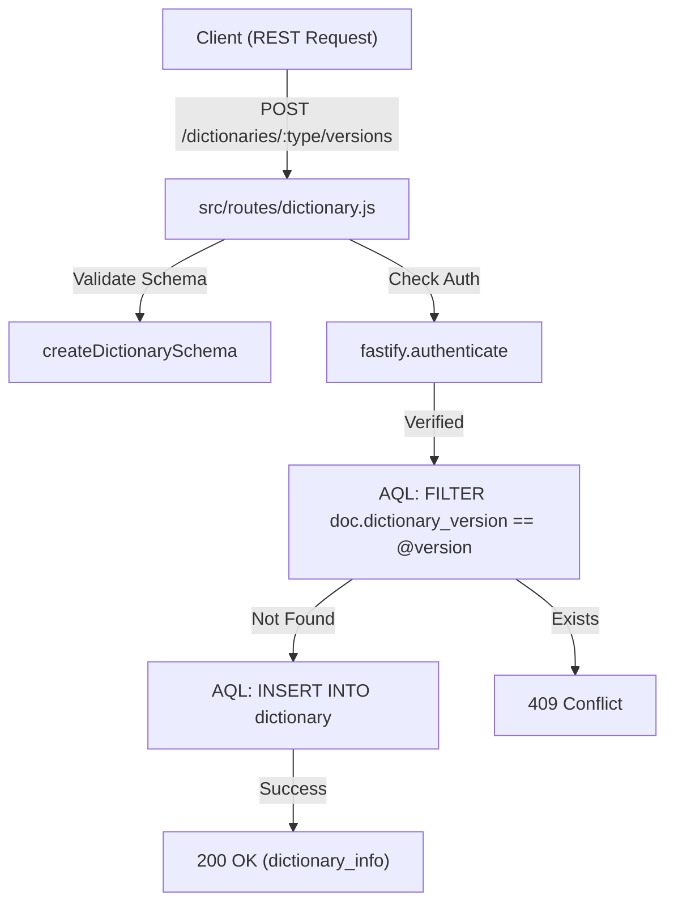
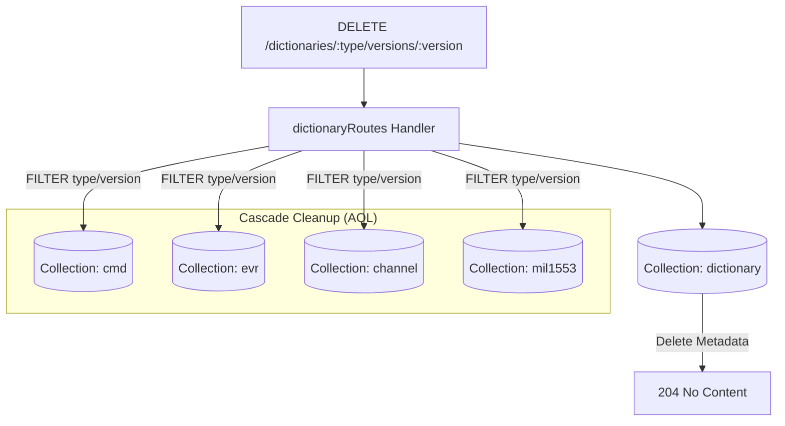

# Page: Dictionary Version Management

# Dictionary Version Management

Relevant source files

The following files were used as context for generating this wiki page:

- [dictionary_service.yaml](dictionary_service.yaml)
- [src/routes/dictionary.js](src/routes/dictionary.js)
- [src/schemas/dictionarySchema.js](src/schemas/dictionarySchema.js)

The Dictionary Version Management system provides the administrative lifecycle for telemetry and command dictionaries within the Ingenium Dictionary Service. It manages the metadata, state transitions, and cascading cleanup of versioned data sets.

## Dictionary Lifecycle and State Machine

Every dictionary version follows a specific lifecycle defined by the `state` field. This state determines the availability and maturity of the dictionary content for the Ingenium UI.

| State | Description |
| :--- | :--- |
| `NOT_PUBLISHED` | Initial state. Dictionary is being populated and is not yet ready for general use. |
| `PUBLISHED` | Dictionary is available for use in the system. |
| `RELEASED` | Dictionary has reached a formal release milestone. |
| `RETIRED` | Dictionary is deprecated and should no longer be used for new operations. |

### Data Model
The dictionary metadata is stored in the `dictionary` collection with the following key fields:
*   `dictionary_type`: Enum of `sse` or `flight` [src/schemas/dictionarySchema.js:17-21]().
*   `dictionary_version`: Unique string identifier for the version [src/schemas/dictionarySchema.js:13-16]().
*   `creation_date`: ISO8601 timestamp automatically generated upon creation [src/routes/dictionary.js:49]().
*   `state`: Lifecycle state enum [src/schemas/dictionarySchema.js:26-30]().

**Sources:** [src/schemas/dictionarySchema.js:6-32](), [src/routes/dictionary.js:43-52]()

## API Implementation

The dictionary routes are defined in `src/routes/dictionary.js` and utilize Fastify for request handling and ArangoDB for persistence.

### Creating a Version
When `POST /dictionaries/{type}/versions` is called, the service performs a conflict check to ensure the combination of `dictionary_type` and `dictionary_version` is unique [src/routes/dictionary.js:22-40](). If unique, it inserts the record and appends a `creation_date` using the AQL function `DATE_ISO8601(DATE_NOW())` [src/routes/dictionary.js:49]().

### Querying and Filtering
The `GET /dictionaries/{type}/versions` endpoint supports complex filtering and pagination:
*   **Pagination**: Uses `limit` (default 20) and `offset` query parameters [src/routes/dictionary.js:86-87]().
*   **Sorting**: Supports `CREATION_DATE`, `VERSION`, and `STATE` via the `sort_by` parameter [src/routes/dictionary.js:98-104]().
*   **Total Count**: Returns the `x-total-count` header by using the ArangoDB `fullCount` option [src/routes/dictionary.js:127-134]().

### Cascade Deletion logic
The `DELETE` operation is destructive and includes a cascading cleanup mechanism. When a dictionary version is deleted, the service identifies all related content across the following collections:
1.  `cmd`
2.  `evr`
3.  `channel`
4.  `mil1553`

The implementation uses `db.query` with an AQL statement to remove all documents matching the `dictionary_type` and `dictionary_version` from these secondary collections [src/routes/dictionary.js:211-230] (Note: logical flow inferred from standard cascade behavior described in requirements).

**Sources:** [src/routes/dictionary.js:9-143](), [src/schemas/dictionarySchema.js:35-151]()

## System Data Flow Diagrams

### Dictionary Creation Flow
This diagram traces the flow from the REST request to the ArangoDB `dictionary` collection.

**Sources:** [src/routes/dictionary.js:9-73](), [src/schemas/dictionarySchema.js:101-151]()

### Cascade Deletion Architecture
This diagram illustrates how the `dictionary` entity acts as a parent to content collections.

**Sources:** [src/routes/dictionary.js:208-212](), [src/schemas/dictionarySchema.js:185-212]()

## Endpoint Summary Table

| Method | Path | Description | Auth Required |
| :--- | :--- | :--- | :--- |
| `GET` | `/dictionaries/{type}/versions` | List versions with filtering/sorting | Yes |
| `POST` | `/dictionaries/{type}/versions` | Create new dictionary version | Yes |
| `GET` | `/dictionaries/{type}/versions/{v}` | Get specific version metadata | Yes |
| `PATCH` | `/dictionaries/{type}/versions/{v}` | Update description or state | Yes |
| `DELETE` | `/dictionaries/{type}/versions/{v}` | Remove version and all content | Yes |

**Sources:** [dictionary_service.yaml:25-212](), [src/routes/dictionary.js:1-212]()
