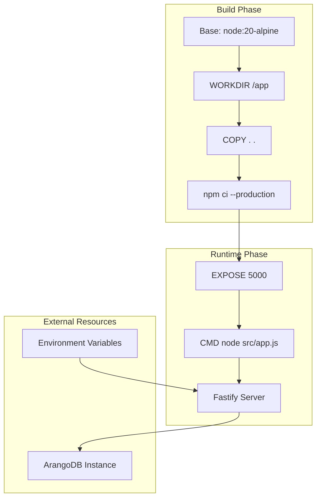
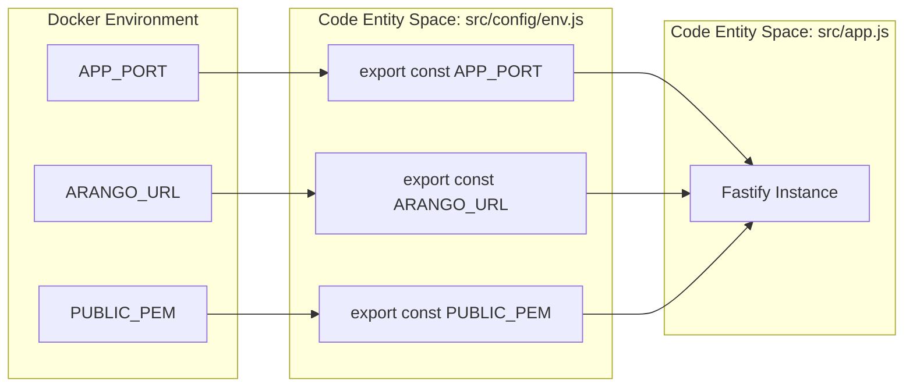

# Page: Docker and Containerization

# Docker and Containerization

Relevant source files

The following files were used as context for generating this wiki page:

- [.dockerignore](.dockerignore)
- [.gitignore](.gitignore)
- [Dockerfile](Dockerfile)
- [src/config/env.js](src/config/env.js)

This page documents the containerization strategy for the Ingenium Dictionary Service. The service uses Docker to provide a consistent, reproducible environment for both development and production deployments. The container encapsulates the Fastify application and its dependencies, ensuring that the Node.js runtime environment remains identical across different infrastructure providers.

## Dockerfile Specification

The `Dockerfile` defines a single-stage build optimized for production. It utilizes a lightweight Alpine Linux base image to minimize the attack surface and reduce the final image size.

| Instruction | Value | Purpose |
| :--- | :--- | :--- |
| `FROM` | `node:20-alpine` | Sets the base image to Node.js 20 on Alpine Linux. |
| `WORKDIR` | `/app` | Establices the working directory for all subsequent instructions. |
| `COPY` | `.` | Copies the source code and configuration files into the container. |
| `RUN` | `npm ci --production` | Installs only production dependencies using the lockfile. |
| `EXPOSE` | `5000` | Informs Docker that the container listens on port 5000. |
| `CMD` | `["node", "src/app.js"]` | Defines the entry point to start the Fastify server. |

### Build and Runtime Flow

The following diagram illustrates how the `Dockerfile` transitions the application from source code to a running containerized process.

**Container Lifecycle Diagram**

**Sources:**
- [Dockerfile:1-17]()
- [src/config/env.js:5-16]()

---

## Environment Configuration

The containerized application relies on environment variables for configuration, which are processed by `src/config/env.js`. These variables must be provided at runtime (e.g., via a `.env` file or orchestrator secrets).

### Required Variables

The following variables are critical for the service to function correctly:

| Variable | Default Value | Description |
| :--- | :--- | :--- |
| `APP_PORT` | `5000` | The port the Fastify server binds to inside the container. |
| `APP_HOST` | `0.0.0.0` | The host interface for the server (must be `0.0.0.0` for Docker). |
| `NODE_ENV` | `production` | Sets the application environment (e.g., `production`, `development`). |
| `ARANGO_URL` | `http://localhost:8529` | The connection string for the ArangoDB instance. |
| `ARANGO_DB_NAME` | `project_config` | The target database name within ArangoDB. |
| `ARANGO_USERNAME` | `""` | Username for ArangoDB authentication. |
| `ARANGO_PASSWORD` | `""` | Password for ArangoDB authentication. |
| `PUBLIC_PEM` | `undefined` | The RSA Public Key used for JWT verification. |

**Sources:**
- [src/config/env.js:5-16]()

---

## Build Exclusions and Security

The project uses `.dockerignore` and `.gitignore` to prevent sensitive data and unnecessary files from entering the container image.

### .dockerignore
The `.dockerignore` file explicitly excludes `secret.txt` from the build context to prevent sensitive credentials from being baked into the image layers.
- [/.dockerignore:1-2]()

### .gitignore
Local development secrets and artifacts are ignored to prevent accidental commits to the repository:
- `node_modules/`: Local dependencies are ignored; the container performs its own `npm ci`.
- `.env*`: Local environment files are excluded.
- `*.pem` and `*.key`: Security keys (except for those explicitly provided in CI/CD) are ignored.
- `docker-compose.override.yml`: Local developer overrides are ignored.

**Sources:**
- [.gitignore:1-55]()
- [.dockerignore:1-2]()

---

## Local Development with Docker Compose

While the `Dockerfile` is optimized for production, local development is supported through Docker Compose.

### docker-compose.override.yml
Developers can use a `docker-compose.override.yml` file (which is ignored by git) to customize the local environment. This is typically used to:
1.  Mount the `src/` directory as a volume for hot-reloading.
2.  Map the container's `5000` port to a different host port.
3.  Inject local development credentials or a local ArangoDB instance.

### System Interaction Diagram
The following diagram maps the configuration entities to the code symbols that consume them during the container startup.

**Configuration Mapping Diagram**

**Sources:**
- [src/config/env.js:1-18]()
- [Dockerfile:14-17]()
- [.gitignore:54-55]()
