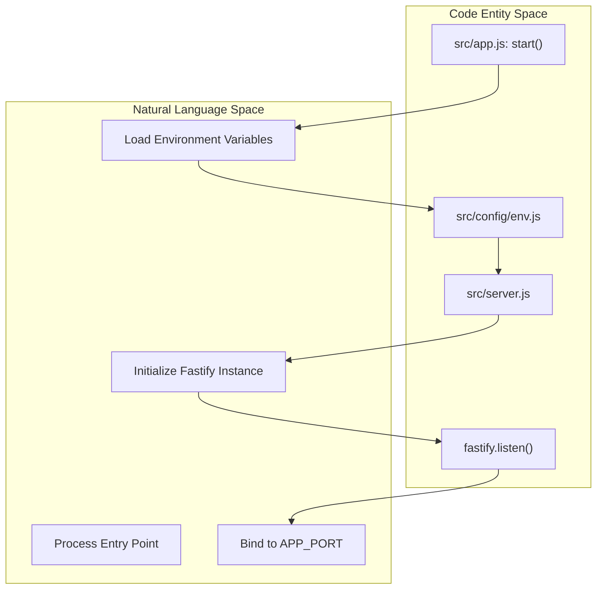
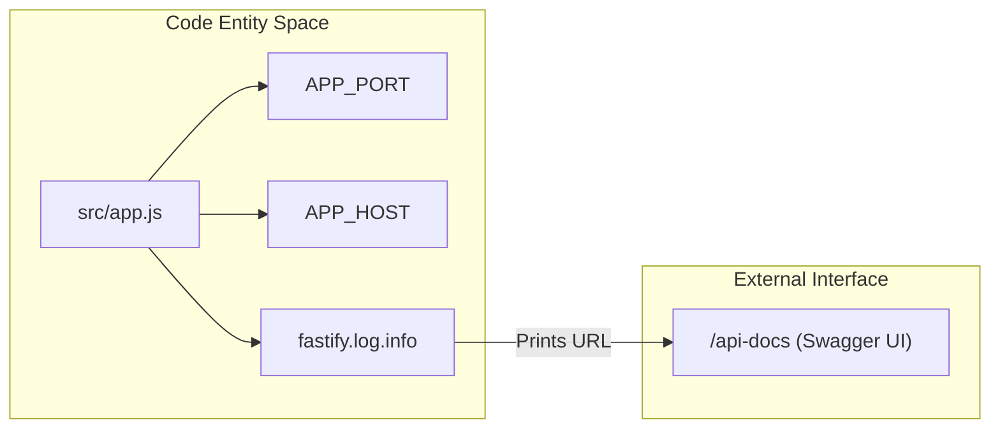

# Page: Getting Started

# Getting Started

<details>
<summary>Relevant source files</summary>

The following files were used as context for generating this wiki page:

- [.dockerignore](.dockerignore)
- [.gitignore](.gitignore)
- [Dockerfile](Dockerfile)
- [src/app.js](src/app.js)
- [src/config/env.js](src/config/env.js)

</details>


The **Ingenium Dictionary Service** is a high-performance backend service built with Fastify and ArangoDB, designed to manage aerospace ground system dictionaries, command definitions, telemetry channels, and verification items. This guide provides the necessary steps to configure, run, and interact with the service in a local development environment.

## Prerequisites

Before beginning, ensure your environment meets the following requirements:

*   **Node.js**: Version 20 or higher (the project uses `node:20-alpine` in production) [Dockerfile:2-2]().
*   **ArangoDB**: A running instance of ArangoDB (local or remote) [src/config/env.js:11-11]().
*   **OpenSSL**: For generating the necessary RSA keys for JWT authentication.

## Environment Variable Configuration

The service uses `dotenv` to manage configuration via environment variables [src/config/env.js:1-3](). Create a `.env` file in the root directory based on the following parameters:

| Variable | Description | Default |
| :--- | :--- | :--- |
| `APP_PORT` | The port the Fastify server listens on | `5000` |
| `APP_HOST` | The host interface for the server | `0.0.0.0` |
| `NODE_ENV` | Environment mode (`development`, `production`, `test`) | `production` |
| `LOG_LEVEL` | Pino logging level (`info`, `debug`, `error`, etc.) | `info` |
| `ARANGO_URL` | Connection string for ArangoDB | `http://localhost:8529` |
| `ARANGO_DB_NAME`| The specific database name within ArangoDB | `project_config` |
| `ARANGO_USERNAME`| Username for ArangoDB authentication | `""` |
| `ARANGO_PASSWORD`| Password for ArangoDB authentication | `""` |
| `PUBLIC_PEM` | RSA Public Key (PEM format) used to verify JWTs | **Required** |

> **Security Note:** Ensure that `.env`, `secret.txt`, and `*.pem` files are never committed to version control [ .gitignore:8-15]().

### Sources:
* [src/config/env.js:5-18]()
* [.gitignore:8-15]()

## Local Development with Node.js

To run the service natively on your machine:

1.  **Install Dependencies**: Use `npm install` to pull the required packages (Fastify, Arangojs, etc.).
2.  **Configure Environment**: Ensure your `.env` file is populated, specifically the `ARANGO_URL` and `PUBLIC_PEM`.
3.  **Start the Server**: Run the application using the entry point:
    ```bash
    node src/app.js
    ```
4.  **Verification**: The server will log its status to the console using the configured `LOG_LEVEL` [src/app.js:7-8]().

### Application Startup Flow
The following diagram illustrates the initialization sequence from `app.js` through the configuration layer.

**Title: Server Initialization Flow**


### Sources:
* [src/app.js:4-15]()
* [src/config/env.js:1-18]()

## Running with Docker

The service includes a `Dockerfile` for containerized deployment using a lightweight Alpine Linux base [Dockerfile:2-2]().

1.  **Build the Image**:
    ```bash
    docker build -t ingenium-dict-service .
    ```
2.  **Run the Container**:
    Pass the environment variables using the `-e` flag or an `--env-file`.
    ```bash
    docker run -p 5000:5000 --env-file .env ingenium-dict-service
    ```

The Docker build process utilizes `npm ci --production` to ensure a clean, reproducible installation of only necessary runtime dependencies [Dockerfile:11-11](). Note that `secret.txt` is explicitly ignored during the build process [ .dockerignore:1-2]().

### Sources:
* [Dockerfile:1-17]()
* [.dockerignore:1-2]()

## Accessing Swagger UI

The service automatically generates OpenAPI documentation. Once the server is running (locally or via Docker), the interactive Swagger UI is available for testing endpoints and inspecting schemas.

*   **URL**: `http://<APP_HOST>:<APP_PORT>/api-docs`
*   **Default Local URL**: [http://localhost:5000/api-docs](http://localhost:5000/api-docs)

The UI provides a visual representation of all routes defined under the `/api/v4` prefix, including the required headers for JWT authentication.

### Data Flow: Request to Swagger Documentation
This diagram shows how the system exposes its internal API structure to the external Swagger UI.

**Title: Documentation Exposure Map**


### Sources:
* [src/app.js:8-8]()
* [src/config/env.js:5-6]()
