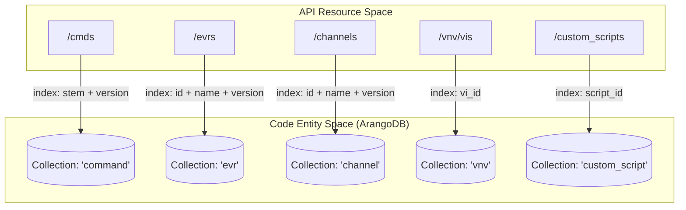
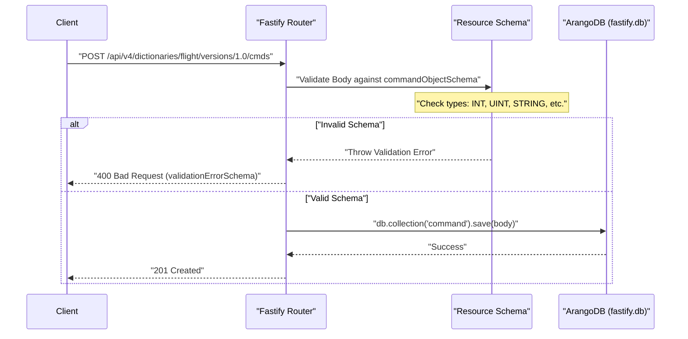

# Page: Glossary

# Glossary

Relevant source files

The following files were used as context for generating this wiki page:

- [README.md](README.md)
- [dictionary_service.yaml](dictionary_service.yaml)
- [src/config/env.js](src/config/env.js)
- [src/plugins/arangodb.js](src/plugins/arangodb.js)
- [src/schemas/customScriptSchema.js](src/schemas/customScriptSchema.js)
- [src/schemas/dictionaryContentSchema.js](src/schemas/dictionaryContentSchema.js)
- [src/schemas/vnvSchema.js](src/schemas/vnvSchema.js)

This page provides definitions for codebase-specific terms, aerospace domain jargon, and framework concepts used throughout the Ingenium Dictionary Service.

## Core Concepts & Domain Jargon

| Term | Definition | Code Reference |
| :--- | :--- | :--- |
| **Dictionary** | A versioned container for telemetry and command definitions, categorized by type (flight/sse). | [src/config/env.js:18-18]() |
| **SSE** | Ground Support Equipment (Support System Equipment). One of the two primary dictionary types. | [src/schemas/dictionaryContentSchema.js:126-126]() |
| **Flight** | Flight Software. One of the two primary dictionary types. | [src/schemas/dictionaryContentSchema.js:126-126]() |
| **Command Stem** | A unique mnemonic or identifier for a spacecraft command (e.g., `POWER_ON`). | [src/schemas/dictionaryContentSchema.js:75-78]() |
| **EVR** | Event Record. A log message or event generated by the spacecraft or ground system. | [src/config/env.js:18-18]() |
| **Channel** | A telemetry point representing a single sensor value or software variable (EH&A). | [src/config/env.js:18-18]() |
| **VI** | Verification Item. A requirement, command, or channel being verified in the V&V process. | [src/schemas/vnvSchema.js:9-12]() |
| **VA / VAC** | Verification Activity / Verification Activity Collection. Linked to VIs for tracking. | [src/schemas/vnvSchema.js:29-42]() |
| **Custom Script** | A python-based verification script with defined UI layouts for the Ingenium step palette. | [src/schemas/customScriptSchema.js:1-12]() |

**Sources:** [src/config/env.js:1-20](), [src/schemas/dictionaryContentSchema.js:71-130](), [src/schemas/vnvSchema.js:5-45]()

---

## Technical Framework Concepts

### ArangoDB Layer
The service uses ArangoDB as a multi-model document store. On startup, the `arangoPlugin` ensures the existence of the database and specific collections.

**Collection to Resource Mapping**
The following diagram bridges the high-level API resources to the specific ArangoDB collections and their unique persistent indexes defined in `src/plugins/arangodb.js`.

**System Resource to Database Mapping**

**Sources:** [src/plugins/arangodb.js:49-92](), [src/config/env.js:18-18]()

---

### Request Lifecycle & Validation
Fastify uses JSON Schemas to validate incoming requests and serialize outgoing responses. This ensures the "Natural Language" requirements of the aerospace domain are strictly enforced in the "Code Entity" space.

**Validation Flow Diagram**

**Sources:** [src/schemas/dictionaryContentSchema.js:72-111](), [src/schemas/shared_schemas/sharedSchemas.js:1-10](), [src/plugins/arangodb.js:106-106]()

---

## Abbreviations and Identifiers

| Abbreviation | Full Term | Context |
| :--- | :--- | :--- |
| **AJV** | Another JSON Schema Validator | The engine Fastify uses for `src/schemas/` validation. |
| **AQL** | ArangoDB Query Language | Used internally by the `db` decorator for bulk queries. |
| **JWT** | JSON Web Token | Used for authentication via the `Authorization: Bearer` header. |
| **PEM** | Privacy-Enhanced Mail | Format for the `PUBLIC_PEM` key used in token verification. |
| **SHA256** | Secure Hash Algorithm 256-bit | Used to generate `script_id` from the script's path. |
| **Ops Cat** | Operations Category | A metadata field used to group commands or telemetry. |

### Dictionary States
Dictionaries follow a specific lifecycle defined in the `dictionarySchema.js` and `dictionary_service.yaml`:
1.  **NOT_PUBLISHED**: Initial state; editable.
2.  **PUBLISHED**: Available for general use.
3.  **RELEASED**: Finalized version.
4.  **RETIRED**: Deprecated; no longer for active use.

**Sources:** [dictionary_service.yaml:44-48](), [src/config/env.js:16-16](), [src/schemas/dictionaryContentSchema.js:195-198]()