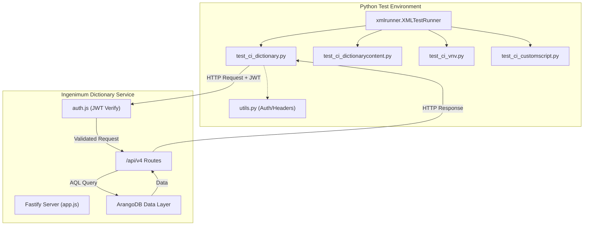
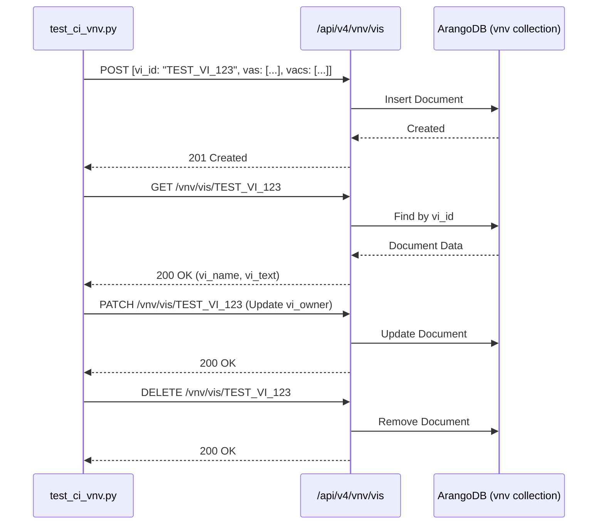

# Page: Integration Test Suites

# Integration Test Suites

Relevant source files

The following files were used as context for generating this wiki page:

- [tests/test_ci_customscript.py](tests/test_ci_customscript.py)
- [tests/test_ci_dictionary.py](tests/test_ci_dictionary.py)
- [tests/test_ci_dictionarycontent.py](tests/test_ci_dictionarycontent.py)
- [tests/test_ci_health.py](tests/test_ci_health.py)
- [tests/test_ci_vnv.py](tests/test_ci_vnv.py)

This page documents the Python-based integration test suites used to verify the Ingenium Dictionary Service. These tests perform end-to-end validation of the REST API, ensuring that the Fastify routes, ArangoDB persistence layer, and authentication logic function correctly together.

The test suite utilizes the `unittest` framework and `xmlrunner` to generate machine-readable reports in `./test-reports/` for CI/CD integration [tests/test_ci_health.py:131]().

## Test Architecture and Data Flow

The integration tests reside in the `tests/` directory and follow a standardized lifecycle:
1.  **Authentication**: Tests use `utils.set_header()` to obtain a JWT token and configure the global `config.HEADER` [tests/test_ci_dictionary.py:28-35]().
2.  **Setup**: The `setUpClass` method initializes unique session identifiers (using `time.time()`) to prevent data collisions between test runs [tests/test_ci_vnv.py:40]().
3.  **Execution**: Standard HTTP methods (`GET`, `POST`, `PATCH`, `DELETE`) are issued via the `requests` library against the `config.API_PATH` [tests/test_ci_health.py:37-42]().
4.  **Verification**: Responses are validated for status codes, JSON schema compliance, and business logic (e.g., ensuring a deleted resource is no longer accessible).

### System Test Interaction Diagram

This diagram illustrates how the test modules interact with the service components.

Title: Integration Test Execution Flow

Sources: [tests/test_ci_dictionary.py:1-46](), [tests/utils.py:1-15](), [tests/test_ci_health.py:131]()

---

## 1. Health and Connectivity (`test_ci_health.py`)

This module verifies the public, unauthenticated health endpoint. It is typically the first test run to ensure the service is reachable.

*   **Endpoint**: `GET /health` [tests/test_ci_health.py:37]().
*   **Verification**:
    *   Ensures a `200 OK` status code [tests/test_ci_health.py:54]().
    *   Validates the JSON structure contains `{"status": "OK"}` [tests/test_ci_health.py:66-67]().
    *   Confirms no authentication header is required for this specific route [tests/test_ci_health.py:16]().

Sources: [tests/test_ci_health.py:9-129]()

---

## 2. Dictionary Lifecycle (`test_ci_dictionary.py`)

Verifies the high-level management of dictionary versions. This suite covers the transition of dictionary metadata and the cascading effects of deletions.

| Test Case | Method | Endpoint | Description |
| :--- | :--- | :--- | :--- |
| Create Dictionary | `POST` | `/dictionaries/{type}/versions` | Creates a new version (e.g., `sse` or `flight`) in `NOT_PUBLISHED` state [tests/test_ci_dictionary.py:86-92](). |
| Get All Versions | `GET` | `/dictionaries/{type}/versions` | Validates pagination and `x-total-count` header [tests/test_ci_dictionary.py:132-153](). |
| Update State | `PATCH` | `/dictionaries/{type}/versions/{version}` | Modifies the dictionary state or description [tests/test_ci_dictionary.py:23](). |
| Delete Dictionary | `DELETE` | `/dictionaries/{type}/versions/{version}` | Final cleanup; verifies resource removal [tests/test_ci_dictionary.py:25](). |

Sources: [tests/test_ci_dictionary.py:10-46](), [tests/test_ci_dictionary.py:86-116]()

---

## 3. Dictionary Content (`test_ci_dictionarycontent.py`)

Focuses on bulk operations for Commands (`cmds`), EVRs (`evrs`), Channels (`channels`), and MIL-1553 data.

*   **Dependency**: This suite automatically creates a parent dictionary version before running content tests [tests/test_ci_dictionarycontent.py:55-77]().
*   **Bulk Operations**: Tests the `POST .../bulk_query` pattern, which allows clients to retrieve specific subsets of content using an array of identifiers [tests/test_ci_dictionarycontent.py:24]().
*   **Schema Validation**: Ensures that complex nested objects, such as command `arguments` (with `min_value`, `max_value`, and `argument_type`), are correctly persisted and retrieved [tests/test_ci_dictionarycontent.py:129-148]().

Sources: [tests/test_ci_dictionarycontent.py:10-53](), [tests/test_ci_dictionarycontent.py:119-150]()

---

## 4. Verification and Validation (`test_ci_vnv.py`)

Verifies the lifecycle of Verification Items (VIs) used for system requirements and test tracking.

Title: V&V Data Lifecycle Mapping

*   **Key Fields**: Validates `vi_id`, `vi_name`, `vi_owner`, `vi_type`, `vi_text`, and the arrays `vas` (Verification Activities) and `vacs` (Verification Activity Criteria) [tests/test_ci_vnv.py:89-97]().
*   **Bulk Query**: Tests `POST /vnv/vis/bulk` to ensure multiple VIs can be fetched in a single round-trip [tests/test_ci_vnv.py:27]().

Sources: [tests/test_ci_vnv.py:13-30](), [tests/test_ci_vnv.py:88-98]()

---

## 5. Custom Scripts (`test_ci_customscript.py`)

Verifies the registration and retrieval of custom script definitions used by the Ingenium UI step palette.

*   **Identification**: Scripts are identified by a `script_id`, which in production is typically a SHA256 hash of the script path [tests/test_ci_customscript.py:40-42]().
*   **Parameter Validation**:
    *   **Inputs**: Verifies `name`, `type`, and `phase` (e.g., `EXECUTION` or `AUTHORING`) [tests/test_ci_customscript.py:100-108]().
    *   **Outputs**: Verifies script return parameter definitions [tests/test_ci_customscript.py:110-116]().
*   **Metadata**: Validates `hash`, `status` (e.g., `ACTIVE`), and `script_path` [tests/test_ci_customscript.py:95-99]().

Sources: [tests/test_ci_customscript.py:10-27](), [tests/test_ci_customscript.py:92-120]()

---

## Test Reporting

All test modules use `xmlrunner` to output JUnit-compatible XML files. These files are stored in the `./test-reports/` directory [tests/test_ci_health.py:131]().

**Standardized Output Format:**
*   **Terminal**: Rich text output with status indicators (✓/✗) and purpose descriptions for each test case [tests/test_ci_dictionary.py:51-54]().
*   **XML**: Detailed breakdown of successes, failures, and execution time for ingestion by CI platforms (e.g., Jenkins, GitLab CI).

Sources: [tests/test_ci_health.py:121-131](), [tests/test_ci_dictionary.py:48-54]()
