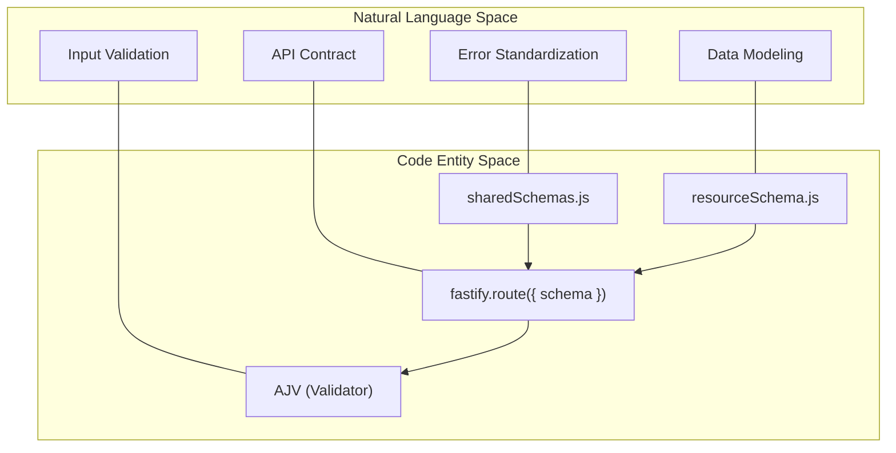
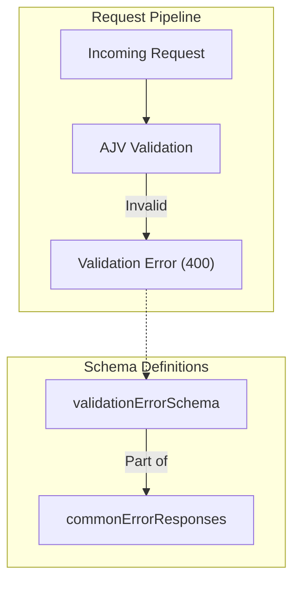

# Page: JSON Schema Layer

# JSON Schema Layer

Relevant source files

The following files were used as context for generating this wiki page:

- [src/schemas/healthSchema.js](src/schemas/healthSchema.js)
- [src/schemas/shared_schemas/sharedSchemas.js](src/schemas/shared_schemas/sharedSchemas.js)

The Ingenium Dictionary Service utilizes **JSON Schema** to enforce strict data validation, generate OpenAPI documentation, and standardize error responses. By leveraging Fastify's native integration with **AJV (Another JSON Schema Validator)**, the service ensures that all incoming requests and outgoing responses adhere to predefined structures before reaching the business logic.

### Validation Pipeline

The schema layer is integrated directly into the Fastify request lifecycle. When a route is defined with a `schema` property, Fastify automatically:
1.  **Validates** the `body`, `querystring`, `params`, and `headers`.
2.  **Serializes** the response according to the defined schema, which also provides a performance boost by optimizing the JSON stringification process.
3.  **Generates** Swagger/OpenAPI documentation based on these definitions.

### Conceptual Mapping

The following diagram bridges the natural language requirements for data integrity to the specific code entities implementing the schema layer.

**Schema-to-Code Entity Map**

**Sources:** [src/schemas/shared_schemas/sharedSchemas.js:1-87](), [src/schemas/healthSchema.js:1-20]()

---

### Shared Schemas and Error Responses

To maintain consistency across the API, the service uses a set of shared error schemas. These are managed through a helper function `createErrorSchema` [src/schemas/shared_schemas/sharedSchemas.js:4-14]() which generates a standard object containing a `message` property.

A central object, `commonErrorResponses`, is used to provide a uniform set of HTTP error definitions (400, 401, 403, 404, 500) that can be easily spread into any route's response schema [src/schemas/shared_schemas/sharedSchemas.js:80-86]().

**Standard Error Flow**

For details on error structures and the shared helper functions, see [Shared Schemas and Error Responses](#4.1).

**Sources:** [src/schemas/shared_schemas/sharedSchemas.js:16-87]()

---

### Resource-Specific Schemas

Every major resource in the system (Dictionaries, Commands, V&V Items, Custom Scripts) has a dedicated schema file. These files define the "shape" of the data as it exists in ArangoDB and as it should be presented in the API.

Key responsibilities of resource schemas include:
*   **Enum Enforcement**: Defining valid states for dictionaries (e.g., `PUBLISHED`, `RETIRED`) or dictionary types (`sse`, `flight`).
*   **Complex Nested Types**: Validating the `vas` and `vacs` arrays within Verification Items (V&V).
*   **Argument Typing**: Ensuring that Command and EVR arguments follow specific data types (integer, float, string).
*   **Phase Validation**: Distinguishing between `AUTHORING` and `EXECUTION` phases for Custom Scripts.

For details on individual resource models and their specific validation rules, see [Resource-Specific Schemas](#4.2).

**Sources:** [src/schemas/healthSchema.js:3-20](), [src/schemas/shared_schemas/sharedSchemas.js:41-76]()
