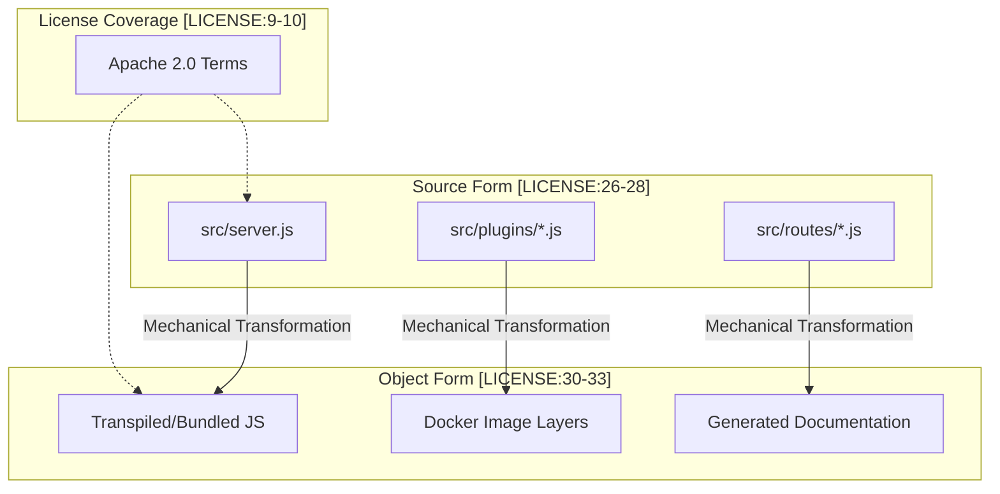
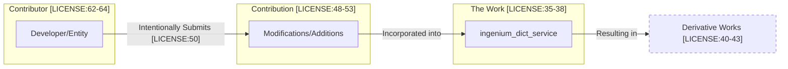

# Page: License

# License

Relevant source files

The following files were used as context for generating this wiki page:

- [LICENSE](LICENSE)

The Ingenium Dictionary Service is released under the **Apache License, Version 2.0**. This page provides a technical summary of the rights, obligations, and legal protections afforded to users and contributors of the codebase.

## 1. Core Grants

The license provides two primary grants of rights to users ("You") of the software, ensuring that the service can be used, modified, and distributed in both commercial and non-commercial contexts.

### 1.1 Copyright License
Each contributor grants a perpetual, worldwide, non-exclusive, no-charge, royalty-free, and irrevocable copyright license [LICENSE:66-71](). This allows for:
* Reproduction of the `Work`.
* Preparation of `Derivative Works`.
* Public display and performance.
* Sublicensing and distribution of the `Source` or `Object` forms.

### 1.2 Patent License
Contributors grant a patent license to make, use, sell, or import the `Work` [LICENSE:73-77](). This grant is specific to patent claims that are necessarily infringed by the `Contribution` alone or in combination with the `Work` [LICENSE:78-81]().

**Sources:**
* [LICENSE:66-71]()
* [LICENSE:73-81]()

---

## 2. Redistribution Requirements

If the Ingenium Dictionary Service or its derivatives are redistributed, the following conditions must be met to remain in compliance with the license [LICENSE:89-92]().

| Requirement | Description |
| :--- | :--- |
| **License Inclusion** | Recipients must be provided with a copy of the Apache 2.0 License [LICENSE:94-95](). |
| **Change Notices** | Any modified files must contain prominent notices stating that the files were changed [LICENSE:97-98](). |
| **Notice Retention** | All copyright, patent, trademark, and attribution notices from the `Source` form must be retained in `Derivative Works` [LICENSE:100-104](). |
| **NOTICE File** | If a `NOTICE` file exists, its attribution notices must be included in the distribution (within a new `NOTICE` file, the `Source` documentation, or a display) [LICENSE:106-115](). |

### Relationship between Source and Object Forms
The following diagram illustrates how the license governs the transition from the preferred form for modification to the mechanically transformed version.

**Code Entity Space: Source to Object Transformation**

**Sources:**
* [LICENSE:26-33]()
* [LICENSE:89-115]()

---

## 3. Legal Protections and Terminations

The license includes specific clauses designed to protect the contributors and the integrity of the project's intellectual property.

### 3.1 Defensive Patent Termination
To prevent patent aggression, the license includes a termination clause. If a user institutes patent litigation against any entity alleging that the `Work` constitutes patent infringement, then any patent licenses granted to that user under this license terminate immediately [LICENSE:81-87]().

### 3.2 Warranty Disclaimer
The software is provided on an **"AS IS" BASIS**, without warranties or conditions of any kind, either express or implied [LICENSE:184-190](). This includes, but is not limited to, warranties of:
* Title
* Non-infringement
* Merchantability
* Fitness for a particular purpose

### 3.3 Limitation of Liability
Contributors are not liable for any damages arising out of the use or inability to use the `Work`, including direct, indirect, special, incidental, or consequential damages [LICENSE:193-201]().

**Sources:**
* [LICENSE:81-87]()
* [LICENSE:184-190]()
* [LICENSE:193-201]()

---

## 4. Contributions and Derivative Works

The license defines how new code enters the project and how modified versions of the project are categorized.

**Code Entity Space: Contribution Flow**

### 4.1 Defining Contributions
A `Contribution` is any work of authorship intentionally submitted to the `Licensor` for inclusion in the `Work` [LICENSE:48-53](). Unless stated otherwise, any contribution submitted is governed by the terms of the Apache 2.0 License [LICENSE:130-134]().

### 4.2 Derivative Works vs. Linking
`Derivative Works` are modifications that represent an original work of authorship [LICENSE:40-43](). However, works that remain separable from or merely link (by name) to the interfaces of the `Work` are not considered `Derivative Works` under this license [LICENSE:44-46]().

**Sources:**
* [LICENSE:40-46]()
* [LICENSE:48-53]()
* [LICENSE:62-64]()
* [LICENSE:130-134]()
