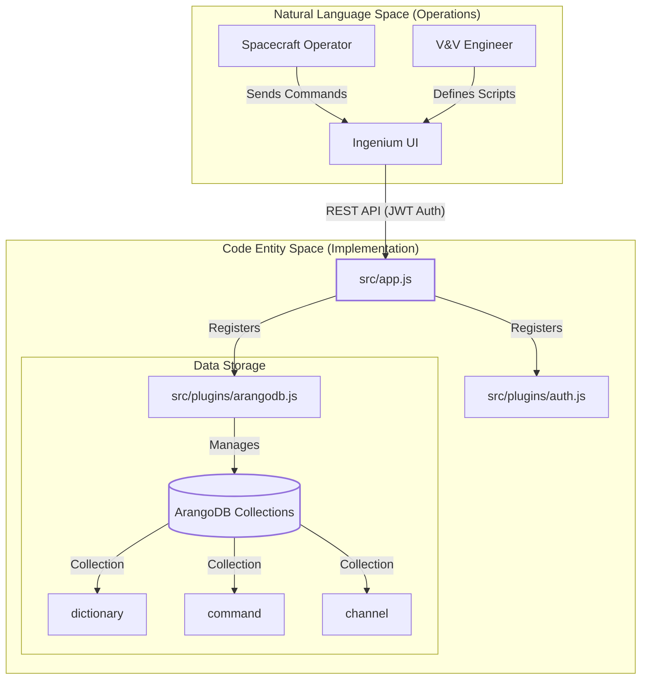
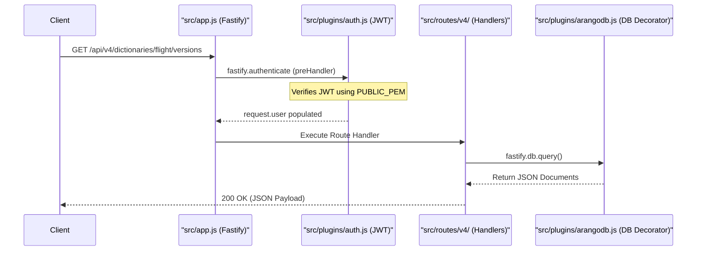

# Page: Overview

# Overview

Relevant source files

The following files were used as context for generating this wiki page:

- [README.md](README.md)
- [dictionary_service.yaml](dictionary_service.yaml)
- [package.json](package.json)

The **Ingenium Dictionary Service** is a high-performance REST API designed to manage aerospace project configurations. It serves as a centralized, queryable interface for flight and ground support equipment (SSE) metadata, including command definitions, telemetry channels, Event Records (EVRs), and verification scripts [dictionary_service.yaml:6-12]().

As a core component of the Ingenium aerospace ground system, this service enables the Ingenium UI to streamline user workflows for commanding, telemetry analysis (EH&A), and system verification [dictionary_service.yaml:15-17]().

### Core Capabilities
*   **Dictionary Lifecycle**: Versioned management of `flight` and `sse` dictionaries with state transitions (e.g., `PUBLISHED`, `RETIRED`) [dictionary_service.yaml:44-48]().
*   **Command & Telemetry**: Management of spacecraft command stems, arguments, and telemetry channel definitions [README.md:17-18]().
*   **V&V Integration**: Tracking of Verification Items (VIs) and associated activities [README.md:21]().
*   **Custom Scripting**: Storage and retrieval of custom verification scripts used in the Ingenium step palette [README.md:22]().

### Technology Stack
The service is built on a modern, asynchronous stack designed for high throughput and flexible data modeling:
*   **Fastify**: A low-overhead web framework for Node.js used for routing and plugin management [package.json:40]().
*   **ArangoDB**: A multi-model NoSQL database used to store document-based dictionary content [package.json:38]().
*   **JWT (JSON Web Tokens)**: Used for securing API endpoints via RS256 Bearer tokens [README.md:25]().
*   **OpenAPI/Swagger**: Automatic documentation and schema validation [package.json:36-37]().

---

### System Context Diagram
The following diagram illustrates how the `dict-service` bridges the "Natural Language Space" of aerospace operations to the "Code Entity Space" of the implementation.

**Dictionary Service Context**

Sources: [README.md:12-26](), [src/app.js:1-20](), [dictionary_service.yaml:1-17]()

---

### Request Lifecycle
This diagram maps the flow of a request from an external client through the primary code entities.

**Request Flow to Code Mapping**

Sources: [src/app.js:1-40](), [README.md:138-145](), [dictionary_service.yaml:25-78]()

---

### Navigation Map

The documentation for the Ingenium Dictionary Service is divided into the following sections:

| Section | Description |
| :--- | :--- |
| **[Getting Started](#1.1)** | Instructions for setting up Node.js, ArangoDB, and environment variables (`.env`). Covers running the service via `npm` or Docker [README.md:37-117](). |
| **[Project Structure](#1.2)** | A guide to the repository layout, explaining the purpose of the `src/` directories (plugins, routes, schemas) and the Python-based `tests/` directory [package.json:5-11](). |
| **Core Architecture** | Deep dive into the Fastify bootstrap process, ArangoDB integration, and JWT authentication logic. |
| **API Reference** | Detailed documentation of all `/api/v4` endpoints, including bulk operations and wildcard searching [dictionary_service.yaml:123-132](). |
| **JSON Schema Layer** | Explanation of the AJV validation schemas and shared error response models used to ensure data integrity. |
| **Testing** | Overview of the integration test suite and how to generate XML reports using the Python `unittest` framework [README.md:146-200](). |
| **Deployment** | Details on Docker containerization, environment injection, and Apache 2.0 licensing [README.md:104-117](). |

Sources: [README.md:1-223](), [package.json:1-49]()
