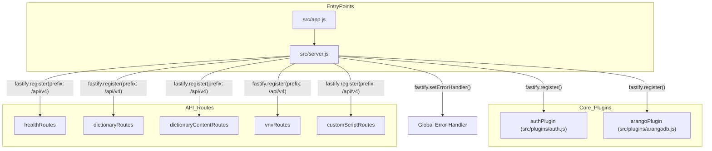
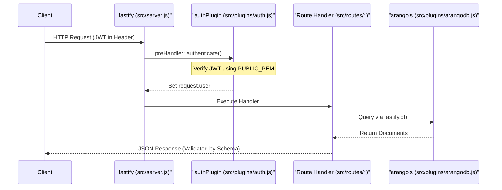

# Page: Project Structure

# Project Structure

Relevant source files

The following files were used as context for generating this wiki page:

- [package-lock.json](package-lock.json)
- [package.json](package.json)
- [src/server.js](src/server.js)

This page provides a technical walkthrough of the `dict-service` repository layout, explaining the organization of the source code, the configuration of the ES Module environment, and the testing infrastructure.

## Repository Root

The root directory contains configuration files for the Node.js environment, containerization, and dependency management.

| File | Purpose |
| :--- | :--- |
| `package.json` | Defines project metadata, dependencies, and scripts. Specifies `"type": "module"` for ES Module support [package.json:1-48](). |
| `src/app.js` | The entry point for the application. It imports the configured Fastify instance and starts the server [package.json:6](). |
| `Dockerfile` | Instructions for building the production container image using `node:20-alpine`. |
| `.env` | (Local only) Environment variables for database credentials and application settings. |

**Sources:** [package.json:1-48](), [src/app.js:1-10]()

## Source Directory (`src/`)

The `src/` directory contains the core logic of the service, organized by functional responsibility. The service follows a plugin-based architecture using the Fastify framework.

### Directory Tree Overview

*   **`config/`**: Contains environment variable parsing and validation logic (e.g., `env.js`).
*   **`plugins/`**: Custom Fastify plugins for cross-cutting concerns like database connectivity and authentication.
*   **`routes/`**: Route definitions grouped by resource type (e.g., `dictionary.js`, `vnv.js`).
*   **`schemas/`**: JSON Schema definitions for request validation and response serialization.
*   **`server.js`**: The main assembly point where plugins, routes, and global handlers are registered [src/server.js:1-101]().

### System Assembly Diagram

The following diagram illustrates how `src/server.js` integrates various components to form the `fastify` instance.

**Fastify Instance Composition**

**Sources:** [src/server.js:32-35](), [src/server.js:77-99](), [src/app.js:1-10]()

---

## Technical Implementation Details

### ES Module Setup
The project is configured as a native ES Module (ESM) environment. This is declared in `package.json` via the `"type": "module"` field [package.json:5](). This allows the use of `import/export` syntax instead of `require()`.

### Naming Conventions
*   **Files**: Lower camelCase (e.g., `dictionaryContent.js`) or kebab-case for configuration.
*   **Routes**: Defined in `src/routes/` and prefixed with `/api/v4` during registration in `server.js` [src/server.js:95-99]().
*   **Schemas**: Grouped by resource in `src/schemas/`.

### Data Flow: Request to Response
The service utilizes Fastify's lifecycle to process requests.

**Request Lifecycle**

**Sources:** [src/server.js:33-35](), [src/server.js:77-92](), [src/plugins/auth.js:1-20]()

---

## Tests Directory (`tests/`)

The `tests/` directory contains a Python-based integration test suite designed to validate the API against a running instance of the service.

*   **`config.py`**: Centralized configuration for test environment variables (URLs, credentials).
*   **`utils.py`**: Helper functions for authentication, token generation, and header management.
*   **`test_ci_*.py`**: Individual test modules targeting specific functional areas:
    *   `test_ci_health.py`: Connectivity checks.
    *   `test_ci_dictionary.py`: Lifecycle of dictionary versions.
    *   `test_ci_dictionarycontent.py`: CRUD for Commands, EVRs, and Channels.
    *   `test_ci_vnv.py`: Verification and Validation item management.

**Sources:** [src/server.js:1-101](), [package.json:1-48]()
