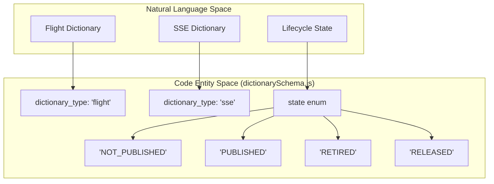
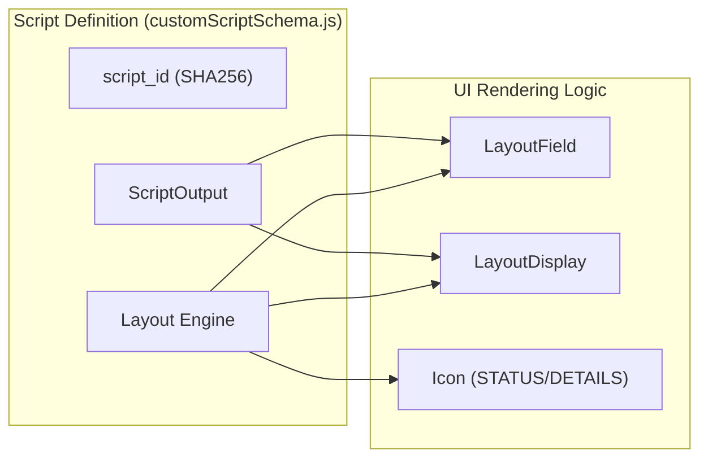

# Page: Resource-Specific Schemas

# Resource-Specific Schemas

Relevant source files

The following files were used as context for generating this wiki page:

- [src/schemas/customScriptSchema.js](src/schemas/customScriptSchema.js)
- [src/schemas/dictionaryContentSchema.js](src/schemas/dictionaryContentSchema.js)
- [src/schemas/dictionarySchema.js](src/schemas/dictionarySchema.js)
- [src/schemas/vnvSchema.js](src/schemas/vnvSchema.js)

This section provides a detailed technical reference for the JSON schemas that define the data models for the Ingenium Dictionary Service. These schemas are used by Fastify for request validation (body, params, and querystring) and for generating the OpenAPI (Swagger) documentation.

## Dictionary Lifecycle Schemas

The `dictionarySchema.js` file defines the structure for dictionary versioning and metadata. This is the top-level resource that containers all other content (Commands, EVRs, etc.).

### Dictionary Object Model
The `dictionaryObjectSchema` [src/schemas/dictionarySchema.js:6-32]() defines the core fields for a dictionary version:
*   **`dictionary_type`**: Restricted to `sse` or `flight` via an enum [src/schemas/dictionarySchema.js:20]().
*   **`state`**: Manages the lifecycle through an enum: `NOT_PUBLISHED`, `PUBLISHED`, `RETIRED`, `RELEASED` [src/schemas/dictionarySchema.js:29]().
*   **`dictionary_version`**: A unique string identifier per type [src/schemas/dictionarySchema.js:14-15]().

### Dictionary Mapping: Logic to Code
The following diagram illustrates how the dictionary lifecycle states and types defined in the schema map to the system's internal logic.

**Dictionary Entity Mapping**

**Sources:** [src/schemas/dictionarySchema.js:17-30]()

---

## Dictionary Content Schemas

The `dictionaryContentSchema.js` file defines complex nested structures for aerospace telemetry and command data.

### Command and Argument Typing
Commands consist of a `command_stem` and an array of `arguments`. Each argument is strictly typed.
*   **Argument Types**: Supported types include `INT`, `UINT`, `STRING`, `FLOAT`, `BOOL`, `TIME`, `ENUM`, and `ROL` [src/schemas/dictionaryContentSchema.js:43]().
*   **Enumerations**: If the type is `ENUM`, the `enumerations` array provides `symbol` (string) and `numeric` (integer) mappings [src/schemas/dictionaryContentSchema.js:6-18]().
*   **Repeat Sets**: Commands support "repeat arguments" where a set of arguments can be repeated between `repeat_min` and `repeat_max` times [src/schemas/dictionaryContentSchema.js:96-103]().

### Content Object Structures
| Resource | Key Identifier | Description |
| :--- | :--- | :--- |
| **Command** | `command_stem` | Includes `operations_category` and `restricted_modes` [src/schemas/dictionaryContentSchema.js:72-111](). |
| **EVR** | `evr_id` / `evr_name` | Event Record definitions with severity levels. |
| **Channel** | `channel_id` | Telemetry channel definitions with units and conversion factors. |
| **MIL-1553** | `mil1553_name` | Bus communication definitions. |

**Sources:** [src/schemas/dictionaryContentSchema.js:5-111]()

---

## Verification and Validation (V&V) Schemas

The `vnvSchema.js` file handles the data model for Verification Items (VIs), which are used to track requirements and their associated activities.

### Verification Item (VI) Structure
A `verificationItemObjectSchema` [src/schemas/vnvSchema.js:6-44]() includes:
*   **`vi_id`**: The primary unique identifier [src/schemas/vnvSchema.js:9]().
*   **`vas`**: An array of strings representing "Verification Activities" associated with the item [src/schemas/vnvSchema.js:29-35]().
*   **`vacs`**: An array of strings representing "Verification Activity Collections" [src/schemas/vnvSchema.js:36-42]().
*   **`vi_type`**: Categorizes the item (e.g., `REQUIREMENT`, `CHANNEL`, `COMMAND`) [src/schemas/vnvSchema.js:21-24]().

**Sources:** [src/schemas/vnvSchema.js:6-44]()

---

## Custom Script Schemas

The `customScriptSchema.js` file is the most complex schema, defining a layout engine for the Ingenium UI. It distinguishes between the script definition (Authoring) and how it is rendered (Execution).

### Layout Engine
The schema defines a grid-based layout system:
*   **`Layout`**: Defines `row`, `column` (1-12), `width` (1-12), and `height` [src/schemas/customScriptSchema.js:102-131]().
*   **`LayoutDisplay`**: Uses Python-style f-string templates (e.g., `"The {var} is active"`) to render dynamic content [src/schemas/customScriptSchema.js:90-99, 135-150]().
*   **`LayoutField`**: Maps a UI input field to a specific variable defined in the script [src/schemas/customScriptSchema.js:174-197]().

### Input/Output Typing
Scripts define their interface through:
*   **`ScriptOutput`**: Standard outputs like `INT`, `STRING`, `FILE`, `IMAGE`, or `SERIES` [src/schemas/customScriptSchema.js:63-88]().
*   **`ScriptOutputArray`**: A repeatable set of outputs, limited to approximately 10 entries for UI performance [src/schemas/customScriptSchema.js:38-60]().

### Authoring vs. Execution
The schema supports different visibility levels:
*   **HeaderLayout (L2)**: Visible at the summary level [src/schemas/customScriptSchema.js:251-266]().
*   **ContentLayout (L3)**: Detailed view containing fields, icons, and images [src/schemas/customScriptSchema.js:291-295]().

**Custom Script Data Flow**

**Sources:** [src/schemas/customScriptSchema.js:38-88](), [src/schemas/customScriptSchema.js:102-197](), [src/schemas/customScriptSchema.js:251-295]()
