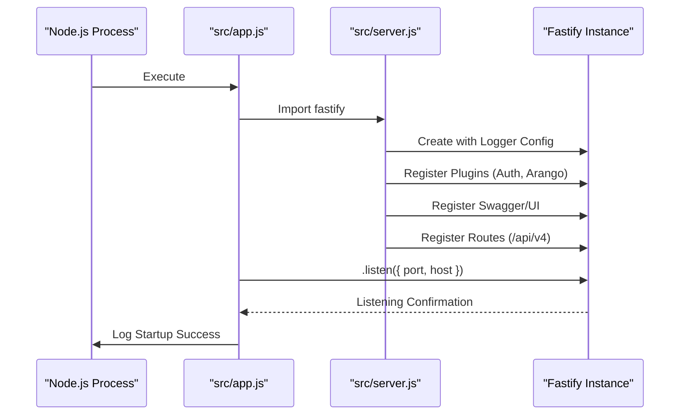
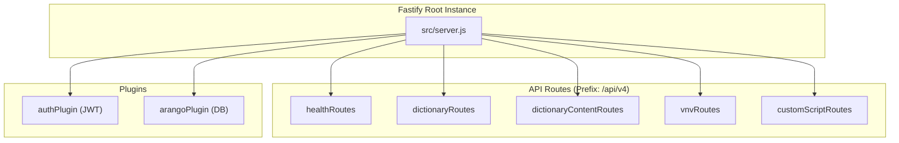

# Page: Server Bootstrap and Configuration

# Server Bootstrap and Configuration

<details>
<summary>Relevant source files</summary>

The following files were used as context for generating this wiki page:

- [src/app.js](src/app.js)
- [src/config/env.js](src/config/env.js)
- [src/server.js](src/server.js)

</details>


This page details the initialization and configuration of the Ingenium Dictionary Service. It covers how the Fastify server is instantiated, the environment-aware logging strategy, the registration of security and database plugins, and the assembly of the API surface area under the `/api/v4` prefix.

## Server Entry Point and Lifecycle

The service follows a two-stage startup process split between `src/server.js` and `src/app.js`. This separation allows the server instance to be exported for testing purposes without immediately binding to a network port.

### Execution Flow
1.  **`src/app.js`** imports the configured `fastify` instance [src/app.js:1-1]().
2.  It invokes the `start()` function [src/app.js:4-15]().
3.  The server begins listening on the host and port defined in the environment configuration [src/app.js:6-6]().
4.  Upon successful binding, it logs the current `NODE_ENV` and the location of the Swagger UI [src/app.js:7-8]().

**Sequence: Server Startup**


**Sources:**
- [src/app.js:1-15]()
- [src/server.js:28-100]()

## Environment-Aware Logging

The service utilizes `pino` for high-performance logging. The configuration is dynamic based on the `NODE_ENV` variable to provide human-readable logs during development and structured JSON logs in production.

| Environment | Configuration | Behavior |
| :--- | :--- | :--- |
| `development` | `pino-pretty` | Colorized output, standard timestamps, suppressed PID/hostname [src/server.js:15-23](). |
| `production` | `true` | Standard JSON logging for log aggregation systems [src/server.js:25-25](). |
| `test` | `false` | Logging disabled to keep test runners clean [src/server.js:26-26](). |

The logger is passed to the Fastify constructor, and the service also increases the default `bodyLimit` to 100MB to accommodate large dictionary uploads [src/server.js:28-31]().

**Sources:**
- [src/server.js:14-31]()
- [src/config/env.js:7-8]()

## Plugin and Route Registration

The server acts as a central hub where core capabilities and business logic are registered. The order of registration is significant for the Fastify lifecycle.

### Core Plugins
1.  **Authentication**: The `authPlugin` is registered with the `PUBLIC_PEM` key to handle JWT verification [src/server.js:33-33]().
2.  **Database**: The `arangoPlugin` is registered to establish the connection to the ArangoDB backend [src/server.js:35-35]().

### Documentation (Swagger/OpenAPI)
The service automatically generates OpenAPI 3.0 documentation. 
- **Specification**: Configured via `fastifySwagger` with Bearer Auth security definitions [src/server.js:38-56]().
- **UI**: Exposed via `fastifySwaggerUi` at the `/api-docs` endpoint [src/server.js:59-73]().

### Route Assembly
All functional routes are prefixed with `/api/v4` to ensure versioning of the API [src/server.js:95-99]().

**Component Mapping: Route Registration**


**Sources:**
- [src/server.js:33-35]()
- [src/server.js:38-73]()
- [src/server.js:95-99]()

## Global Error Handling

A centralized error handler is defined in `src/server.js` to ensure consistent error responses across all endpoints.

- **Status Codes**: Defaults to `500` if no specific `statusCode` is provided on the error object [src/server.js:80-80]().
- **Validation Errors**: If the error originates from Fastify's AJV validation, the handler returns a `Validation Error` string and includes the specific validation `details` [src/server.js:83-89]().
- **Production Safety**: In production, internal server error messages are masked as "An unexpected error occurred" to prevent leaking stack traces or sensitive logic [src/server.js:84-84]().

**Error Response Structure:**
```json
{
  "statusCode": 400,
  "error": "Validation Error",
  "message": "body should have required property 'version'",
  "details": [...]
}
```

**Sources:**
- [src/server.js:77-92]()

## Configuration Management

The `src/config/env.js` file manages all environment variables using `dotenv`. It provides defaults for local development while allowing overrides via the environment.

| Variable | Default | Description |
| :--- | :--- | :--- |
| `APP_PORT` | `5000` | Port the server listens on [src/config/env.js:5-5](). |
| `APP_HOST` | `0.0.0.0` | Host interface binding [src/config/env.js:6-6](). |
| `ARANGO_URL` | `http://localhost:8529` | Connection string for ArangoDB [src/config/env.js:11-11](). |
| `COLLECTION_NAMES` | `[...]` | List of mandatory database collections [src/config/env.js:18-18](). |

**Sources:**
- [src/config/env.js:1-18]()
