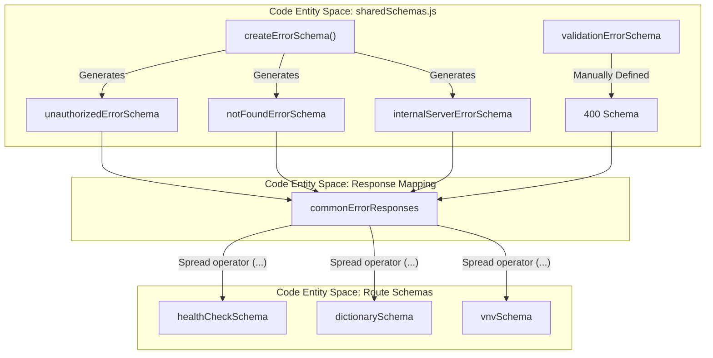
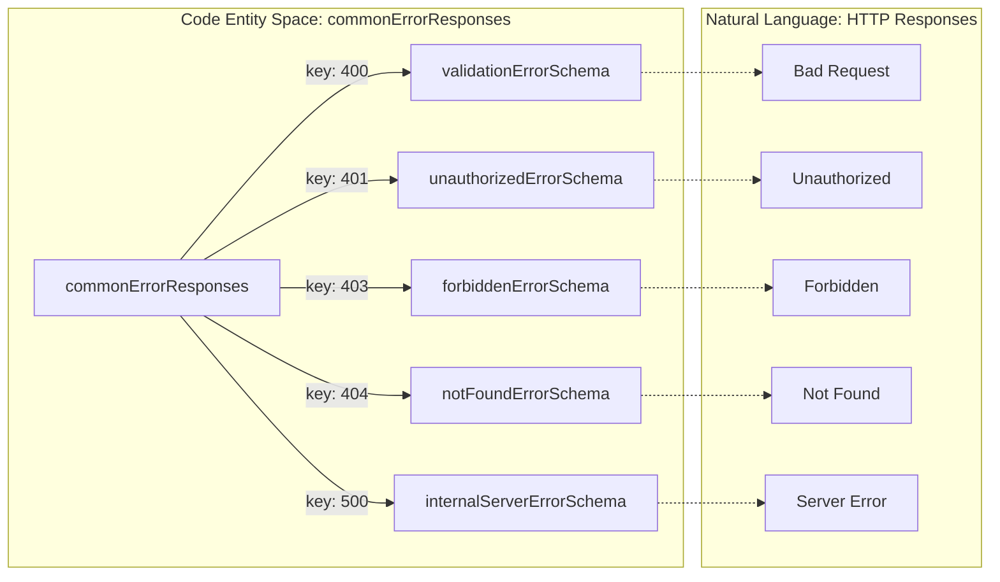

# Page: Shared Schemas and Error Responses

# Shared Schemas and Error Responses

<details>
<summary>Relevant source files</summary>

The following files were used as context for generating this wiki page:

- [src/schemas/healthSchema.js](src/schemas/healthSchema.js)
- [src/schemas/shared_schemas/sharedSchemas.js](src/schemas/shared_schemas/sharedSchemas.js)

</details>


This page documents the centralized JSON Schema definitions used for error handling and response consistency across the Ingenium Dictionary Service. These schemas ensure that every API endpoint follows a predictable structure for error reporting, facilitating easier integration for client applications and the Ingenium UI.

The core logic resides in `src/schemas/shared_schemas/sharedSchemas.js` [src/schemas/shared_schemas/sharedSchemas.js:1-87](), which provides both individual error models and a convenience object for route registration.

## The Error Schema Factory

To maintain DRY (Don't Repeat Yourself) principles, the service utilizes a helper function, `createErrorSchema`, to generate standard JSON objects representing error responses.

### `createErrorSchema`
This function [src/schemas/shared_schemas/sharedSchemas.js:4-14]() generates a schema for an "Error Model" consisting of a single human-readable message. It is used for most standard HTTP status codes where detailed field-level debugging is not required.

| Parameter | Type | Description |
| :--- | :--- | :--- |
| `description` | String | The OpenAPI description for the specific HTTP status code. |
| `exampleMessage` | String | A sample error message used for Swagger UI documentation. |

**Structure generated:**
- `message`: A string containing the error description [src/schemas/shared_schemas/sharedSchemas.js:8-8]().
- **Requirement**: The `message` field is always required [src/schemas/shared_schemas/sharedSchemas.js:10-10]().

**Sources:**
- [src/schemas/shared_schemas/sharedSchemas.js:4-14]()

---

## Standard Error Schemas

The service defines five primary error schemas that correspond to standard RESTful failure states.

### 1. Validation Error (400)
Unlike the standard error model, the `validationErrorSchema` [src/schemas/shared_schemas/sharedSchemas.js:41-76]() provides a `details` array. This is specifically designed to catch and report AJV (Another JSON Schema Validator) validation failures from Fastify.

| Property | Type | Description |
| :--- | :--- | :--- |
| `message` | String | General failure notice (e.g., "Request data validation failed"). |
| `details` | Array | Objects containing `instancePath`, `keyword`, and specific `message` from the validator. |

### 2. Unauthorized (401)
Generated via `unauthorizedErrorSchema` [src/schemas/shared_schemas/sharedSchemas.js:21-24](). This is triggered when the JWT is missing, expired, or fails signature verification against the `PUBLIC_PEM`.

### 3. Forbidden (403)
Generated via `forbiddenErrorSchema` [src/schemas/shared_schemas/sharedSchemas.js:26-29](). Used when a user is authenticated but lacks the necessary permissions for the requested resource or action.

### 4. Not Found (404)
Generated via `notFoundErrorSchema` [src/schemas/shared_schemas/sharedSchemas.js:31-34](). Returned when a specific dictionary version, command, or VI does not exist in the ArangoDB collections.

### 5. Internal Server Error (500)
Generated via `internalServerErrorSchema` [src/schemas/shared_schemas/sharedSchemas.js:36-39](). A catch-all for unexpected runtime exceptions or database connectivity issues.

**Sources:**
- [src/schemas/shared_schemas/sharedSchemas.js:16-76]()

---

## Implementation and Data Flow

The following diagram illustrates how the `sharedSchemas.js` entities are consumed by specific route schemas (e.g., `healthCheckSchema`) to produce the final OpenAPI specification used by Fastify.

### Schema Composition Flow
"This diagram shows the relationship between the helper functions, the shared constants, and their final application in route definitions."



**Sources:**
- [src/schemas/shared_schemas/sharedSchemas.js:80-86]()
- [src/schemas/healthSchema.js:1-20]()

---

## Global Error Response Spread

To simplify route definitions, the `commonErrorResponses` object [src/schemas/shared_schemas/sharedSchemas.js:80-86]() aggregates the standard errors. Developers use the JavaScript spread operator (`...`) to include these in the `response` block of any Fastify schema.

### Usage Example: `healthCheckSchema`
The `healthCheckSchema` demonstrates how the shared schemas are integrated into a functional endpoint.

```javascript
// src/schemas/healthSchema.js
import { commonErrorResponses } from './shared_schemas/sharedSchemas.js';

export const healthCheckSchema = {
  // ... metadata ...
  response: {
    200: { /* success schema */ },
    ...commonErrorResponses // Injects 400, 401, 403, 404, 500
  }
};
```

### Schema Association Diagram
"Mapping of the commonErrorResponses object to the HTTP Status Codes it manages within the Fastify framework."



**Sources:**
- [src/schemas/shared_schemas/sharedSchemas.js:80-86]()
- [src/schemas/healthSchema.js:1-20]()
