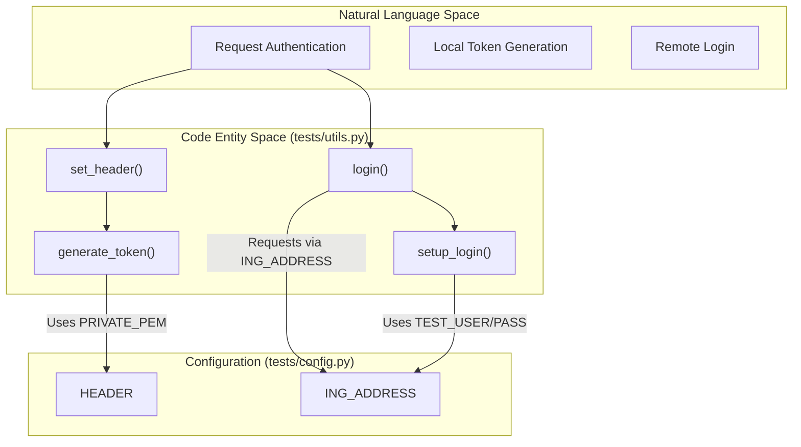
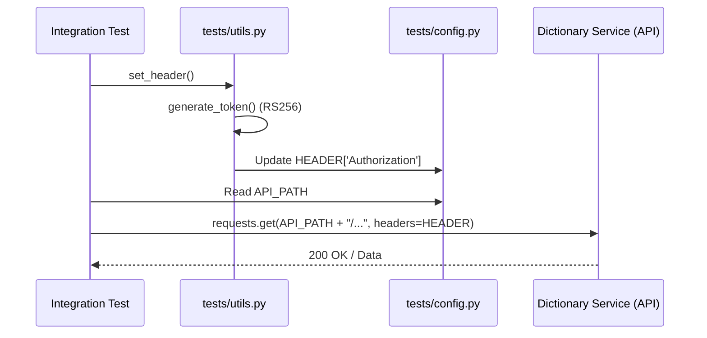

# Page: Test Infrastructure and Configuration

# Test Infrastructure and Configuration

Relevant source files

The following files were used as context for generating this wiki page:

- [tests/__init__.py](tests/__init__.py)
- [tests/config.py](tests/config.py)
- [tests/requirements.txt](tests/requirements.txt)
- [tests/utils.py](tests/utils.py)

This page documents the Python-based testing infrastructure used to validate the Ingenium Dictionary Service. The test suite is designed for integration testing, utilizing environment-aware configurations and a custom JWT generation mechanism to simulate authenticated requests against the service's REST API.

## Environment Configuration

The test suite relies on `tests/config.py` to manage service locations and authentication parameters. It utilizes environment variables to adapt to different execution environments (e.g., local development vs. CI/CD pipelines).

| Variable | Description | Default / Source |
| :--- | :--- | :--- |
| `INGENIUM_SERVER` | The base URL for the Ingenium ecosystem services. | `os.environ.get('INGENIUM_SERVER')` [tests/config.py:3]() |
| `DICT_SERVICE_URL` | The root URL of the Dictionary Service instance being tested. | `http://localhost:5000` [tests/config.py:8]() |
| `API_PATH` | The fully qualified base path for API v4 endpoints. | `{DICT_SERVICE_URL}/api/v4` [tests/config.py:9]() |
| `AUTH_ENDPOINT` | The relative path to the Ingenium Auth Service login. | `auth_service/api/v2/login` [tests/config.py:4]() |
| `USERNAME` / `PASSWORD` | Credentials used for real service-to-service login. | `os.environ.get` [tests/config.py:5-6]() |

**Sources:**
- [tests/config.py:1-11]()

## Dependency Management

The test environment is managed via `tests/requirements.txt`. The suite requires libraries for HTTP communication, JWT manipulation, and XML-based test reporting.

- **requests (2.23.0):** Used for making RESTful API calls to the service [tests/requirements.txt:1]().
- **PyJWT (1.7.1) & cryptography (2.9.2):** Used for generating and signing RS256 JWT tokens for authentication bypass during local testing [tests/requirements.txt:2-3]().
- **unittest-xml-reporting (2.4.0):** Generates JUnit-style XML reports for integration with CI/CD dashboards [tests/requirements.txt:4]().

**Sources:**
- [tests/requirements.txt:1-5]()

## Authentication and Utility Functions

The `tests/utils.py` module provides the logic for authenticating test requests. It supports two modes: authenticating against a real `auth_service` or generating a local token using a private key.

### Token Generation and Headers

For most integration tests, the suite generates a JWT locally to avoid a dependency on a running `auth_service`. This requires the `PRIVATE_PEM` environment variable to be set with a key that matches the `PUBLIC_PEM` used by the Fastify server.

- **`generate_token()`**: Creates a JWT with `RS256` algorithm. It includes scopes (`config_mgmt`, `admin`) and a 30-minute expiration window [tests/utils.py:32-44]().
- **`set_header()`**: Calls `generate_token()`, decodes it to a UTF-8 string, and updates the global `config.HEADER` with the `Bearer` token [tests/utils.py:46-48]().
- **`login()`**: Performs a real authentication flow by sending Basic Auth credentials to the `INGENIUM_SERVER`'s auth endpoint to retrieve a production token [tests/utils.py:23-30]().

### Configuration to Code Mapping: Auth Flow

The following diagram illustrates how the utility functions interact with the configuration and the external environment to prepare a request.

**Test Auth Logic Flow**

**Sources:**
- [tests/utils.py:13-48]()
- [tests/config.py:3-11]()

## Data Flow for Authenticated Requests

The testing infrastructure ensures that every API call made during a test run is properly authorized. The flow typically starts with a call to `set_header()`, which populates the `HEADER` dictionary used in subsequent `requests` calls.

**Authenticated Request Lifecycle**

**Sources:**
- [tests/utils.py:32-48]()
- [tests/config.py:7-9]()
- [tests/requirements.txt:1-2]()

## Key Pair Requirements

For the `generate_token()` function to work correctly, the test environment must have access to a private RSA key.

1. **`PRIVATE_PEM`**: An environment variable containing the RSA private key used by `tests/utils.py` [tests/utils.py:36-41]().
2. **`PUBLIC_PEM`**: The corresponding public key must be provided to the Fastify server (usually via environment variable or `secret.txt`) to allow the `auth.js` plugin to verify the signature [tests/utils.py:42]().

**Sources:**
- [tests/utils.py:32-44]()
