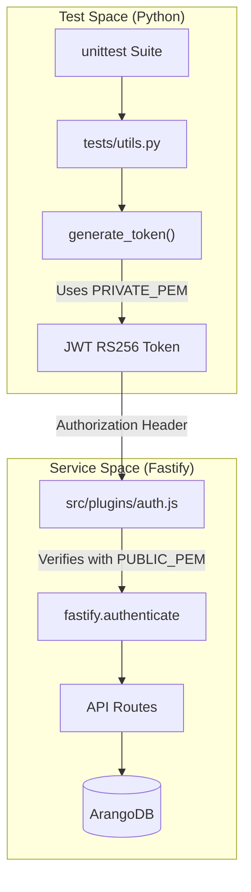
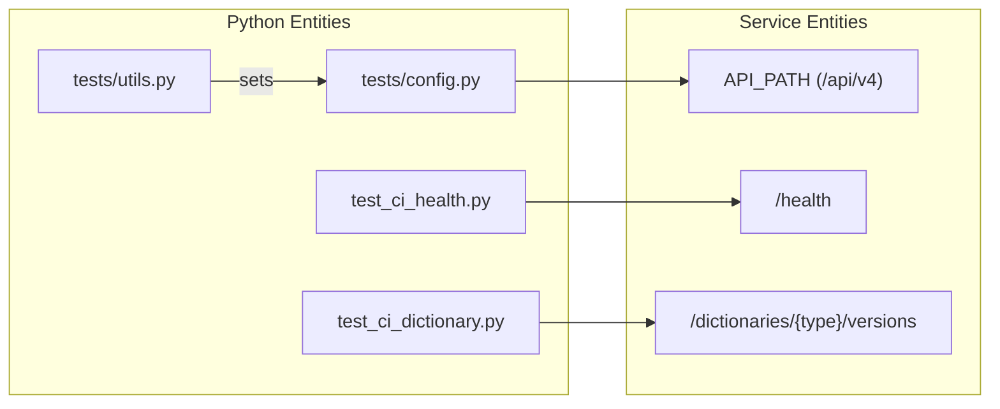

# Page: Testing

# Testing

Relevant source files

The following files were used as context for generating this wiki page:

- [tests/__init__.py](tests/__init__.py)
- [tests/config.py](tests/config.py)
- [tests/requirements.txt](tests/requirements.txt)
- [tests/utils.py](tests/utils.py)

The Ingenium Dictionary Service employs a Python-based integration testing suite located in the `tests/` directory. The suite is designed to validate the service's REST API endpoints against a running instance of the application and its ArangoDB backend. Unlike unit tests, these integration tests verify the full request-response lifecycle, including authentication, schema validation, and database persistence.

### Test Philosophy and Approach

The testing strategy focuses on "black-box" verification of the API. The suite simulates a client interacting with the service to ensure that the business logic (such as dictionary state transitions and cascade deletions) and data integrity (bulk inserts and queries) function as expected in a production-like environment.

The suite is built using the standard Python `unittest` framework, supplemented by `requests` for HTTP interaction and `PyJWT` for local token generation to bypass external authentication dependencies during CI/CD pipelines.

### Environment Setup and Execution

To run the test suite, the environment must have access to the target service URL and the necessary cryptographic keys for authentication.

1.  **Dependencies**: Install the required Python packages defined in `tests/requirements.txt`.
2.  **Configuration**: Set environment variables such as `DICT_SERVICE_URL` and `PRIVATE_PEM`. The `tests/config.py` file reads these variables to construct the `API_PATH`.
3.  **Execution**: Tests are typically executed via a test runner. The suite is configured to use `unittest-xml-reporting` to generate machine-readable reports in the `./test-reports/` directory for CI integration.

For detailed setup instructions and environment variable mappings, see **[Test Infrastructure and Configuration](#5.1)**.

### Test Suite Organization

The testing logic is divided into specialized modules, each targeting a specific functional area of the API.

| Module | Target Resource | Key Coverage |
| :--- | :--- | :--- |
| `test_ci_health.py` | `/health` | Public availability and service status. |
| `test_ci_dictionary.py` | `/dictionaries` | Dictionary CRUD, state transitions, and cascade-delete of child content. |
| `test_ci_dictionarycontent.py` | `/cmds`, `/evrs`, etc. | Bulk operations for Commands, EVRs, Channels, and MIL-1553 data. |
| `test_ci_vnv.py` | `/vnv/vis` | Verification Item lifecycle and bulk query filtering. |
| `test_ci_customscript.py` | `/custom_scripts` | Script registration, SHA256 ID verification, and retrieval. |

For a breakdown of individual test cases and validation logic, see **[Integration Test Suites](#5.2)**.

### Testing Architecture

The following diagram illustrates how the Python test suite interacts with the Service components and the security layer.

**Test Suite Interaction Flow**

Sources: [tests/utils.py:32-44](), [tests/config.py:1-11](), [tests/requirements.txt:1-5]()

### Code Entity Mapping

This diagram maps the Python testing utilities to the service endpoints and configuration entities they exercise.

**Component-to-Test Mapping**

Sources: [tests/config.py:3-11](), [tests/utils.py:9-11](), [tests/utils.py:46-48]()

***

**Child Pages:**
*   **[Test Infrastructure and Configuration](#5.1)**: Details on `config.py`, `utils.py`, and JWT token generation using `PRIVATE_PEM`.
*   **[Integration Test Suites](#5.2)**: Deep dive into the `test_ci_*.py` modules and XML reporting.
