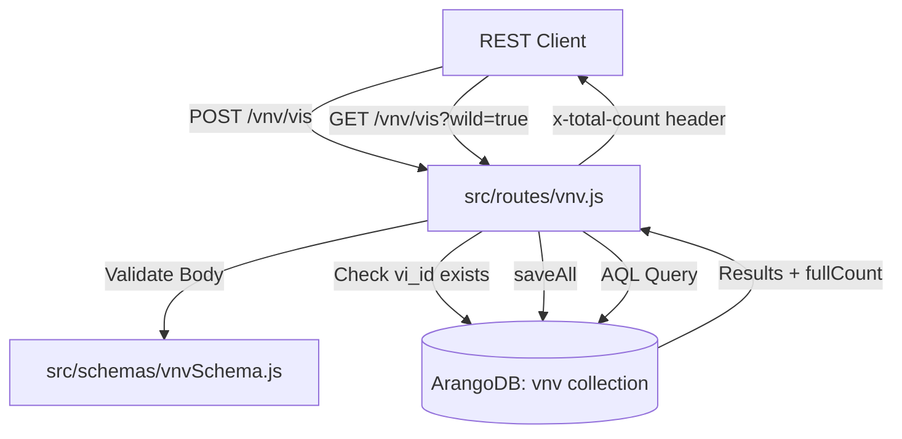
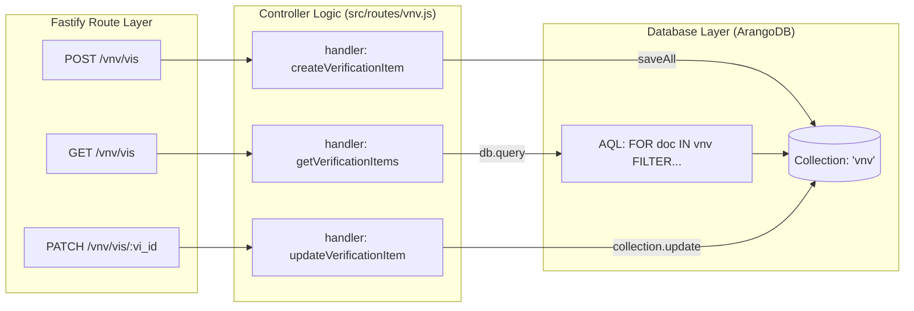

# Page: Verification and Validation (V&V) Endpoints

# Verification and Validation (V&V) Endpoints

Relevant source files

The following files were used as context for generating this wiki page:

- [dictionary_service.yaml](dictionary_service.yaml)
- [src/routes/vnv.js](src/routes/vnv.js)
- [src/schemas/vnvSchema.js](src/schemas/vnvSchema.js)

The Verification and Validation (V&V) endpoints provide a structured interface for managing **Verification Items (VIs)**. VIs are used within the Ingenium ecosystem to track requirements, channels, and commands against their verification activities and collections. These endpoints support full CRUD operations, bulk ingestion, and advanced filtering for UI-driven searches.

## VI Data Model

The data model for a Verification Item is defined in `src/schemas/vnvSchema.js`. It encapsulates both metadata and relationships to verification activities.

| Field | Type | Description |
| :--- | :--- | :--- |
| `vi_id` | String | Unique identifier for the VI (e.g., a requirement ID). |
| `vi_name` | String | Short descriptive name (e.g., "Thermal Control Logic"). |
| `vi_owner` | String | The point of contact or team responsible for the item. |
| `vi_type` | String | Category, typically `REQUIREMENT`, `CHANNEL`, or `COMMAND`. |
| `vi_text` | String | Full text description or requirement statement. |
| `vas` | Array (String) | List of associated Verification Activity IDs. |
| `vacs` | Array (String) | List of associated Verification Activity Collection IDs. |

**Sources:**
- [src/schemas/vnvSchema.js:6-44]()

## Data Flow: VI Lifecycle

The following diagram illustrates the interaction between the Fastify route handlers, the validation layer, and the ArangoDB collection named `vnv`.

### VI Management Logic
"Logic for CRUD and Search"

**Sources:**
- [src/routes/vnv.js:11-13]()
- [src/routes/vnv.js:16-70]()
- [src/routes/vnv.js:74-141]()

## Endpoint Reference

### Create Verification Items
`POST /api/v4/vnv/vis`
Accepts an array of VI objects. The service performs a conflict check to ensure none of the provided `vi_id` values already exist in the `vnv` collection before proceeding with a bulk insert using `collection.saveAll`.

*   **Status Codes:**
    *   `201`: Items created successfully.
    *   `409`: Conflict (one or more `vi_id` already exists). [src/routes/vnv.js:38-43]()

### Listing and Filtering
`GET /api/v4/vnv/vis`
Supports pagination via `limit` and `offset`, and sorting via `sort_by`.

**Filtering Logic:**
The endpoint supports a `wild` boolean parameter.
*   **Exact Match (`wild=false`):** Filters use the `==` operator in AQL. [src/routes/vnv.js:104-105]()
*   **Wildcard Match (`wild=true`):** Filters use `CONTAINS(LOWER(TO_STRING(...)), LOWER(...))` for case-insensitive partial matching. [src/routes/vnv.js:101]()

Available filters include `vi_id`, `vi_name`, `vi_owner`, `vi_type`, `vi_text`, `va_poc`, and `vac_name`. [src/routes/vnv.js:109-115]()

### Single Item Operations
*   **GET `/vnv/vis/:vi_id`**: Retrieves a VI by its user-defined ID using `collection.byExample({ vi_id })`. [src/routes/vnv.js:154-155]()
*   **PATCH `/vnv/vis/:vi_id`**: Performs a partial update. It first locates the internal ArangoDB `_key` and then executes `collection.update`. [src/routes/vnv.js:181-191]()
*   **DELETE `/vnv/vis/:vi_id`**: Removes the item by locating its `_key`. [src/routes/vnv.js:210-218]()

### Bulk Query
`POST /api/v4/vnv/vis/bulk`
Used primarily by the Ingenium UI to resolve a large list of `vi_id` strings into full objects. This uses a POST body to avoid URL length limitations associated with GET query strings.

**Sources:**
- [src/routes/vnv.js:146-235]()
- [src/schemas/vnvSchema.js:226-243]()

## Code Entity Mapping

The following diagram maps the API routes to the specific handler logic and database interactions.

### V&V System Mapping
"Code Entity to Infrastructure Map"

**Sources:**
- [src/routes/vnv.js:16-17]()
- [src/routes/vnv.js:74-75]()
- [src/routes/vnv.js:173-174]()
- [src/routes/vnv.js:119-127]()
