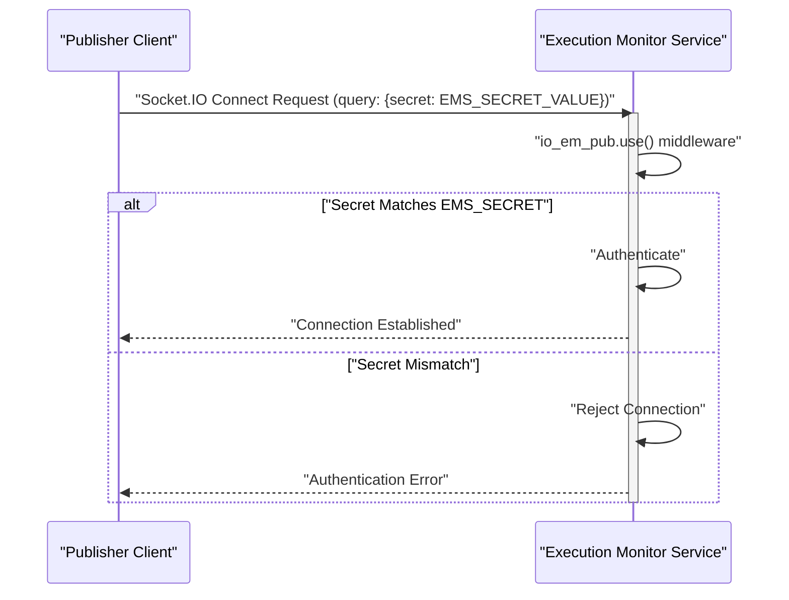

# Authentication and Security

<details>
<summary>Relevant source files</summary>

The following files were used as context for generating this wiki page:

- [image/index.js](image/index.js)
- [image/publish_example.js](image/publish_example.js)
- [image/subscribe_example.js](image/subscribe_example.js)

</details>


This page details the two-tier security model implemented in the execution-monitor-service. It covers the authentication mechanisms for both event publishers and subscribers, including how tokens are constructed and validated. Publishers use a shared secret for authentication, while subscribers rely on RS256 JSON Web Token (JWT) verification.

## Publisher Authentication (Shared Secret)

Publishers authenticate to the `/api/v2/execution_event_publish` Socket.IO namespace using a shared secret. This secret is provided as a query parameter during the WebSocket connection handshake.

The server expects the `secret` query parameter to match the value of the `EMS_SECRET` environment variable. If the secrets do not match, the connection is rejected with an "Authentication error."

### Implementation Details

The authentication logic for publishers is handled by a middleware function applied to the `io_em_pub` Socket.IO namespace [image/index.js:76-85]().

```javascript
io_em_pub.use(function(socket, next) {
  if (socket.handshake.query && socket.handshake.query.secret) {
    if (socket.handshake.query.secret == ems_secret) {
      next();
    } else {
      return next(new Error('Authentication error.'));
    }
  }  
})
```

The `ems_secret` variable is initialized from the `EMS_SECRET` environment variable [image/index.js:20]().

### Publisher Client Example

The `publish_example.js` script demonstrates how a publisher client connects and authenticates. It retrieves the `EMS_SECRET` from environment variables and includes it in the `query` object when initializing the Socket.IO client [image/publish_example.js:24-28,33-38]().

```javascript
var ems_secret = process.env.EMS_SECRET || '';
if (ems_secret == '') {
    console.log('EMS_SECRET is not defined');
    process.exit(0);
}
// ...
const socket = io(publish_url, {
    path: '/execution_monitor/socket.io',
    transport: ['websocket'],
    autoConnect: false,
    query: {secret: ems_secret}
});
```

### Publisher Authentication Flow



Sources:
- [image/index.js:20]()
- [image/index.js:76-85]()
- [image/publish_example.js:24-28]()
- [image/publish_example.js:33-38]()

## Subscriber Authentication (RS256 JWT)

Subscribers authenticate to the `/api/v2/execution_event_subscribe` Socket.IO namespace using a JSON Web Token (JWT). This JWT must be signed with an RS256 algorithm and verified using a public key. The token is provided as a query parameter during the WebSocket connection handshake.

The server expects the `token` query parameter to contain a valid JWT. The `jwt.verify` function is used with the `public_pem` (public key) and `RS256` algorithm to validate the token. If verification fails, the connection is rejected.

### Implementation Details

The authentication logic for subscribers is handled by a middleware function applied to the `io_em_sub` Socket.IO namespace [image/index.js:123-137]().

```javascript
io_em_sub.use(function(socket, next) {
  if (socket.handshake.query && socket.handshake.query.token) {
    try {
      jwt.verify(socket.handshake.query.token, public_pem, {algorithms: ['RS256']});
      log.info('jwt.verify ok');
      next();
    } catch (e) {
      log.error('jwt.verify error: %s', e);
      return next(new Error('Authentication error'));
    }
  } else {
      next(new Error('No authentication info was provided.'));
  }     
})
```

The `public_pem` variable is initialized from the `PUBLIC_PEM` environment variable [image/index.js:19](). The `jsonwebtoken` library is used for JWT operations [image/index.js:17]().

### Subscriber Client Example

The `subscribe_example.js` script demonstrates how a subscriber client generates and uses a JWT. It requires a `PRIVATE_PEM` environment variable to sign the token. The script constructs a payload with scopes, expiration (`exp`), issued at time (`iat`), and username, then signs it using `jwt.sign` with the `private_pem` and `RS256` algorithm [image/subscribe_example.js:18-42](). The resulting `encoded_token` is then included in the `query` object for the Socket.IO connection [image/subscribe_example.js:49-54]().

```javascript
var private_pem = process.env.PRIVATE_PEM || '';
if (private_pem == '') {
    console.log('PRIVATE_PEM is not defined');
    process.exit(0);
}
// ...
let payload = {
    'scopes': ['execute:wsts', 'execute:testbed', 'execute:sit', 'admin'],
    'exp':exp,
    'iat':iat,
    'username': username
}

let sign_options = {'algorithm': 'RS256'}

let encoded_token = jwt.sign({'scopes': ['execute:wsts', 'execute:testbed', 'execute:sit', 'admin'],
    'exp':exp,
    'iat':iat,
    'username': username},
    private_pem,
    sign_options)
// ...
const socket = io(subscribe_url, {
    path: '/execution_monitor/socket.io',
    transport: ['websocket'],
    autoConnect: false,
    query: {token: encoded_token, execution_id: execution_id}
});
```

### Subscriber Authentication Flow

```mermaid
sequenceDiagram
    participant S as "Subscriber Client"
    participant EMS as "Execution Monitor Service"
    participant JWT_Lib as "jsonwebtoken Library"
    S->>S: "Generate JWT (payload, PRIVATE_PEM, RS256)"
    S->>EMS: "Socket.IO Connect Request (query: {token: JWT_TOKEN})"
    activate EMS
    EMS->>EMS: "io_em_sub.use() middleware"
    EMS->>JWT_Lib: "jwt.verify(JWT_TOKEN, PUBLIC_PEM, {algorithms: ['RS256']})"
    activate JWT_Lib
    alt "Token Valid"
        JWT_Lib-->>EMS: "Verification Success"
        deactivate JWT_Lib
        EMS->>EMS: "Authenticate"
        EMS-->>S: "Connection Established"
    else "Token Invalid"
        JWT_Lib-->>EMS: "Verification Error"
        deactivate JWT_Lib
        EMS->>EMS: "Reject Connection"
        EMS-->>S: "Authentication Error"
    end
    deactivate EMS
```

Sources:
- [image/index.js:17]()
- [image/index.js:19]()
- [image/index.js:123-137]()
- [image/subscribe_example.js:18-42]()
- [image/subscribe_example.js:49-54]()

## Environment Variables for Security

The security mechanisms rely on specific environment variables being set in the service's environment:

*   **`EMS_SECRET`**: Used for shared-secret authentication by publishers.
*   **`PUBLIC_PEM`**: The public key (PEM format) used by the service to verify JWTs from subscribers.
*   **`PRIVATE_PEM`**: (Used by client examples, not the service itself) The private key (PEM format) used by subscriber clients to sign JWTs.

These variables are crucial for the proper functioning of the authentication system.

Sources:
- [image/index.js:19]()
- [image/index.js:20]()
- [image/publish_example.js:24]()
- [image/subscribe_example.js:18]()
