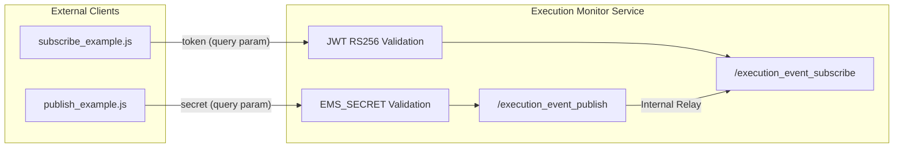
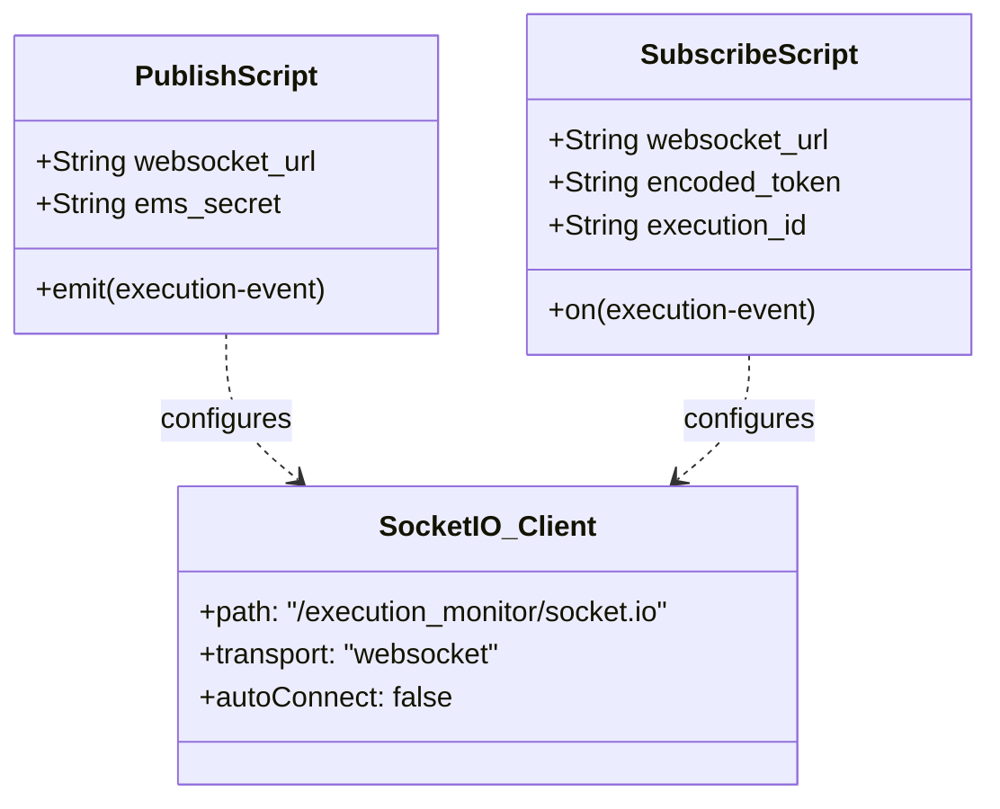

# Client Usage Examples

Relevant source files

The following files were used as context for generating this wiki page:

- [image/publish_example.js](image/publish_example.js)
- [image/subscribe_example.js](image/subscribe_example.js)

The `execution-monitor-service` provides two primary reference implementations in Node.js to demonstrate how external clients should interact with the WebSocket relay. These scripts serve as the functional baseline for implementing publishers (services generating events) and subscribers (UIs or monitoring tools consuming events).

Both examples utilize the `socket.io-client` library and demonstrate the specific connection parameters, such as the custom `path` and namespace-specific URLs required by the service's architecture.

### Conceptual Client Flow

The following diagram illustrates how the example scripts map to the service's internal namespaces and authentication requirements.

**Client-Service Interaction Map**

Sources: [image/publish_example.js:30-38](), [image/subscribe_example.js:46-54]()

---

### Publisher Pattern

The publisher pattern is intended for backend services that need to broadcast execution status updates. The provided example, `publish_example.js`, demonstrates how to authenticate using a shared secret and emit events to specific execution IDs.

Key characteristics of the publisher client:
*   **Authentication**: Uses the `EMS_SECRET` environment variable passed via the `secret` query parameter [image/publish_example.js:24-37]().
*   **Connection**: Connects to the `/execution_event_publish` namespace [image/publish_example.js:30]().
*   **Event Emission**: Uses `socket.emit('execution-event', ...)` to send payloads containing an `execution_id` and message body [image/publish_example.js:60-64]().

For a detailed walkthrough of the publisher implementation, see **[Publisher Example (publish_example.js)](#3.1)**.

Sources: [image/publish_example.js:1-68]()

---

### Subscriber Pattern

The subscriber pattern is used by clients (like the Ingenium UI) that need to listen for real-time updates for a specific execution. The `subscribe_example.js` script demonstrates the more complex handshake required for subscribers, including JWT generation.

Key characteristics of the subscriber client:
*   **Authentication**: Requires an RS256 signed JWT token generated using a private key (`PRIVATE_PEM`) [image/subscribe_example.js:18-42]().
*   **Room Subscription**: Passes an `execution_id` in the connection query parameters to automatically join the relevant Socket.IO room [image/subscribe_example.js:53]().
*   **Event Handling**: Listens for the `execution-event` name to receive relayed messages [image/subscribe_example.js:68-70]().

For a detailed walkthrough of the subscriber implementation, see **[Subscriber Example (subscribe_example.js)](#3.2)**.

Sources: [image/subscribe_example.js:1-76]()

---

### Script Comparison

The following table summarizes the technical differences between the two interaction patterns provided in the examples:

| Feature | Publisher (`publish_example.js`) | Subscriber (`subscribe_example.js`) |
| :--- | :--- | :--- |
| **Namespace** | `/execution_event_publish` | `/execution_event_subscribe` |
| **Auth Method** | Shared Secret (`EMS_SECRET`) | RS256 JWT (`token`) |
| **Primary Action** | `socket.emit('execution-event', ...)` | `socket.on('execution-event', ...)` |
| **Path Config** | `/execution_monitor/socket.io` | `/execution_monitor/socket.io` |
| **Targeting** | Included in every emit payload | Defined once during connection query |

Sources: [image/publish_example.js:30-64](), [image/subscribe_example.js:46-70]()

### Code Entity Association

This diagram bridges the script logic to the configuration required for successful communication with the service.

**Entity Mapping**

Sources: [image/publish_example.js:33-38](), [image/subscribe_example.js:49-54]()
