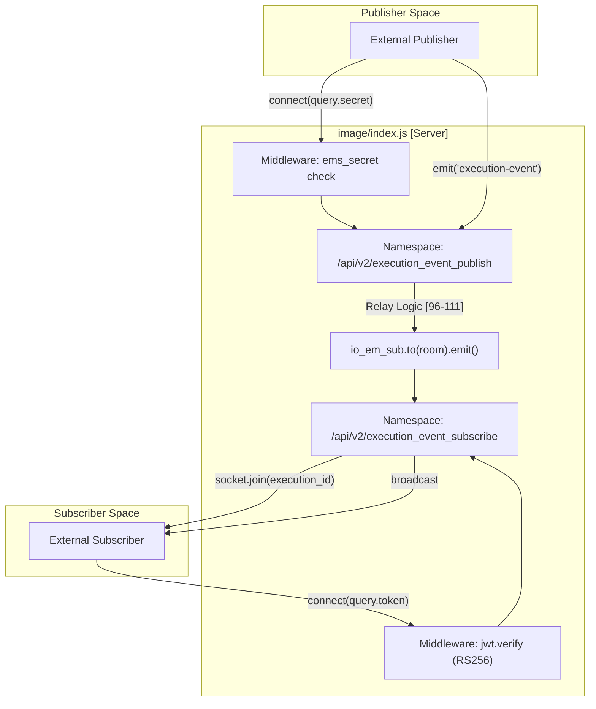

# Core Service Implementation

Relevant source files

The following files were used as context for generating this wiki page:

- [image/index.js](image/index.js)
- [image/package.json](image/package.json)

The `execution-monitor-service` is a Node.js application built using the **Express** framework and **Socket.IO**. Its primary responsibility is to act as a real-time event relay between publishers (services executing procedures) and subscribers (UI clients or monitoring tools).

The core logic resides within the `image/` directory, centered around a single-threaded event loop that manages multiple WebSocket namespaces, room-based message routing, and a two-tier authentication system.

## System Architecture Overview

The service utilizes a Hub-and-Spoke model where the `index.js` server acts as the central hub. It separates concerns by defining distinct Socket.IO namespaces for incoming events and outgoing broadcasts.

### Component Relationship Diagram
This diagram illustrates how the core code entities interact to facilitate the event relay.

**Relay Flow: Publisher to Subscriber**

**Sources:** [image/index.js:72-74](), [image/index.js:76-85](), [image/index.js:96](), [image/index.js:111](), [image/index.js:123-137]()

---

## Core Components

### Server Logic (index.js)
The entry point of the application initializes the HTTP server and Socket.IO namespaces. It configures global settings such as `pingTimeout` and `pingInterval` to manage connection liveness. The server manages two primary namespaces: `io_em_pub` for receiving events and `io_em_sub` for distributing them.

For details, see [Server Logic (index.js)](#2.1).

**Sources:** [image/index.js:1-13](), [image/index.js:72-73]()

### Authentication and Security
The service implements a bifurcated security model. Publishers must provide a plain-text `ems_secret` via handshake queries, while subscribers must provide a JSON Web Token (JWT) signed with RS256, which is verified against a `PUBLIC_PEM`.

For details, see [Authentication and Security](#2.2).

**Sources:** [image/index.js:19-20](), [image/index.js:78-80](), [image/index.js:127]()

### Event Flow: Publish and Subscribe
Messages are routed based on "rooms." When a publisher emits an `execution-event`, the server extracts the `execution_id` and broadcasts the message to a corresponding room in the subscriber namespace. A similar mechanism exists for `procedure-event`, which uses a composite room name of `procedure_id:version`.

For details, see [Event Flow: Publish and Subscribe](#2.3).

**Sources:** [image/index.js:89-96](), [image/index.js:102-111]()

### Web Monitoring UI (index.html)
The service serves a static HTML file at the root route (`/`). This interface allows developers to manually subscribe to execution IDs and view real-time event streams directly in the browser for debugging purposes.

For details, see [Web Monitoring UI (index.html)](#2.4).

**Sources:** [image/index.js:57-59]()

### Dependencies and Package Configuration
The application relies on a lean stack of Node.js libraries, including `express` for the web server, `socket.io` for WebSocket management, `jsonwebtoken` for security, and `winston` for structured logging.

For details, see [Dependencies and Package Configuration](#2.5).

**Sources:** [image/package.json:19-24]()

---

## Data Structures and Mapping

The following table maps natural language concepts to the specific code entities used in the implementation.

| Concept | Code Entity | File Reference |
| :--- | :--- | :--- |
| **Publisher Namespace** | `io_em_pub` | [image/index.js:72]() |
| **Subscriber Namespace** | `io_em_sub` | [image/index.js:73]() |
| **Execution Room** | `msg.execution_id` | [image/index.js:92-96]() |
| **Procedure Room** | ``${procedure_id}:${version}`` | [image/index.js:109-111]() |
| **Health Check** | `GET /api/v2/health` | [image/index.js:61-70]() |
| **Logger** | `winston.Logger` | [image/index.js:31-49]() |

**Sources:** [image/index.js:31](), [image/index.js:61](), [image/index.js:72-73](), [image/index.js:92](), [image/index.js:109]()
