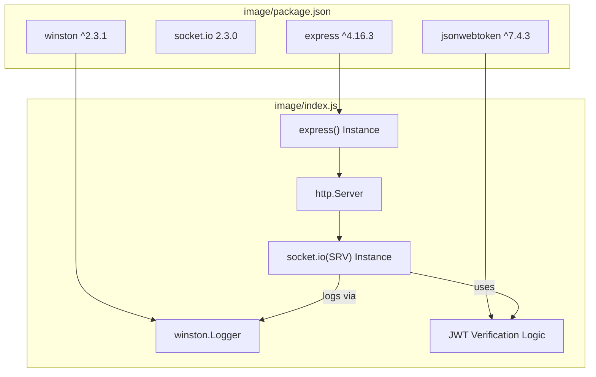
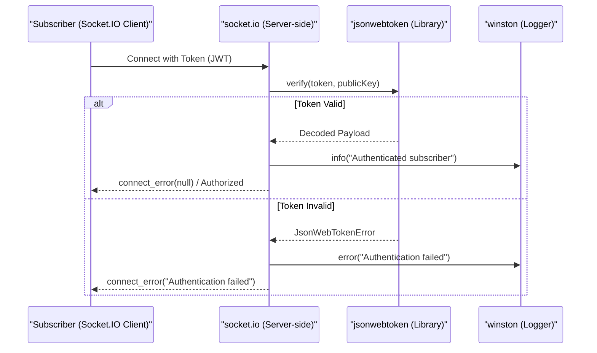

# Dependencies and Package Configuration

Relevant source files

The following files were used as context for generating this wiki page:

- [image/package-lock.json](image/package-lock.json)
- [image/package.json](image/package.json)

This page details the Node.js dependency stack and package configuration for the `execution-monitor-service`. The service relies on a minimal set of robust libraries to handle HTTP routing, real-time WebSocket communication, JSON Web Token (JWT) security, and structured logging.

## Package Manifest and Metadata

The service is defined as a Node.js application named `execution-monitor-service` at version `0.1.0` [image/package.json:2-3](). Its primary entry point is `index.js` [image/package.json:5](), which is invoked via the standard `npm start` command [image/package.json:7]().

### Core Scripts
| Script | Command | Purpose |
| :--- | :--- | :--- |
| `start` | `node index.js` | Launches the main execution monitor server. |
| `test` | `echo "Error: no test specified"` | Placeholder for unit tests (currently handled by external Python suite). |

Sources: [image/package.json:1-9]()

---

## Dependency Stack

The service utilizes four primary production dependencies to implement its publish/subscribe architecture.

### 1. Express (`^4.16.3`)
Express serves as the underlying HTTP web framework. It is used to:
*   Host the static monitoring UI (`index.html`).
*   Provide a `/health` endpoint for infrastructure monitoring.
*   Bootstrap the HTTP server required by Socket.IO.

### 2. Socket.IO (`2.3.0`)
Socket.IO is the core engine of the service. It provides the full-duplex communication layer between publishers (emitting events) and subscribers (receiving events). The service uses version `2.3.0` specifically to ensure compatibility with the event-relay logic and room management features.

### 3. JSON Web Token (`^7.4.3`)
The `jsonwebtoken` library is used to implement the subscriber security model. It handles:
*   Verification of RS256-signed tokens provided by subscribers.
*   Extraction of claims to ensure subscribers are authorized for specific namespaces.

### 4. Winston (`^2.3.1`)
Winston provides asynchronous, structured logging. It is configured within the service to output logs to the console, capturing connection events, authentication failures, and relay activities.

### Dependency Relationship Diagram

The following diagram illustrates how these packages are integrated within the `index.js` server logic.

**Server Dependency Integration**

Sources: [image/package.json:19-24](), [image/package-lock.json:6-24]()

---

## Dependency Locking and Resolution

The `package-lock.json` file ensures deterministic installs by locking the entire dependency tree, including transitive dependencies.

### Key Transitive Dependencies
*   **`body-parser` (1.18.2)**: Required by Express for parsing incoming request bodies [image/package-lock.json:69-85]().
*   **`ecdsa-sig-formatter` (1.0.11)**: A sub-dependency of `jsonwebtoken` used for handling cryptographic signatures [image/package-lock.json:164-171]().
*   **`debug` (2.6.9)**: Used internally by both Express and Socket.IO for development-time logging [image/package-lock.json:146-153]().

### Versioning Strategy
The project uses a mix of pinned versions and caret (`^`) ranges:
*   **Pinned**: `socket.io` is pinned to `2.3.0` to prevent breaking changes in the WebSocket protocol or namespace handling [image/package.json:22]().
*   **Caret**: `express`, `jsonwebtoken`, and `winston` use caret ranges, allowing for minor and patch updates that maintain backward compatibility [image/package.json:20-23]().

Sources: [image/package.json:19-24](), [image/package-lock.json:1-171]()

---

## Data Flow: Dependency Interaction

The following diagram maps the flow of a subscriber connection request through the entities defined by the dependencies.

**Connection and Authentication Flow**

Sources: [image/package.json:21-23](), [image/package-lock.json:51-55](), [image/package-lock.json:164-171]()
