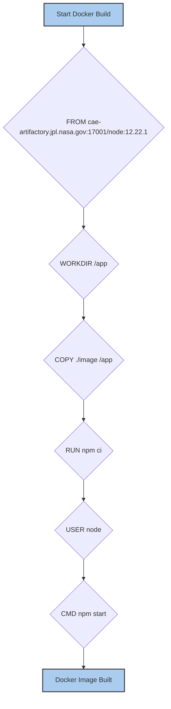

# 5.1. Docker Containerization

<details>
<summary>Relevant source files</summary>

The following files were used as context for generating this wiki page:

- [Dockerfile](Dockerfile)

</details>


This page details the Dockerfile used to containerize the `execution-monitor-service`. It covers the base image selection, working directory configuration, dependency installation, security practices, and the command used to start the service within the container.

## Dockerfile Structure and Purpose

The `Dockerfile` defines the steps to build a Docker image for the `execution-monitor-service`. This image encapsulates the application and its dependencies, ensuring a consistent and isolated environment for deployment.

### Base Image Selection

The container build process begins by specifying a base image:
```dockerfile
FROM cae-artifactory.jpl.nasa.gov:17001/node:12.22.1
```
This line [Dockerfile:1]() indicates that the image is built upon `node:12.22.1`, sourced from JPL's internal Artifactory registry (`cae-artifactory.jpl.nasa.gov:17001`). Using a specific version (`12.22.1`) ensures reproducibility and stability, while the Artifactory source provides a controlled and secure environment for base images.

Sources:
- [Dockerfile:1]()

### Working Directory

The `WORKDIR` instruction sets the working directory inside the container:
```dockerfile
WORKDIR /app
```
This means all subsequent commands, such as `COPY` and `RUN`, will be executed relative to `/app` [Dockerfile:2](). The application's source code is then copied into this directory:
```dockerfile
COPY ./image /app
```
The `./image` directory from the build context (which contains the application's source code) is copied to `/app` inside the container [Dockerfile:3]().

Sources:
- [Dockerfile:2]()
- [Dockerfile:3]()

### Dependency Installation

After copying the application code, Node.js dependencies are installed:
```dockerfile
RUN npm ci
```
The `npm ci` command [Dockerfile:4]() is used for clean installations of dependencies. Unlike `npm install`, `npm ci` is designed for automated environments like CI/CD pipelines. It installs dependencies strictly based on the `package-lock.json` file, ensuring that the exact versions of dependencies are used, which prevents unexpected changes due to new package versions.

Sources:
- [Dockerfile:4]()

### Security Practice: Non-Root User

For enhanced security, the container is configured to run as a non-root user:
```dockerfile
USER node
```
By switching to the `node` user [Dockerfile:5](), the application operates with reduced privileges. This is a best practice in container security, as it limits the potential damage if the application or container is compromised.

Sources:
- [Dockerfile:5]()

### Entrypoint Command

Finally, the `CMD` instruction specifies the command to execute when the container starts:
```dockerfile
CMD npm start
```
This command [Dockerfile:7]() initiates the `execution-monitor-service` by running the `start` script defined in the application's `package.json`. This script typically executes the main application file (e.g., `node index.js`).

Sources:
- [Dockerfile:7]()

## Docker Build Process Flow

The following diagram illustrates the sequence of operations performed by the `Dockerfile` to build the `execution-monitor-service` Docker image.


**Diagram 1: Dockerfile Build Steps**

Sources:
- [Dockerfile:1-7]()

## Container Runtime Behavior

When a Docker container is launched from the built image, the `npm start` command is executed as the `node` user within the `/app` directory. This initiates the `execution-monitor-service`, making it ready to handle WebSocket connections and HTTP requests.

```mermaid
graph TD
    A[Docker Container Start] --> B{Execute CMD ["npm", "start"]};
    B --> C{Application "execution-monitor-service" starts};
    C --> D[Listen for "HTTP" and "WebSocket" connections];
    D --> E[Process "publish" and "subscribe" events];
    E --> F[Relay "execution-event" and "procedure-event" messages];
    F --> G[Service Running];

    style A fill:#ace,stroke:#333,stroke-width:2px;
    style G fill:#ace,stroke:#333,stroke-width:2px;
```
**Diagram 2: Container Runtime Flow**

Sources:
- [Dockerfile:7]()
