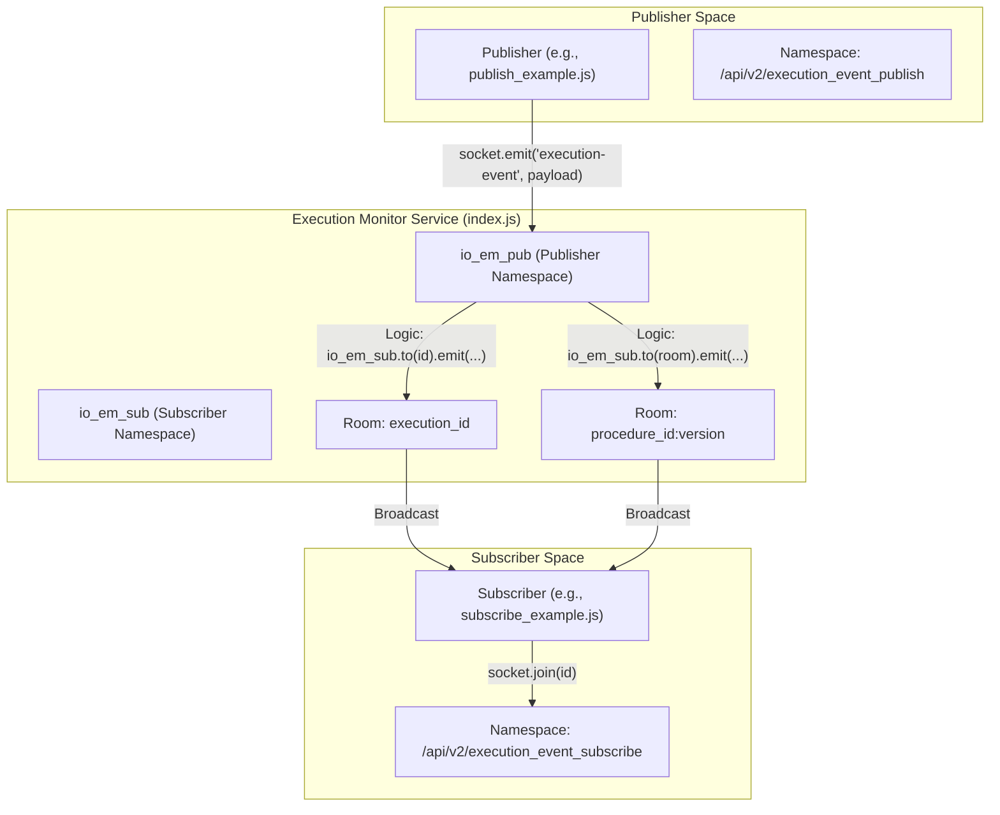
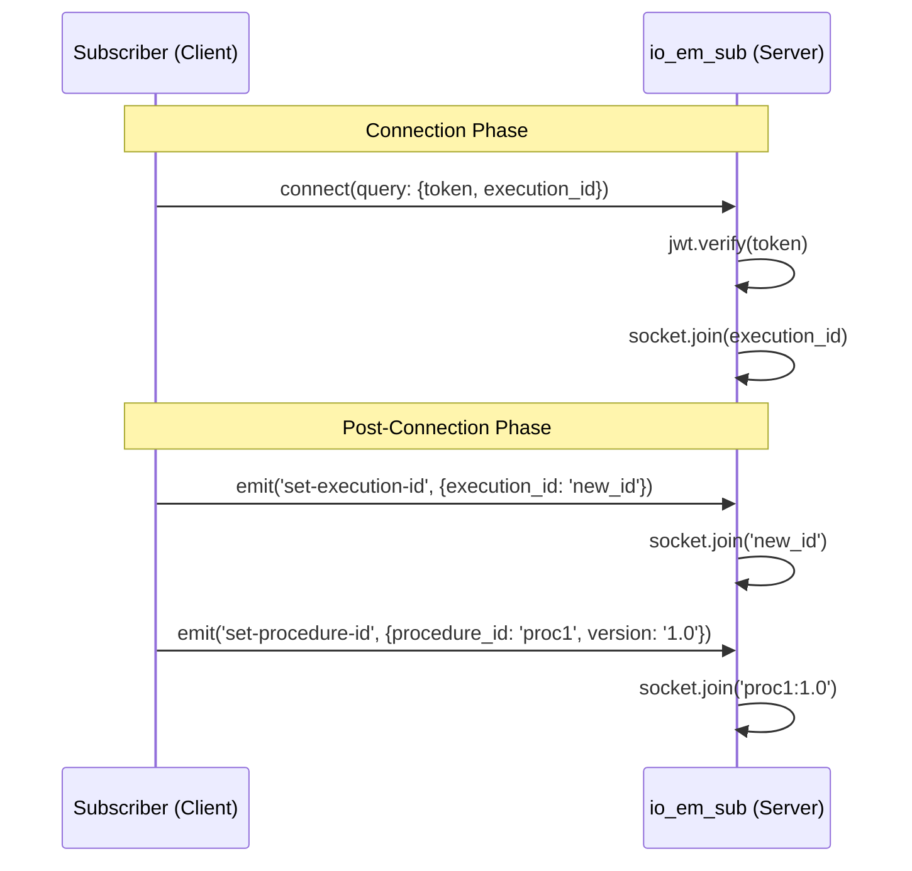

# Event Flow: Publish and Subscribe

<details>
<summary>Relevant source files</summary>

The following files were used as context for generating this wiki page:

- [image/index.js](image/index.js)
- [image/publish_example.js](image/publish_example.js)
- [image/subscribe_example.js](image/subscribe_example.js)

</details>


This page describes the end-to-end data flow within the `execution-monitor-service`. It covers how events are ingested from publishers, how the service manages internal routing via Socket.IO rooms, and how messages are broadcasted across namespaces to authenticated subscribers.

## Overview of the Relay Mechanism

The service acts as a real-time bridge between two distinct Socket.IO namespaces: `/api/v2/execution_event_publish` and `/api/v2/execution_event_subscribe` [image/index.js:72-73](). Unlike a standard chat application where clients in the same room communicate, this service implements a unidirectional relay where events received in the "publish" namespace are programmatically cross-broadcasted to the "subscribe" namespace [image/index.js:96]().

### Data Flow Diagram: Publisher to Subscriber

The following diagram illustrates the path of a message from a publisher to a subscriber, highlighting the transition between namespaces and the room-based filtering.

**Message Relay Flow**

Sources: [image/index.js:72-115](), [image/index.js:138-167](), [image/publish_example.js:60-64](), [image/subscribe_example.js:49-54]()

---

## Message Types and Room Naming

The service handles two primary event types, each with its own room naming convention to ensure precise targeting of messages.

### 1. Execution Events
These events represent updates for a specific execution instance.
- **Event Name**: `execution-event` [image/index.js:89]()
- **Room Name**: The value of `msg.execution_id` [image/index.js:92-95]()
- **Logic**: When a publisher emits an `execution-event`, the service extracts the `execution_id` and tells the subscriber namespace (`io_em_sub`) to emit that same message only to the room named after that ID [image/index.js:96]().

### 2. Procedure Events
These events represent updates for a procedure definition, often spanning multiple executions.
- **Event Name**: `procedure-event` [image/index.js:102]()
- **Room Name Convention**: `{procedure_id}:{version}` [image/index.js:109]()
- **Logic**: The service concatenates the `procedure_id` and `version` from the message payload to form a unique room string. It then broadcasts the event to that specific room in the subscriber namespace [image/index.js:111]().

| Message Type | Publisher Event Name | Subscriber Room | Payload Key(s) |
| :--- | :--- | :--- | :--- |
| **Execution** | `execution-event` | `execution_id` | `execution_id` |
| **Procedure** | `procedure-event` | `procedure_id:version` | `procedure_id`, `version` |

Sources: [image/index.js:89-115]()

---

## Subscription and Room Management

Subscribers join rooms to receive filtered traffic. This can happen during the initial connection or dynamically after the connection is established.

### Initial Subscription
A subscriber can join an execution room immediately upon connecting by providing an `execution_id` in the connection query string [image/index.js:142-145]().

### Dynamic Subscription
The `io_em_sub` namespace listens for specific events that allow a client to join additional rooms without reconnecting:
- **`set-execution-id`**: The client provides an `execution_id`, and the server calls `socket.join(data.execution_id)` [image/index.js:150-153]().
- **`set-procedure-id`**: The client provides `procedure_id` and `version`, and the server joins them to the formatted `{procedure_id}:{version}` room [image/index.js:159-163]().

**Subscriber Room Management Logic**

Sources: [image/index.js:123-167](), [image/subscribe_example.js:49-54]()

---

## Implementation Details

### Cross-Namespace Broadcasting
The core of the relay logic is the use of the `to()` method on the **target** namespace while inside the listener of the **source** namespace:

```javascript
// Inside io_em_pub connection listener
socket.on('execution-event', function(msg) {
    let execution_id = msg.execution_id;
    if (execution_id) {
        // Broadcast to the OTHER namespace's room
        io_em_sub.to(execution_id).emit('execution-event', msg);
    }
});
```
[image/index.js:89-96]()

### Payload Persistence
The service does not modify the message payload. It acts as a transparent relay, passing the JSON object received from the publisher directly to the subscribers in the relevant room [image/index.js:96](), [image/index.js:111]().

### Error Handling in Flow
- If a publisher sends an event without the required ID (`execution_id` or `procedure_id`), the service logs a warning and drops the message [image/index.js:98](), [image/index.js:113]().
- If a subscriber fails JWT verification during the connection handshake, the `next(new Error(...))` call prevents the socket from ever joining the namespace or any rooms [image/index.js:130-132]().

Sources: [image/index.js:89-136]()
