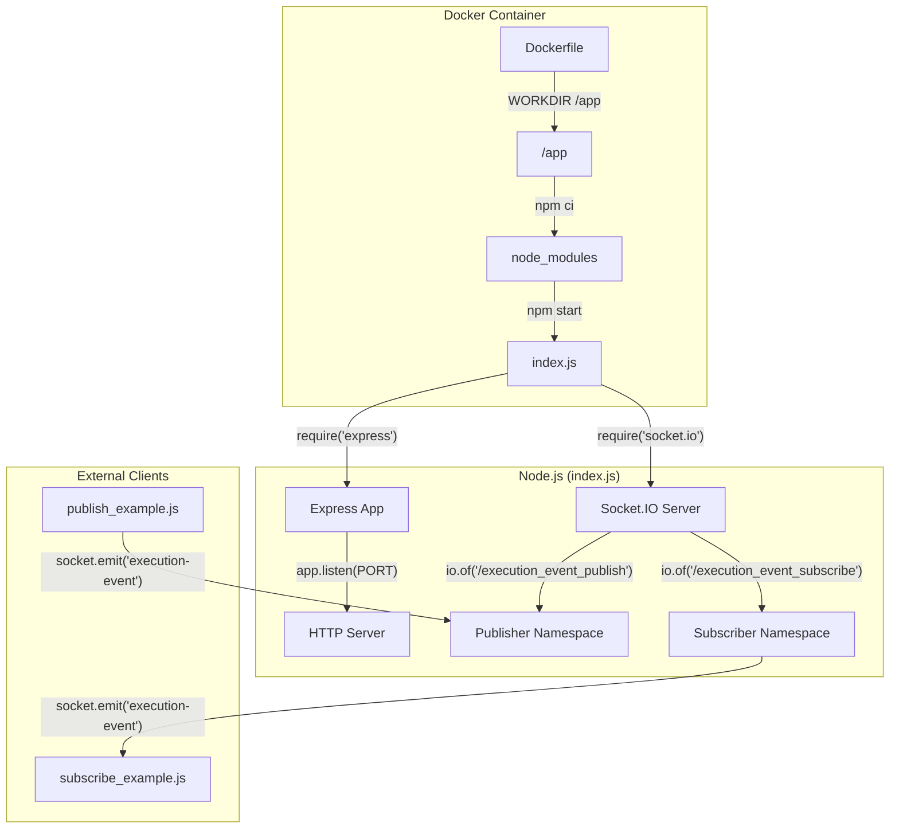
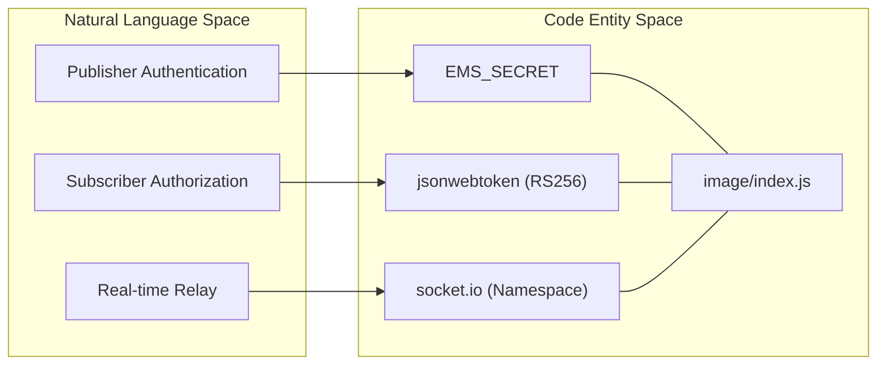

# Getting Started

<details>
<summary>Relevant source files</summary>

The following files were used as context for generating this wiki page:

- [Dockerfile](Dockerfile)
- [image/package-lock.json](image/package-lock.json)
- [image/package.json](image/package.json)

</details>


This page provides technical instructions for setting up, configuring, and running the **Execution Monitor Service (EMS)**. The service is a Node.js application that utilizes Socket.IO to relay real-time execution and procedure events between publishers and subscribers.

## Local Setup and Installation

The service is built on Node.js and requires a standard environment to run locally.

### Prerequisites
* **Node.js**: Version 12.22.1 is the tested base for this service [Dockerfile:1-1]().
* **npm**: Used for dependency management.

### Installation Steps
1. Navigate to the `image/` directory where the source code resides [image/package.json:1-5]().
2. Install dependencies using `npm ci` to ensure a clean install based on the lockfile [image/package-lock.json:1-5]().
3. Start the service using the defined npm script [image/package.json:7-7]().

```bash
cd image
npm ci
npm start
```

### Dependency Stack
The service relies on four primary production dependencies [image/package.json:19-24]():
* `express`: Web framework for HTTP endpoints.
* `socket.io`: Real-time bidirectional event-based communication.
* `jsonwebtoken`: For RS256 JWT verification of subscribers.
* `winston`: Logging subsystem.

Sources: [image/package.json:1-25](), [image/package-lock.json:1-40](), [Dockerfile:1-4]()

## Configuration and Environment Variables

The service behavior is controlled through environment variables. These are consumed by the server logic to determine security keys and connection parameters.

| Variable | Description | Requirement |
| :--- | :--- | :--- |
| `EMS_SECRET` | Shared secret used to authenticate publishers. | Required for Publishing |
| `PUBLIC_PEM` | RSA Public Key used to verify JWTs for subscribers. | Required for Subscribing |
| `PRIVATE_PEM` | RSA Private Key (used in example scripts to generate tokens). | Required for Examples |
| `PORT` | The port on which the Express server listens (defaults to 3000). | Optional |

Sources: [image/package.json:19-24](), [Dockerfile:1-7]()

## Docker-Based Workflow

The service is containerized for consistent deployment across environments. The `Dockerfile` uses a specific Node.js base image from the JPL Artifactory.

### Docker Implementation Details
* **Base Image**: `node:12.22.1` [Dockerfile:1-1]().
* **Working Directory**: `/app` [Dockerfile:2-2]().
* **Security**: The container runs as the non-root `node` user [Dockerfile:5-5]().
* **Execution**: The entrypoint is `npm start`, which executes `node index.js` [Dockerfile:7-7](), [image/package.json:7-7]().

### Building and Running the Container
```bash
# Build the image
docker build -t execution-monitor-service .

# Run the container with environment variables
docker run -p 3000:3000 \
  -e EMS_SECRET="your_secret" \
  -e PUBLIC_PEM="$(cat public.pem)" \
  execution-monitor-service
```

Sources: [Dockerfile:1-7](), [image/package.json:6-9]()

## System Data Flow

The following diagram illustrates the initialization and data flow between the Docker environment, the Node.js `index.js` server, and the external clients.

### Initialization and Execution Flow
Title: Service Startup and Request Handling

Sources: [Dockerfile:1-7](), [image/package.json:19-24](), [image/package.json:7-7]()

## Verification and Testing

Once the service is running, you can verify its health and connectivity.

### Health Check
The service provides a `/health` endpoint that can be used by CI/CD pipelines or load balancers to verify status.
* **URL**: `http://localhost:3000/health`
* **Method**: `GET`

### Web Monitoring UI
The service serves a built-in monitoring interface at the root URL (`/`) using `index.html`. This allows developers to manually input an `execution_id` and a `jwt_token` to monitor events in the browser.

### Entity Mapping
Title: Code Entity Mapping

Sources: [image/package.json:19-24](), [Dockerfile:1-7]()
