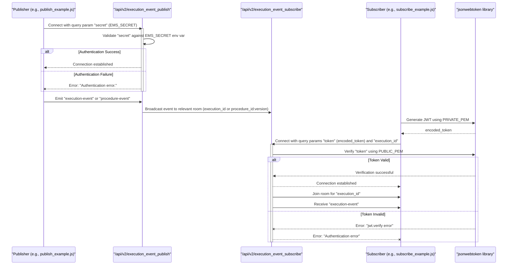

# Glossary

<details>
<summary>Relevant source files</summary>

The following files were used as context for generating this wiki page:

- [Dockerfile](Dockerfile)
- [Jenkinsfile](Jenkinsfile)
- [README.md](README.md)
- [image/index.html](image/index.html)
- [image/index.js](image/index.js)
- [image/publish_example.js](image/publish_example.js)
- [image/subscribe_example.js](image/subscribe_example.js)
- [tests/config.py](tests/config.py)

</details>


This page defines key terms, abbreviations, and concepts specific to the `execution-monitor-service` codebase. It aims to provide an onboarding engineer with a clear understanding of the system's vocabulary, linking each definition to its relevant implementation details within the code.

## Terms and Concepts

### `execution-monitor-service`
The primary service described by this codebase. It is a Node.js application that acts as a real-time WebSocket relay for procedure and execution events within the Ingenium platform. Its main function is to receive events from publishers and broadcast them to authorized subscribers. [README.md:1-2]()

### `Socket.IO`
A JavaScript library for real-time web applications. It enables real-time, bidirectional, event-based communication between web clients and servers. The `execution-monitor-service` uses `Socket.IO` for both publishing and subscribing to events. [image/index.js:13]()

### `Namespace`
In `Socket.IO`, a namespace is a way to separate the logic of your application over a single shared connection. The `execution-monitor-service` defines two main namespaces:
*   `/api/v2/execution_event_publish`: Used by event publishers. [image/index.js:72]()
*   `/api/v2/execution_event_subscribe`: Used by event subscribers. [image/index.js:73]()

### `Publisher`
An entity that sends `execution-event` or `procedure-event` messages to the `execution-monitor-service`. Publishers must authenticate using a shared secret (`EMS_SECRET`). [image/index.js:76-84]()
Sources:
*   [image/index.js:76-84]()
*   [image/publish_example.js:33-37]()

### `Subscriber`
An entity that receives `execution-event` or `procedure-event` messages from the `execution-monitor-service`. Subscribers must authenticate using a JSON Web Token (JWT) signed with `RS256` and verified against `PUBLIC_PEM`. [image/index.js:123-136]()
Sources:
*   [image/index.js:123-136]()
*   [image/subscribe_example.js:49-53]()

### `execution-event`
A type of message emitted by publishers and relayed to subscribers. These events are typically associated with a specific `execution_id`. [image/index.js:89-100]()
Sources:
*   [image/index.js:89-100]()
*   [image/publish_example.js:60]()
*   [image/subscribe_example.js:68-70]()

### `procedure-event`
A type of message emitted by publishers and relayed to subscribers. These events are associated with a `procedure_id` and a `version`. [image/index.js:102-114]()
Sources:
*   [image/index.js:102-114]()

### `execution_id`
A unique identifier for a specific execution. Subscribers can join a "room" corresponding to an `execution_id` to receive only events related to that execution. [image/index.js:94-96]()
Sources:
*   [image/index.js:94-96]()
*   [image/index.js:142-145]()
*   [image/index.html:19-20]()

### `procedure_id`
A unique identifier for a specific procedure. Along with `version`, it forms a room name for `procedure-event` subscriptions. [image/index.js:109-110]()
Sources:
*   [image/index.js:109-110]()
*   [image/index.js:160-162]()

### `version`
The version of a procedure. Used in conjunction with `procedure_id` to form a room name for `procedure-event` subscriptions. [image/index.js:109-110]()
Sources:
*   [image/index.js:109-110]()
*   [image/index.js:160-162]()

### `Room`
In `Socket.IO`, a room is an arbitrary channel that sockets can `join` and `leave`. Messages can be broadcast to all sockets in a given room. The `execution-monitor-service` uses `execution_id` and `procedure_id:version` as room names. [image/index.js:95-96]()
Sources:
*   [image/index.js:95-96]()
*   [image/index.js:109-110]()
*   [image/index.js:145]()
*   [image/index.js:162]()

### `EMS_SECRET`
An environment variable holding a shared secret used for authenticating publishers to the `/api/v2/execution_event_publish` namespace. [image/index.js:20]()
Sources:
*   [image/index.js:20]()
*   [image/publish_example.js:26-28]()

### `PUBLIC_PEM`
An environment variable holding the public key (in PEM format) used to verify JWTs provided by subscribers for authentication to the `/api/v2/execution_event_subscribe` namespace. [image/index.js:19]()
Sources:
*   [image/index.js:19]()
*   [image/index.js:127]()

### `PRIVATE_PEM`
An environment variable holding the private key (in PEM format) used by clients to sign JWTs for subscriber authentication. This is used in the `subscribe_example.js` to generate tokens. [image/subscribe_example.js:18-20]()
Sources:
*   [image/subscribe_example.js:18-20]()
*   [image/subscribe_example.js:41-43]()

### `JWT (JSON Web Token)`
A compact, URL-safe means of representing claims to be transferred between two parties. Subscribers use JWTs for authentication. The service expects JWTs signed with the `RS256` algorithm. [image/index.js:127]()
Sources:
*   [image/index.js:127]()
*   [image/subscribe_example.js:37-43]()

### `Winston`
A versatile logging library for Node.js. The `execution-monitor-service` uses Winston for structured logging, with configurable log levels and console transport. [image/index.js:31-47]()
Sources:
*   [image/index.js:31-47]()
*   [image/index.js:51]()

### `Express`
A minimal and flexible Node.js web application framework that provides a robust set of features for web and mobile applications. The `execution-monitor-service` uses Express to handle HTTP routes like `/` (for the monitoring UI) and `/api/v2/health`. [image/index.js:1]()
Sources:
*   [image/index.js:1]()
*   [image/index.js:57-70]()

### `Health Check`
An HTTP endpoint (`/api/v2/health`) that returns a simple JSON response indicating the service's operational status. Used by monitoring systems and CI/CD pipelines to verify service availability. [image/index.js:61-70]()
Sources:
*   [image/index.js:61-70]()
*   [tests/config.py:10-13]()

### `Dockerfile`
A text document that contains all the commands a user could call on the command line to assemble an image. It defines how the `execution-monitor-service` is containerized. [Dockerfile:1-7]()
Sources:
*   [Dockerfile:1-7]()

### `Jenkinsfile`
A text file that defines a Jenkins Pipeline. It specifies the CI/CD process for the `execution-monitor-service`, including building Docker images and running tests based on the branch name. [Jenkinsfile:1-94]()
Sources:
*   [Jenkinsfile:1-94]()

## System Architecture Overview

The following diagram illustrates the high-level interaction between publishers, the `execution-monitor-service`, and subscribers, highlighting the key components and authentication mechanisms.

```mermaid
graph TD
    subgraph "Ingenium Platform"
        P[Publisher] -->|1. Authenticate with EMS_SECRET| EMS_PUB(execution_event_publish Namespace)
        EMS_PUB -->|2. Emit execution-event/procedure-event| EMS_SVC(execution-monitor-service)
        EMS_SVC -->|3. Broadcast to Room| EMS_SUB(execution_event_subscribe Namespace)
        EMS_SUB -->|4. Authenticate with JWT (PUBLIC_PEM)| S[Subscriber]
    end

    style P fill:#f9f,stroke:#333,stroke-width:2px
    style S fill:#ccf,stroke:#333,stroke-width:2px
    style EMS_SVC fill:#afa,stroke:#333,stroke-width:2px
    style EMS_PUB fill:#fcf,stroke:#333,stroke-width:1px
    style EMS_SUB fill:#cff,stroke:#333,stroke-width:1px
```
Title: Execution Monitor Service High-Level Architecture
Sources:
*   [image/index.js:72-73]()
*   [image/index.js:76-84]()
*   [image/index.js:89-114]()
*   [image/index.js:123-136]()
*   [image/publish_example.js:33-37]()
*   [image/subscribe_example.js:49-53]()

## Authentication Flow

This diagram details the authentication process for both publishers and subscribers.


Title: Publisher and Subscriber Authentication Flow
Sources:
*   [image/index.js:19-20]()
*   [image/index.js:76-84]()
*   [image/index.js:123-136]()
*   [image/publish_example.js:26-28]()
*   [image/publish_example.js:33-37]()
*   [image/subscribe_example.js:18-20]()
*   [image/subscribe_example.js:37-43]()
*   [image/subscribe_example.js:49-53]()
