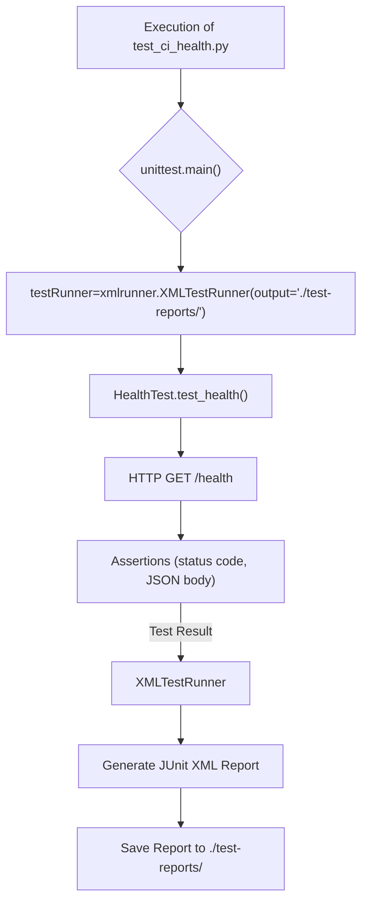

# Health Check Test (test_ci_health.py)

<details>
<summary>Relevant source files</summary>

The following files were used as context for generating this wiki page:

- [tests/config.py](tests/config.py)
- [tests/test_ci_health.py](tests/test_ci_health.py)

</details>


This page details the `HealthTest` class defined in `test_ci_health.py` [tests/test_ci_health.py:12-32](). This test is crucial for Continuous Integration (CI) pipelines as it verifies the basic operational status of the `execution-monitor-service` by performing a health check. It constructs a `/health` URL, sends an HTTP GET request, and asserts on the response status code and body. The test also integrates with `unittest-xml-reporting` to generate XML reports suitable for CI systems.

## HealthTest Class Implementation

The `HealthTest` class inherits from `unittest.TestCase` [tests/test_ci_health.py:12]() and contains a single test method, `test_health` [tests/test_ci_health.py:19-32]().

### Test Setup and Teardown

The `setUp` [tests/test_ci_health.py:13-14]() and `tearDown` [tests/test_ci_health.py:16-17]() methods are currently empty, indicating no specific setup or teardown actions are required before or after each test run for this particular health check.

### `test_health` Method

The `test_health` method performs the following steps:

1.  **URL Construction**: It constructs the full `/health` endpoint URL. The base host is retrieved from `shared_dict['host']` [tests/test_ci_health.py:20](), which is populated in `config.py` [tests/config.py:13]() with the `api_path` [tests/config.py:11]() (e.g., `http://127.0.0.1:3000/api/v2`). The `/health` path is then appended to this base URL.
    Sources:
    *   [tests/test_ci_health.py:20]()
    *   [tests/config.py:11-13]()

2.  **HTTP GET Request**: An HTTP GET request is sent to the constructed URL using the `requests` library [tests/test_ci_health.py:26](). The request includes `Content-Type` and `Accept` headers set to `application/json` [tests/test_ci_health.py:24-25]().
    Sources:
    *   [tests/test_ci_health.py:24-27]()

3.  **Assertions**:
    *   The test asserts that the HTTP response status code is `200` (OK) [tests/test_ci_health.py:28]().
    *   The response body, which is expected to be JSON, is parsed into a dictionary [tests/test_ci_health.py:29]().
    *   Finally, it asserts that the `status` field within the JSON response body is equal to `'OK'` [tests/test_ci_health.py:31]().
    Sources:
    *   [tests/test_ci_health.py:28-31]()

The `logger.debug` calls [tests/test_ci_health.py:22](), [tests/test_ci_health.py:27]() are used to output the URL being tested and the raw response text for debugging purposes.

### Diagram: Health Check Test Flow

```mermaid
graph TD
    A[Start test_health] --> B{Retrieve 'host' from shared_dict};
    B --> C[Construct URL: shared_dict['host'] + "/health"];
    C --> D{Set Headers: "Content-Type: application/json", "Accept: application/json"};
    D --> E[Send HTTP GET Request to URL];
    E --> F{Receive HTTP Response};
    F --> G{Assert Response Status Code == 200};
    G -- "If 200" --> H{Parse Response Body as JSON};
    H --> I{Assert JSON['status'] == "OK"};
    I --> J[Test Passed];
    G -- "If not 200" --> K[Test Failed];
    I -- "If not 'OK'" --> K;
```
Sources:
*   [tests/test_ci_health.py:20-31]()
*   [tests/config.py:13]()

### XML Report Generation

The `if __name__ == '__main__':` block [tests/test_ci_health.py:33-34]() ensures that when `test_ci_health.py` is executed directly, the tests are run using `xmlrunner.XMLTestRunner` [tests/test_ci_health.py:34](). This runner generates JUnit-style XML test reports in the `./test-reports/` directory, which is a standard practice for CI/CD pipelines to collect and display test results.
Sources:
*   [tests/test_ci_health.py:33-34]()

### Diagram: Test Execution and Reporting


Sources:
*   [tests/test_ci_health.py:19-32]()
*   [tests/test_ci_health.py:34]()
