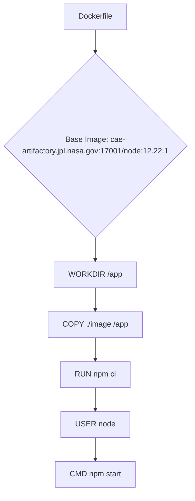

# Infrastructure and CI/CD

<details>
<summary>Relevant source files</summary>

The following files were used as context for generating this wiki page:

- [Dockerfile](Dockerfile)
- [Jenkinsfile](Jenkinsfile)

</details>


This section provides a high-level overview of the containerization and continuous integration/continuous deployment (CI/CD) setup for the `execution-monitor-service`. It covers how the service is packaged into a Docker image and how changes are automatically built, tested, and deployed using a Jenkins pipeline. Detailed explanations for Docker and Jenkins are provided in their respective child pages.

## 5.1. Docker Containerization

The `execution-monitor-service` is containerized using Docker to ensure consistent environments across development, testing, and production. The Dockerfile defines the steps to build the service's image, including specifying the base image, setting up the working directory, installing dependencies, and defining the command to run the application. This approach facilitates portability and simplifies deployment. For details, see [Docker Containerization](#5.1).


Sources: [Dockerfile:1-7]()

## 5.2. Jenkins CI Pipeline

The Jenkins CI pipeline automates the build, test, and deployment processes for the `execution-monitor-service`. It uses a declarative `Jenkinsfile` to define stages and steps, with conditional logic based on the branch name. This pipeline distinguishes between the `devel` branch, which triggers image builds and updates, and other branches (like feature branches or pull requests), which trigger image builds and repository tests. The pipeline also includes post-execution notifications and workspace cleanup. For details, see [Jenkins CI Pipeline](#5.2).

```mermaid
graph TD
    A[Jenkinsfile] --> B{Branch Name?};
    B -- "devel" --> C[Stage: "Build Image for Devel"];
    C --> D[Call Job: "Ingenium/build_image"];
    D --> E[Stage: "Update CI Image for Devel"];
    E --> F[Call Job: "Ingenium/update_ci_image"];
    B -- "Other (e.g., PR)" --> G[Stage: "Build Image for PR or Other Branch"];
    G --> H[Call Job: "Ingenium/build_image"];
    H --> I[Stage: "Run Repo Tests for PR"];
    I --> J[Call Job: "Ingenium/run_repo_tests"];
    F --> K[Post-build Actions];
    J --> K;
    K --> L[Success/Failure/Aborted Notifications];
    K --> M[Cleanup Workspace: cleanWs()];
```
Sources: [Jenkinsfile:1-94]()
