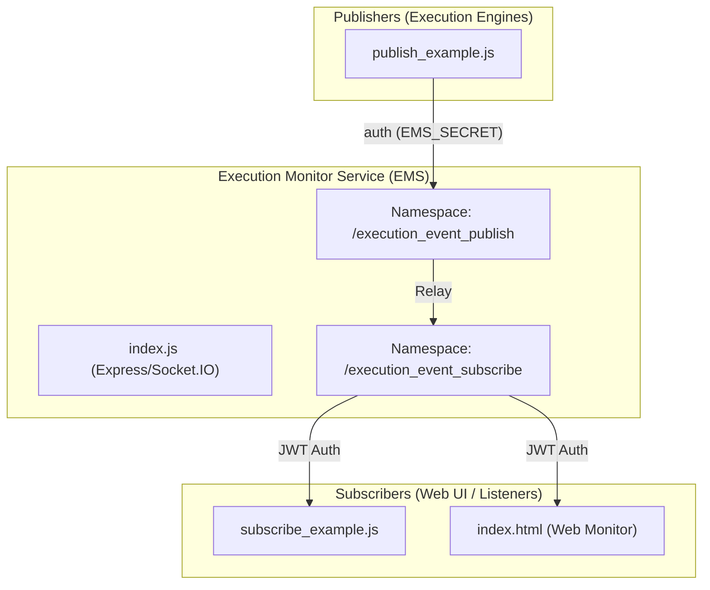

# Overview

Relevant source files

The following files were used as context for generating this wiki page:

- [LICENSE](LICENSE)
- [README.md](README.md)
- [image/package.json](image/package.json)

The **execution-monitor-service** is a specialized Node.js application within the Ingenium platform designed to facilitate real-time updates for procedure executions [README.md:1-2](). It functions as a high-performance WebSocket relay that bridges the gap between backend execution engines (publishers) and frontend monitoring interfaces or automated listeners (subscribers).

By leveraging a publish/subscribe (Pub/Sub) model, the service ensures that telemetry, status changes, and execution events are broadcasted instantaneously to interested clients without the overhead of traditional HTTP polling.

## Core Functionality

The service is built on the `Socket.IO` framework [image/package.json:22-22](), providing a robust bidirectional communication channel. It manages two primary types of data flows:

1.  **Execution Events**: Real-time updates regarding a specific instance of a running procedure.
2.  **Procedure Events**: Updates related to the definition or versioning of procedures.

### High-Level Event Flow
The following diagram illustrates how the `execution-monitor-service` (EMS) acts as the central hub for event distribution.

**EMS Event Relay Logic**

**Sources:** [image/index.js:1-10](), [publish_example.js:1-20](), [subscribe_example.js:1-20]()

## Architectural Concepts

The service operates on several key architectural pillars:

*   **Namespace Isolation**: The service uses Socket.IO namespaces to separate publishing concerns from subscribing concerns, ensuring that only authorized publishers can inject data into the stream.
*   **Room-Based Subscription**: Clients subscribe to specific "rooms" based on an `execution_id` or `procedure_id`. This ensures they only receive traffic relevant to the specific execution they are monitoring.
*   **Dual-Tier Security**: 
    *   **Publishers** use a shared secret (`EMS_SECRET`) for fast, internal authentication.
    *   **Subscribers** use RS256-signed JSON Web Tokens (JWT) to ensure secure, verifiable access for external or frontend clients.

### Mapping Code Entities to System Roles
The following table maps logical system roles to their specific implementations within the codebase.

| Role | Code Entity | File Path |
| :--- | :--- | :--- |
| **Service Entrypoint** | `node index.js` | [image/index.js:1-5]() |
| **Event Publisher** | `socket.io-client` | [publish_example.js:10-15]() |
| **Event Subscriber** | `socket.io-client` | [subscribe_example.js:15-20]() |
| **Security Handler** | `jsonwebtoken` | [image/package.json:21-21]() |
| **Logging** | `winston` | [image/package.json:23-23]() |

**Sources:** [image/package.json:19-24](), [image/index.js:1-10]()

## Project Structure

*   **`image/`**: Contains the core Node.js application, including the server logic, dependencies, and a built-in web monitoring interface.
*   **`tests/`**: Contains Python-based integration tests to ensure service health and connectivity within a CI/CD environment.
*   **Root Directory**: Contains configuration for infrastructure (Docker, Jenkins) and usage examples.

## Detailed Documentation

For deeper technical insights, please refer to the following child pages:

### [Project Purpose and Architecture](#1.1)
Detailed breakdown of the service's role in the Ingenium microservices ecosystem, the internal Pub/Sub logic, and the technical rationale behind the WebSocket implementation.

### [Getting Started](#1.2)
Step-by-step instructions on setting up the environment, configuring the necessary environment variables (like `PUBLIC_PEM` and `EMS_SECRET`), and running the service via Docker or npm.

---
**Sources:** [README.md:1-4](), [image/package.json:1-25]()
