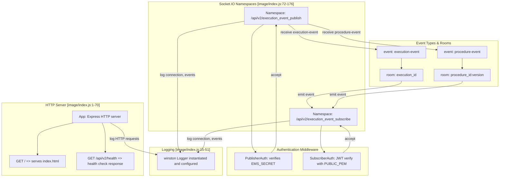
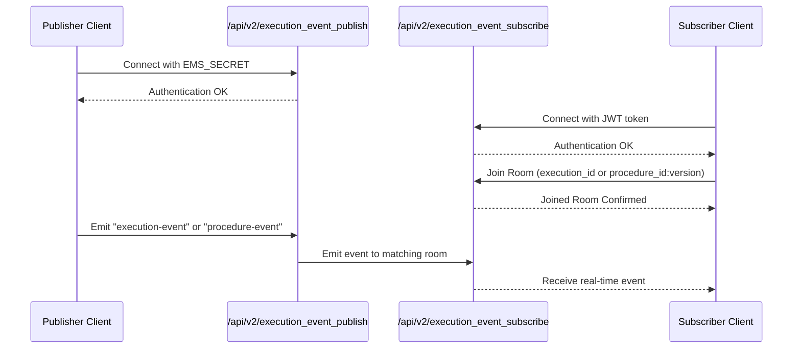

# Project Purpose and Architecture

Relevant source files

The following files were used as context for generating this wiki page:

- [README.md](README.md)
- [image/index.js](image/index.js)
- [image/package.json](image/package.json)

This page provides a detailed technical overview of the **execution-monitor-service**, focusing on its purpose within the Ingenium platform, its architectural design, and core implementation details. The service operates as a WebSocket relay that enables real-time updates for procedure and execution events. It follows a publish/subscribe model to efficiently route events between microservice components and eligible subscribers. This page also explains how the service fits into the broader Ingenium microservices ecosystem.

---

## 1. Purpose and Role in Ingenium Platform

The **execution-monitor-service** provides a real-time WebSocket-based communication channel specifically tailored for pushing **procedure** and **execution** event updates within the Ingenium platform. These events relate to:

- Ongoing procedure states and changes.
- Execution progress and events during their lifecycle.

It acts as an event relay intermediary, forwarding messages from **publisher clients** (trusted services or agents authorized to emit events) to **subscriber clients** (generally UI dashboards or downstream services interested in events).

This design enables loose coupling and scalability by decoupling event producers and consumers:

- Publishers authenticate using a shared-secret authentication scheme.
- Subscribers authenticate with RS256 JWT tokens for security and controlled access.

Thus, the service provides:

- **Low-latency event routing over WebSocket.**
- **Secure enforced authentication and authorization for event streams.**
- **Topic-based filtering using socket.io "rooms" keyed by execution or procedure IDs, isolating event traffic.**
- **A monitoring UI and healthcheck endpoints to enable operational visibility.**

The service is a critical component in the Ingenium microservice architecture, supporting real-time execution monitoring while abstracting complexities such as connectivity, security, and message routing.

---

## 2. Architectural Overview

### 2.1 High-Level Design

At its core, the service is a Node.js application built on the following foundational technologies:

- **Express.js** to provide HTTP endpoints for UI and health checks.
- **Socket.IO** for WebSocket communications, supporting namespaces, rooms, and event broadcasting.
- **jsonwebtoken** for JWT validation in subscriptions.
- **winston** for structured logging with multiple levels.

The service exposes two main Socket.IO namespaces:

| Namespace                      | Role                          | Authentication                          |
|-------------------------------|-------------------------------|---------------------------------------|
| `/api/v2/execution_event_publish`   | Publishers connect here to emit events. | Shared-secret token (`EMS_SECRET`)   |
| `/api/v2/execution_event_subscribe` | Subscribers connect here to receive events.| JWT token verified with RS256 and `PUBLIC_PEM` |

#### Event Types Routed

- **execution-event**: Related to execution lifecycles, keyed by `execution_id`.
- **procedure-event**: Related to procedure versions, keyed by `procedure_id:version`.

### 2.2 Event Routing Logic

The key routing flow is as follows:

- A publisher connects to `/api/v2/execution_event_publish`, authenticates with a shared secret, and sends event messages.
- For an **execution-event**, the service extracts the `execution_id` and emits the event only to subscriber sockets joined to the corresponding room named after that execution ID.
- For a **procedure-event**, the service extracts the `procedure_id` and `version`, forms the room string `{procedure_id}:{version}`, and emits events to subscribers in that room.
- Subscribers connect to `/api/v2/execution_event_subscribe` after authenticating the RS256 JWT, and join rooms based on `execution_id` or `procedure_id:version` to receive corresponding events.

This publish/subscribe model efficiently propagates events with minimal overhead and isolates message delivery to only interested parties.

### 2.3 Integration with Microservices Ecosystem

Within Ingenium's microservices environment, this service:

- Acts as an event distribution hub for execution-related state changes.
- Provides standardized interfaces for any event publisher component.
- Enables UI and downstream analytics clients to subscribe to filtered event streams.
- Enhances real-time observability by reducing the need for polling or heavy REST queries.

---

## 3. Core Components and Data Flow

### 3.1 Express HTTP Server and Web Endpoints

- HTTP server serves:
  - **GET /**: Static file `index.html` for a basic web-monitor UI.
  - **GET /api/v2/health**: Returns a JSON health check `{ status: "OK", message:"" }`.

### 3.2 Socket.IO Setup and Namespaces

- Instantiates Socket.IO on top of HTTP server with configurable `pingTimeout` and `pingInterval` (default 30 and 35 seconds respectively).
- Creates two namespaces:
  - `/api/v2/execution_event_publish` for publishers.
  - `/api/v2/execution_event_subscribe` for subscribers.

### 3.3 Authentication Middleware

- **Publisher Namespace:** Checks `secret` query parameter against `EMS_SECRET`. Rejects unauthorized connections.
- **Subscriber Namespace:** Validates `token` JWT query parameter with `PUBLIC_PEM` and RS256. Rejects on failure or missing token.

### 3.4 Event Handlers and Room Management

- Publisher sockets listen for:
  - `execution-event` messages -> emit to `execution_id` room on subscriber namespace.
  - `procedure-event` messages -> emit to `procedure_id:version` room on subscriber namespace.
- Subscriber sockets:
  - Auto-join room based on query parameter `execution_id`.
  - Dynamically join rooms upon client emitting `set-execution-id` or `set-procedure-id` with appropriate IDs.
  - This allows subscribers to flexibly subscribe to multiple streams.

### 3.5 Logging Subsystem

- Winston logger configured with custom log levels (`critical`, `error`, `warning`, `info`, `debug`, `trace`).
- Console transport prints timestamped log messages.
- Log level is configurable by environment variable `LOG_LEVEL` (default `debug`).

---

## 4. Mermaid Diagrams

### 4.1 System Context and Namespace to Code Mapping

### 4.2 Event Flow Publish/Subscribe Model

---

## 5. Summary of Key Environment Variables and Config

| Env Variable     | Description                                      | Default/Notes                    |
|------------------|-------------------------------------------------|---------------------------------|
| `PORT`           | TCP port where server listens                    | 3000 if unset                   |
| `PING_TIMEOUT_SECS` | Socket.IO ping timeout in seconds              | 30 seconds default              |
| `PING_INTERVAL_SECS`| Socket.IO ping interval in seconds             | 35 seconds default              |
| `EMS_SECRET`      | Shared secret for publisher authentication       | Must be configured              |
| `PUBLIC_PEM`      | PEM-format public key for subscriber JWT verify  | Must be configured              |
| `LOG_LEVEL`       | Winston logger verbosity level (info, debug, etc)| Defaults to `debug`             |

---

## 6. Detailed Code Mapping

### 6.1 Entry Point: `image/index.js`

- Lines 1-59: Setup Express app and HTTP endpoints.
- Lines 13-53: Initialize Socket.IO with ping options and Winston logger.
- Lines 72-121: Define the publisher namespace `/api/v2/execution_event_publish`.
  - Auth middleware checks `secret` query param against `EMS_SECRET`.
  - Listens for `execution-event` and `procedure-event`.
  - Emits received events to subscriber namespace rooms.
- Lines 123-176: Define the subscriber namespace `/api/v2/execution_event_subscribe`.
  - Auth middleware verifies JWT tokens with RS256 using `PUBLIC_PEM`.
  - On connection, joins socket rooms based on `execution_id` query or later commands (`set-execution-id`, `set-procedure-id`).
- Lines 178-180: Start HTTP server with logging.

---

# Summary

The **execution-monitor-service** is engineered to fulfill a crucial function in the Ingenium platform: it acts as a scalable, secure WebSocket relay for real-time dissemination of execution and procedure events. By segmenting event publishers and subscribers via namespaces and authenticating them with separate schemes, it provides robust isolation and role-based access control. The use of Socket.IO rooms enables fine-grained routing, reducing unnecessary traffic and aligning event visibility to the subscriber's interest.

This architectural overview and code mapping clarify how the service achieves its goals through its core components, event flow, and integration patterns within the Ingenium ecosystem.

---

### Sources

- `image/index.js:1-180`  
- `image/package.json:1-25`  
- `README.md:1-4`
