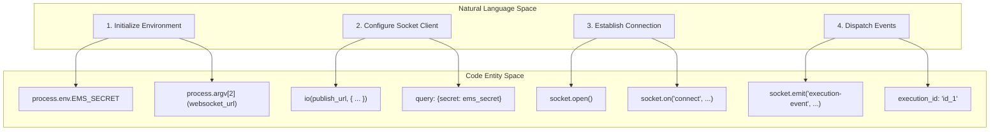
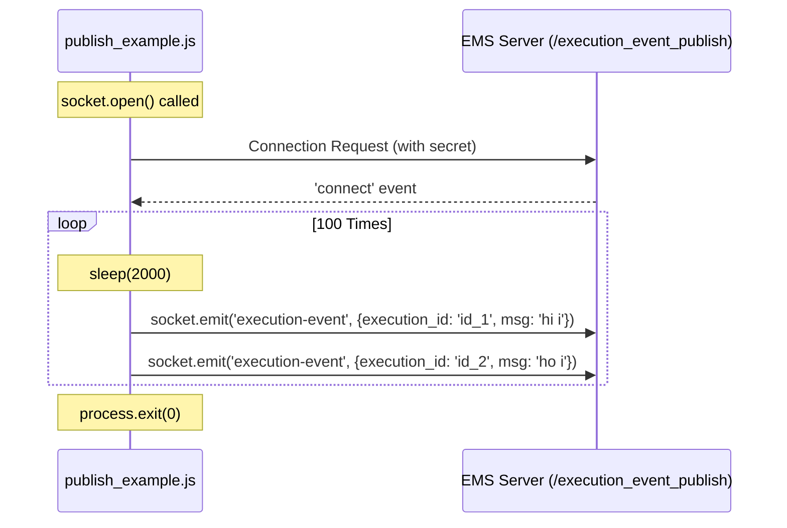

# Publisher Example (publish_example.js)

Relevant source files

The following files were used as context for generating this wiki page:

- [image/publish_example.js](image/publish_example.js)

The `publish_example.js` script serves as a reference implementation for a client acting as an event producer. It demonstrates how to establish a secure WebSocket connection to the Execution Monitor Service (EMS) and broadcast execution-related events to specific rooms based on `execution_id`.

## Overview and Purpose

This script provides a practical example of the "Publish" side of the EMS relay architecture. It targets the `/execution_event_publish` namespace and utilizes a shared secret for authentication. The script simulates a continuous stream of events by looping through a set of messages and emitting them to the server.

### Logic Flow: Natural Language to Code Entity Space

The following diagram maps the logical steps of the publisher to the specific code entities and variables used in the implementation.

**Publisher Logic Mapping**

**Sources:** [image/publish_example.js:1-68]()

---

## Environment Setup and Configuration

The script requires specific command-line arguments and environment variables to function. It performs validation checks before attempting to connect to the server.

### Required Inputs
*   **Command Line Argument:** The base URL of the EMS API (e.g., `http://localhost/api/v2`) [image/publish_example.js:10-15]().
*   **EMS_SECRET:** A shared secret string used to authenticate the publisher against the EMS middleware [image/publish_example.js:24-28]().
*   **PRIVATE_PEM:** While checked by the script, this is primarily used for signing JWTs in subscriber scenarios; however, it is currently required by the script's validation logic [image/publish_example.js:18-22]().

### Socket.IO Client Configuration
The script uses `socket.io-client` to connect to the `/execution_event_publish` namespace [image/publish_example.js:30-33]().

| Option | Value | Description |
| :--- | :--- | :--- |
| `path` | `/execution_monitor/socket.io` | Specifies the custom path where the Socket.IO server is hosted [image/publish_example.js:34](). |
| `transport` | `['websocket']` | Forces the use of WebSockets instead of HTTP long-polling [image/publish_example.js:35](). |
| `autoConnect` | `false` | Prevents the client from connecting immediately upon instantiation [image/publish_example.js:36](). |
| `query` | `{secret: ems_secret}` | Passes the authentication secret as a query parameter for the server's middleware to verify [image/publish_example.js:37](). |

**Sources:** [image/publish_example.js:1-38]()

---

## Connection Management and Event Dispatch

The script explicitly manages the connection lifecycle and uses an asynchronous loop to simulate real-time data production.

### Data Flow: Message Dispatch Loop
The following diagram illustrates the flow of data from the script's internal loop to the EMS server.

**Message Dispatch Flow**

### Implementation Details
1.  **Connection:** The connection is manually triggered using `socket.open()` [image/publish_example.js:52](). Success is handled via the `connect` event listener [image/publish_example.js:48-50]().
2.  **Throttling:** A `sleep` function (utilizing `setTimeout`) is defined to space out message emissions [image/publish_example.js:3-5]().
3.  **Emission:** Messages are sent using `socket.emit`. Each payload must contain an `execution_id`, which the server uses to route the message to the appropriate room [image/publish_example.js:60-64]().
4.  **Payload Structure:**
    *   `execution_id`: The identifier for the specific execution trace.
    *   `msg`: The actual data or log message being reported.

**Sources:** [image/publish_example.js:3-66]()
