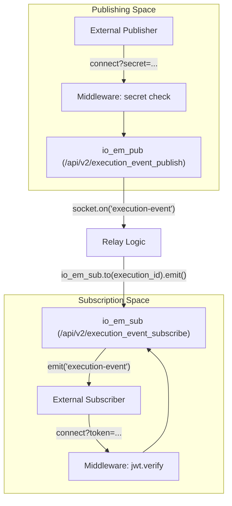

# Server Logic (index.js)

Relevant source files

The following files were used as context for generating this wiki page:

- [image/index.js](image/index.js)

The `image/index.js` file serves as the entry point for the Execution Monitor Service. It implements a real-time event relay system using Node.js, Express, and Socket.IO. The service facilitates a publish/subscribe architecture where execution and procedure events are received from authorized publishers and broadcast to authenticated subscribers based on specific identifiers (rooms).

## Initialization and Configuration

The server initializes an Express application and wraps it in an HTTP server to support Socket.IO. It configures connection health parameters and environment-driven variables.

| Variable | Source | Default | Description |
| :--- | :--- | :--- | :--- |
| `ping_timeout_secs` | `process.env.PING_TIMEOUT_SECS` | 30 | How many seconds the server waits for a pong response [image/index.js:3-6](). |
| `ping_interval_secs` | `process.env.PING_INTERVAL_SECS` | 35 | How often the server sends a ping packet [image/index.js:8-11](). |
| `port` | `process.env.PORT` | 3000 | The port the HTTP server listens on [image/index.js:55-55](). |
| `public_pem` | `process.env.PUBLIC_PEM` | '' | RSA Public Key for verifying subscriber JWTs [image/index.js:19-19](). |
| `ems_secret` | `process.env.EMS_SECRET` | '' | Shared secret for publisher authentication [image/index.js:20-20](). |

**Sources:** [image/index.js:1-21](), [image/index.js:55-55]()

## Logging Subsystem (Winston)

The service utilizes `winston` for structured logging. It defines custom levels (`critical`, `error`, `warning`, `info`, `debug`, `trace`) and a console transport that formats output with timestamps and metadata [image/index.js:31-49]().

*   **Stdout Redirection:** All levels are sent to `stdout` (via `stderrLevels: []`) to ensure logs appear in chronological order in containerized environments [image/index.js:34-35]().
*   **Dynamic Level:** The log level is set via `process.env.LOG_LEVEL`, defaulting to `debug` [image/index.js:51-51]().
*   **String Formatting:** A custom `String.prototype.format` helper is added to facilitate C#-style string interpolation in log messages [image/index.js:26-29]().

**Sources:** [image/index.js:26-51]()

## HTTP Endpoints

The Express `app` exposes two primary HTTP GET routes:

1.  **`GET /`**: Serves the `index.html` file, providing a browser-based monitoring UI [image/index.js:57-59]().
2.  **`GET /api/v2/health`**: A health check endpoint that returns a JSON object `{"status": "OK", "message": ""}` [image/index.js:61-70]().

**Sources:** [image/index.js:57-70]()

## Socket.IO Namespace Architecture

The service splits logic into two distinct Socket.IO namespaces to separate publishing concerns from subscription concerns.

### Event Relay Flow

The following diagram illustrates how data flows from the code entities in the publishing namespace to the subscription namespace.

**Diagram: Namespace Interaction and Event Relay**

**Sources:** [image/index.js:72-73](), [image/index.js:96-96](), [image/index.js:111-111]()

### Publisher Namespace (`/api/v2/execution_event_publish`)

This namespace (`io_em_pub`) handles incoming events from data sources.

*   **Authentication:** Uses a `use` middleware to check `socket.handshake.query.secret` against the `ems_secret` [image/index.js:76-85]().
*   **`execution-event`**: Listens for this event. If a `msg.execution_id` is present, it broadcasts the message to the corresponding room in the `io_em_sub` namespace [image/index.js:89-100]().
*   **`procedure-event`**: Listens for this event. It constructs a room name using `${msg.procedure_id}:${msg.version}` and broadcasts to that room in the `io_em_sub` namespace [image/index.js:102-115]().

**Sources:** [image/index.js:72-121]()

### Subscriber Namespace (`/api/v2/execution_event_subscribe`)

This namespace (`io_em_sub`) manages clients who wish to receive real-time updates.

*   **Authentication:** Uses `jsonwebtoken` to verify the `socket.handshake.query.token` using the `public_pem` and `RS256` algorithm [image/index.js:123-137]().
*   **Room Management**:
    *   **Initial Join**: On connection, if `execution_id` is in the query string, the socket automatically joins that room [image/index.js:142-148]().
    *   **`set-execution-id`**: Allows a client to join an execution room after the connection is established [image/index.js:150-157]().
    *   **`set-procedure-id`**: Allows a client to join a procedure room (formatted as `id:version`) [image/index.js:159-167]().

**Sources:** [image/index.js:73-176]()

## Server Execution

The server starts by calling `http.listen(port)`, logging the active port once the service is ready to accept connections [image/index.js:178-180]().

**Diagram: Code Entity Map**
| Logic Component | Code Entity (Variable/Function) | File Path |
| :--- | :--- | :--- |
| **HTTP Server** | `http` | [image/index.js:2]() |
| **Socket.IO Instance** | `io` | [image/index.js:13]() |
| **Publisher Namespace** | `io_em_pub` | [image/index.js:72]() |
| **Subscriber Namespace** | `io_em_sub` | [image/index.js:73]() |
| **Logger** | `log` | [image/index.js:31]() |
| **JWT Verification** | `jwt.verify` | [image/index.js:127]() |

**Sources:** [image/index.js:1-180]()
