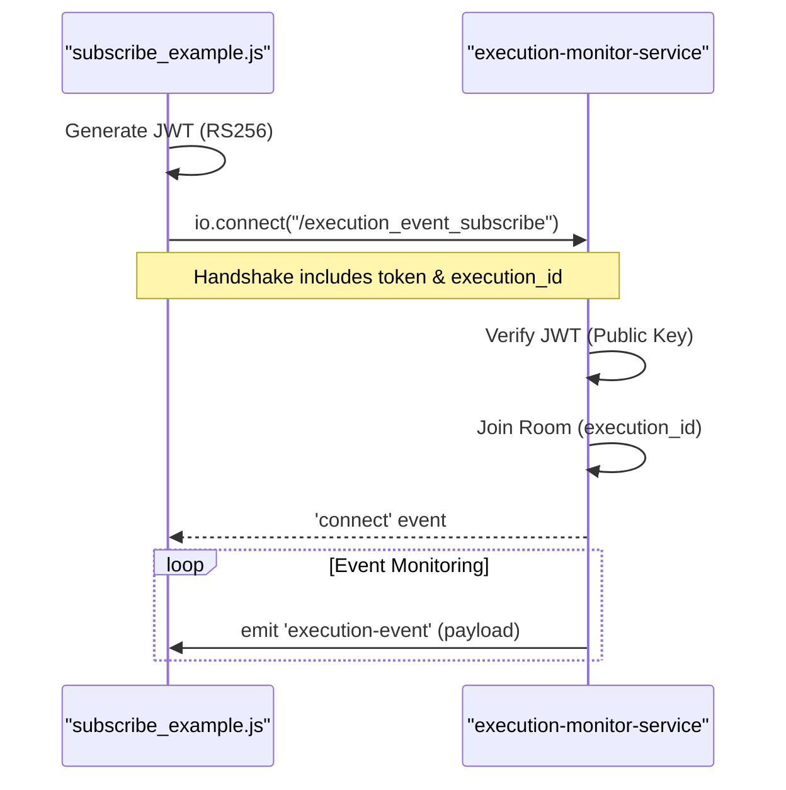
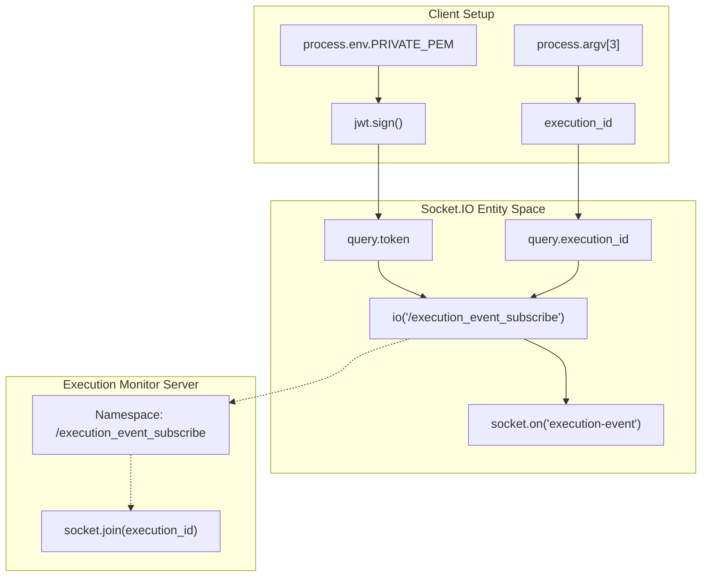

# Subscriber Example (subscribe_example.js)

Relevant source files

The following files were used as context for generating this wiki page:

- [image/subscribe_example.js](image/subscribe_example.js)

The `subscribe_example.js` script serves as a reference implementation for clients wishing to consume real-time execution events from the `execution-monitor-service`. It demonstrates the end-to-end workflow of generating a secure RS256 JSON Web Token (JWT), connecting to a specific Socket.IO namespace, and subscribing to events filtered by a specific `execution_id`.

## Authentication and Token Generation

Unlike the publisher which uses a simple shared secret, the subscriber must provide a JWT signed with an RSA private key. The service validates this token using a corresponding public key to ensure the subscriber is authorized to access execution data.

The script constructs a payload containing authorization scopes, expiration times, and the user's identity [image/subscribe_example.js:28-33]().

### Token Construction Details
| Field | Description | Source |
| :--- | :--- | :--- |
| `scopes` | Array of permissions (e.g., `execute:wsts`, `admin`) | [image/subscribe_example.js:29-29]() |
| `iat` | Issued At timestamp (current time in seconds) | [image/subscribe_example.js:25-25]() |
| `exp` | Expiration timestamp (set to 30 minutes in the example) | [image/subscribe_example.js:26-26]() |
| `username` | The identity of the subscriber | [image/subscribe_example.js:32-32]() |

The token is signed using the `RS256` algorithm via the `jsonwebtoken` library, requiring the `PRIVATE_PEM` environment variable [image/subscribe_example.js:35-42]().

**Sources:** [image/subscribe_example.js:18-42]()

## Connection Logic

The script connects to the `/execution_event_subscribe` namespace. This namespace is specifically designed for read-only event consumption.

### Socket.IO Client Configuration
The `socket.io-client` is initialized with specific options to handle the environment's routing requirements:
*   **Path**: Set to `/execution_monitor/socket.io` to accommodate deployments behind an Nginx reverse proxy [image/subscribe_example.js:50-50]().
*   **Transport**: Forced to `websocket` [image/subscribe_example.js:51-51]().
*   **Query Parameters**: The `encoded_token` and the target `execution_id` are passed during the initial handshake [image/subscribe_example.js:53-53]().

### Subscription Sequence
Title: Subscriber Connection and Room Entry

**Sources:** [image/subscribe_example.js:46-54](), [image/subscribe_example.js:64-70]()

## Event Handling

The script registers listeners for lifecycle events and the primary data stream.

*   **'connect'**: Triggered once the server validates the JWT and accepts the connection [image/subscribe_example.js:64-66]().
*   **'error'**: Handles connection or authentication failures [image/subscribe_example.js:58-60]().
*   **'execution-event'**: The primary data handler. When the service relays a message to the room associated with the `execution_id`, this callback receives the JSON payload [image/subscribe_example.js:68-70]().

The connection is manually initiated using `socket.open()` after the listeners are attached [image/subscribe_example.js:72-72]().

## Code Entity Map

Title: Mapping Subscriber Logic to Code Entities

**Sources:** [image/subscribe_example.js:1-75]()

## Usage Requirements

To run the example, the following environment variables and arguments must be provided:

1.  **Environment Variable**: `PRIVATE_PEM` must contain the RSA private key string [image/subscribe_example.js:18-22]().
2.  **Command Line Arguments**:
    *   `websocket_url`: The base URL of the service (e.g., `http://localhost/api/v2`) [image/subscribe_example.js:12-13]().
    *   `execution_id`: The unique identifier for the execution to monitor [image/subscribe_example.js:15-16]().

**Sources:** [image/subscribe_example.js:4-16]()
