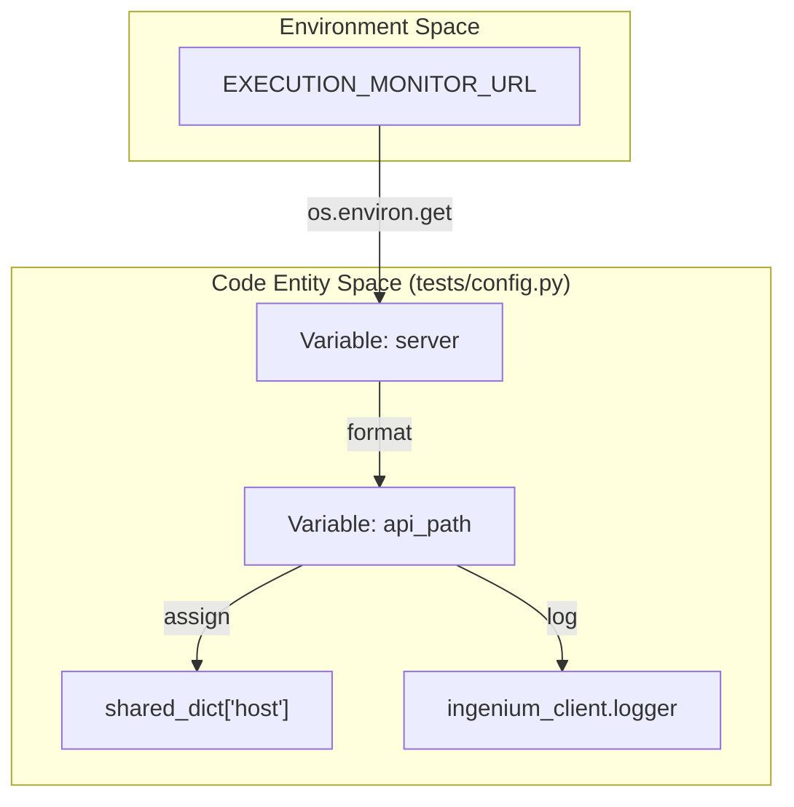
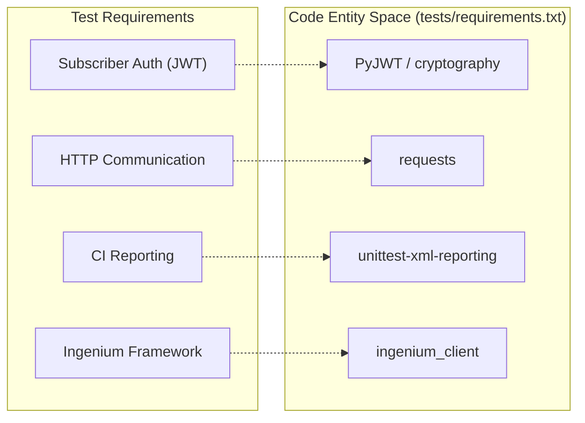

# Test Configuration and Dependencies

Relevant source files

The following files were used as context for generating this wiki page:

- [tests/config.py](tests/config.py)
- [tests/requirements.txt](tests/requirements.txt)

This page documents the configuration logic and external dependencies required for the Python-based test suite used to validate the `execution-monitor-service`. The testing infrastructure is designed to integrate with the broader Ingenium ecosystem while maintaining flexibility for local and CI-based execution.

## Purpose and Scope

The test configuration layer serves three primary roles:
1.  **Endpoint Resolution**: Dynamically determining the target URL of the execution monitor service.
2.  **Shared State Management**: Populating global dictionaries used by `unittest` classes to locate service endpoints.
3.  **Dependency Management**: Ensuring the Python environment has the necessary cryptographic and networking libraries to simulate both publishers and subscribers.

## Test Configuration Logic (`tests/config.py`)

The `tests/config.py` file initializes the environment for the test suite. It specifically overrides default server settings to ensure tests target the correct instance of the execution monitor.

### Endpoint Resolution Flow
The configuration prioritizes the `EXECUTION_MONITOR_URL` environment variable. If this variable is not set, it defaults to `http://127.0.0.1:3000` [tests/config.py:10-10]().

The resolved URL is used to construct the `api_path`, which appends the versioned API suffix `/api/v2` [tests/config.py:11-11](). This path is then injected into the `shared_dict` object, which is a common pattern in the `ingenium_client` framework for sharing configuration across test modules [tests/config.py:13-13]().

### Natural Language to Code Entity Mapping: Configuration

The following diagram illustrates how environment variables and external libraries are transformed into the internal configuration state used by the test suite.

**Configuration Data Flow**

**Sources:** [tests/config.py:7-13]()

## Dependencies (`tests/requirements.txt`)

The test suite relies on a specific set of Python packages to handle HTTP communication, JWT generation for subscriber authentication, and CI reporting.

### Package Manifest
| Package | Version | Role |
| :--- | :--- | :--- |
| `ingenium_client` | 1.0 | Core Ingenium testing framework providing `shared_dict` and `logger` [tests/requirements.txt:2-2](). |
| `PyJWT` | 1.5.2 | Used to generate RS256 tokens for authenticating subscribers [tests/requirements.txt:3-3](). |
| `requests` | 2.18.4 | Handles synchronous HTTP requests to the `/health` and API endpoints [tests/requirements.txt:4-4](). |
| `cryptography` | 2.2.2 | Backend requirement for `PyJWT` to handle RSA key signing [tests/requirements.txt:6-6](). |
| `unittest-xml-reporting` | 2.4.0 | Generates JUnit-compatible XML reports for Jenkins CI integration [tests/requirements.txt:7-7](). |

### Repository Index
The suite utilizes the JPL Artifactory as an extra index URL to fetch internal packages like `ingenium_client`:
`--extra-index-url https://cae-artifactory.jpl.nasa.gov/artifactory/api/pypi/pypi-release-virtual/simple` [tests/requirements.txt:1-1]().

### Dependency Relationship Diagram

The following diagram maps the functional requirements of the test suite to the specific libraries defined in the requirements file.

**Functional Dependency Mapping**

**Sources:** [tests/requirements.txt:1-8]()

## Integration with `ingenium_client`

The configuration utilizes symbols from the `ingenium_client` package to maintain consistency with other Ingenium microservices.

*   **`shared_dict`**: A global dictionary used to store the `host` (API path) so that individual test files (like `test_ci_health.py`) can access the target URL without re-calculating it [tests/config.py:7-13]().
*   **`logger`**: The standard logger instance used to output the resolved `api_path` for debugging purposes during test execution [tests/config.py:12-12]().

**Sources:** [tests/config.py:7-13](), [tests/requirements.txt:1-8]()
