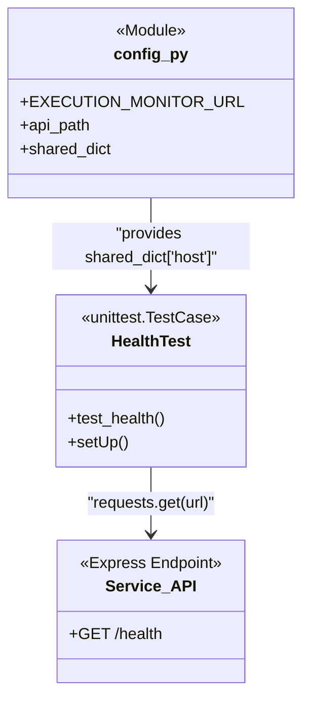

# Testing

<details>
<summary>Relevant source files</summary>

The following files were used as context for generating this wiki page:

- [tests/config.py](tests/config.py)
- [tests/requirements.txt](tests/requirements.txt)
- [tests/test_ci_health.py](tests/test_ci_health.py)

</details>


The `ingenium_execution-monitor-service` includes a Python-based test suite located in the `tests/` directory. This suite is designed to validate service availability and API health, primarily serving as a gatekeeper within the Continuous Integration (CI) pipeline. The tests utilize standard Python libraries such as `unittest` and `requests`, and are configured to generate machine-readable XML reports for automated build systems.

### Test Suite Overview

The testing infrastructure is built around a centralized configuration that resolves the service endpoint and a set of dependencies that facilitate HTTP communication and JWT handling. The suite is orchestrated to run against a live instance of the Execution Monitor Service, whether running locally or within a containerized CI environment.

#### High-Level Test Architecture

The following diagram illustrates how the Python test environment interacts with the Execution Monitor Service.

**Test Execution Flow**
```mermaid
graph TD
    subgraph "Python Test Environment"
        [test_ci_health.py] -- "uses" --> [config.py]
        [config.py] -- "populates" --> [shared_dict]
        [test_ci_health.py] -- "executes" --> [HealthTest]
    end

    subgraph "Execution Monitor Service"
        [Express_Server] -- "exposes" --> [GET_/health]
    end

    [HealthTest] -- "HTTP GET" --> [GET_/health]
    [GET_/health] -- "JSON Response" --> [HealthTest]
    [HealthTest] -- "generates" --> [XML_Report]
```
Sources: [tests/test_ci_health.py:12-34](), [tests/config.py:7-13]()

### Test Components

The test suite is divided into configuration management and specific test cases.

#### [Test Configuration and Dependencies](#4.1)
The testing environment relies on `tests/config.py` to establish the target environment. It retrieves the service location from the `EXECUTION_MONITOR_URL` environment variable, defaulting to `http://127.0.0.1:3000` for local development [tests/config.py:10-10](). This configuration populates a `shared_dict` used by test classes to resolve API paths [tests/config.py:13-13]().

The suite requires several external libraries, including `PyJWT` for token operations and `unittest-xml-reporting` for CI integration, all of which are managed via a JPL Artifactory PyPI index [tests/requirements.txt:1-7]().

For more details, see [Test Configuration and Dependencies](#4.1).

#### [Health Check Test (test_ci_health.py)](#4.2)
The primary functional test currently implemented is the `HealthTest` class. This test verifies that the service's `/health` endpoint is reachable and returning the expected status [tests/test_ci_health.py:12-31](). It performs a standard HTTP GET request and asserts that the response code is `200 OK` and the JSON body contains `{"status": "OK"}` [tests/test_ci_health.py:28-31]().

For more details, see [Health Check Test (test_ci_health.py)](#4.2).

### Relationship between Test Entities

The following diagram maps the Python test entities to the service endpoints they validate.

**Test Entity Mapping**

Sources: [tests/config.py:7-13](), [tests/test_ci_health.py:19-26]()

### Execution and Reporting
Tests are typically executed using the `unittest` framework. When run as a standalone script, `test_ci_health.py` uses `xmlrunner.XMLTestRunner` to output results into the `./test-reports/` directory [tests/test_ci_health.py:33-34](). This allows Jenkins or other CI tools to parse the results and report on build health.

Sources: [tests/test_ci_health.py:33-34](), [tests/requirements.txt:7-7]()
