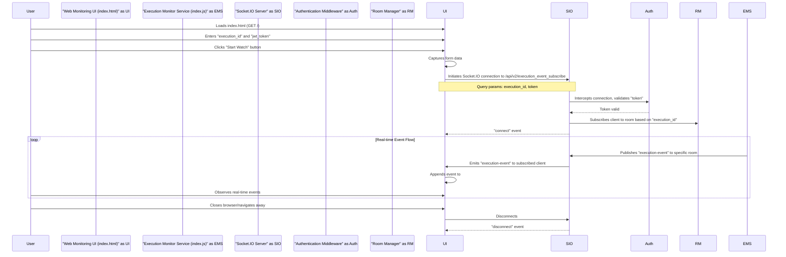

# Web Monitoring UI (index.html)

<details>
<summary>Relevant source files</summary>

The following files were used as context for generating this wiki page:

- [image/index.html](image/index.html)

</details>


This page documents the browser-based debug and monitoring interface provided by the `execution-monitor-service`. This interface is served directly from the root path (`GET /`) of the service and allows users to subscribe to real-time execution events through a web browser. It demonstrates the client-side interaction with the Socket.IO server, including authentication and event display.

## Purpose and Scope

The `index.html` file [image/index.html:1-68]() provides a simple web page that acts as a client to the `execution-monitor-service`. Its primary purpose is to offer a visual tool for debugging and monitoring the real-time event stream. Users can input an `execution_id` and a `jwt_token` to establish a Socket.IO connection and observe `execution-event` messages as they are broadcast by the service. This page serves as a practical example of how a client can interact with the `execution_event_subscribe` namespace.

## Implementation Details

The `index.html` page is a standard HTML document with embedded CSS for styling and JavaScript for client-side logic.

### HTML Structure

The HTML defines a basic layout with a form for user input and an unordered list (`<ul>`) to display incoming messages [image/index.html:18-25]().

*   **Input Fields**:
    *   `execution_id`: An input field (`<input id="execution_id">`) where the user can specify the ID of the execution they wish to monitor [image/index.html:19]().
    *   `jwt_token`: An input field (`<input id="jwt_token">`) for providing a JSON Web Token (JWT) for authentication with the Socket.IO server [image/index.html:20]().
*   **Action Button**: A button (`<button>Start Watch</button>`) that, when clicked, triggers the Socket.IO connection attempt [image/index.html:21]().
*   **Message Display**: An unordered list (`<ul id="messages">`) where received `execution-event` messages are appended as list items [image/index.html:24]().

Sources:
* [image/index.html:1-25]()

### Client-Side JavaScript

The core functionality is implemented using JavaScript, leveraging jQuery for DOM manipulation and the Socket.IO client library for WebSocket communication.

#### External Libraries

The page includes two external JavaScript libraries:
*   **Socket.IO Client**: `https://cdn.socket.io/socket.io-1.7.3.js` [image/index.html:27]() - Provides the necessary client-side API to connect to and interact with the Socket.IO server.
*   **jQuery**: `https://code.jquery.com/jquery-1.11.1.js` [image/index.html:28]() - Used for simplifying DOM selection and event handling.

#### Form Submission and Socket.IO Connection

When the "Start Watch" button is clicked, the form's `submit` event is triggered [image/index.html:32](). The event handler performs the following actions:

1.  **Retrieve Input Values**: It retrieves the `execution_id` and `jwt_token` from their respective input fields [image/index.html:33-34]().
2.  **Initialize Socket.IO Client**: A new Socket.IO client instance is created, targeting the `/api/v2/execution_event_subscribe` namespace [image/index.html:38]().
    *   `path`: Specifies the custom path for the Socket.IO connection, `/execution_monitor/socket.io` [image/index.html:39]().
    *   `query`: The `execution_id` and `jwt_token` are passed as query parameters (`execution_id` and `token`) during the connection handshake [image/index.html:40-43](). This is crucial for the server to authenticate the client and subscribe it to the correct room.
    *   `transports`: Forces the client to use `websocket` as the transport mechanism [image/index.html:44]().

#### Event Handling

The Socket.IO client registers several event listeners:

*   **`connect`**: Fired when the client successfully connects to the Socket.IO server. A message is logged to the console [image/index.html:49-51]().
*   **`disconnect`**: Fired when the client disconnects from the server. The reason for disconnection is logged [image/index.html:53-56]().
*   **`execution-event`**: This is the primary event for receiving monitoring data. When an `execution-event` message is received:
    1.  The message content (`msg`) is logged to the console [image/index.html:58]().
    2.  The message object is converted to a pretty-printed JSON string [image/index.html:59]().
    3.  A new list item (`<li>`) is created with the JSON string as its text content [image/index.html:60]().
    4.  This new list item is appended to the `#messages` unordered list, making the event visible in the UI [image/index.html:60]().

Sources:
* [image/index.html:27-65]()

### Data Flow

The following diagram illustrates the data flow when a user interacts with the Web Monitoring UI.


**Diagram 1: Web Monitoring UI Data Flow**

Sources:
* [image/index.html:33-45]()
* [image/index.html:49-61]()

### Code Entity Relationship

```mermaid
classDiagram
    direction LR
    class "image/index.html" as IndexHtml {
        +input#execution_id
        +input#jwt_token
        +form
        +ul#messages
        +script (Socket.IO client setup)
        +script (jQuery)
        +socket.on('connect')
        +socket.on('disconnect')
        +socket.on('execution-event')
    }

    class "Socket.IO Client Library" as SocketIOClient {
        +io(namespace, options)
        +socket.on(event, handler)
    }

    class "jQuery Library" as JQuery {
        +$(selector)
        +$.submit(handler)
        +$.val()
        +$.append()
        +$.text()
    }

    IndexHtml --> SocketIOClient : Uses `io()` to connect
    IndexHtml --> JQuery : Uses `$` for DOM manipulation
    IndexHtml ..> "image/index.js" : Connects to `/api/v2/execution_event_subscribe`
```
**Diagram 2: Web Monitoring UI Code Entity Relationship**

Sources:
* [image/index.html:27]()
* [image/index.html:28]()
* [image/index.html:30-65]()
