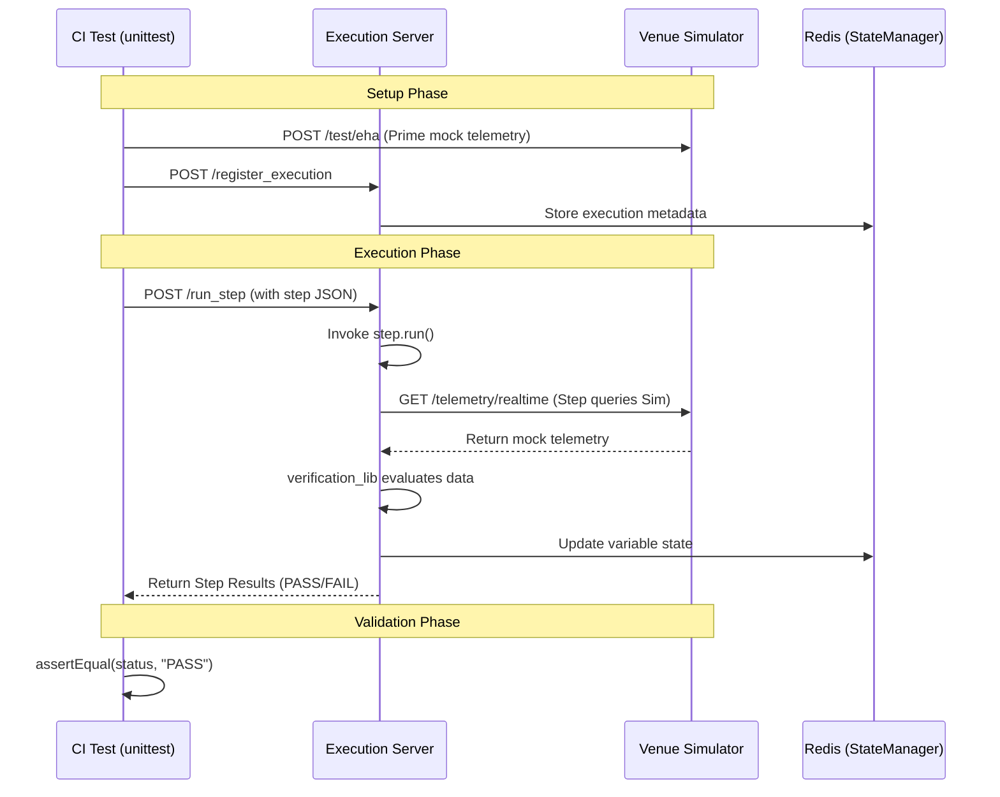
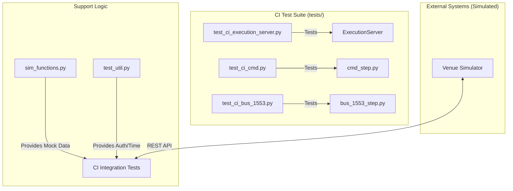

# Page: CI Integration Tests

# CI Integration Tests

Relevant source files

The following files were used as context for generating this wiki page:

- [tests/sim_functions.py](tests/sim_functions.py)
- [tests/test_ci_bus_1553.py](tests/test_ci_bus_1553.py)
- [tests/test_ci_cmd.py](tests/test_ci_cmd.py)
- [tests/test_ci_cmdfile.py](tests/test_ci_cmdfile.py)
- [tests/test_ci_cmdscmf.py](tests/test_ci_cmdscmf.py)
- [tests/test_ci_cmdsse.py](tests/test_ci_cmdsse.py)
- [tests/test_ci_custom_scripts.py](tests/test_ci_custom_scripts.py)
- [tests/test_ci_environment_manual.py](tests/test_ci_environment_manual.py)
- [tests/test_ci_execution_server.py](tests/test_ci_execution_server.py)
- [tests/test_ci_graph_eha.py](tests/test_ci_graph_eha.py)
- [tests/test_ci_health.py](tests/test_ci_health.py)
- [tests/test_ci_list_dataproducts.py](tests/test_ci_list_dataproducts.py)
- [tests/test_ci_logging.py](tests/test_ci_logging.py)
- [tests/test_ci_manual_eip.py](tests/test_ci_manual_eip.py)
- [tests/test_ci_manual_gds.py](tests/test_ci_manual_gds.py)
- [tests/test_ci_manual_input.py](tests/test_ci_manual_input.py)
- [tests/test_ci_manual_verification.py](tests/test_ci_manual_verification.py)
- [tests/test_ci_query_evr.py](tests/test_ci_query_evr.py)
- [tests/test_ci_verify_eha.py](tests/test_ci_verify_eha.py)
- [tests/test_ci_wait.py](tests/test_ci_wait.py)
- [tests/test_ci_wait_dataproducts.py](tests/test_ci_wait_dataproducts.py)
- [tests/test_ci_wait_eha.py](tests/test_ci_wait_eha.py)
- [tests/test_ci_wait_evr.py](tests/test_ci_wait_evr.py)
- [tests/test_config.py](tests/test_config.py)
- [tests/test_util.py](tests/test_util.py)

The Ingenium Execution Server utilizes a comprehensive suite of integration tests (prefixed with `test_ci_*.py`) to ensure the reliability of the execution engine, the embedded step library, and the REST API. These tests validate the full data flow from the server's HTTP endpoints down to the simulated hardware and flight software interfaces.

## Overview and Test Infrastructure

CI tests are designed to run against a live instance of the `execution_server` and a `venue_simulator`. They use `unittest` and `xmlrunner` to generate standard XML reports for Jenkins integration [tests/test_ci_execution_server.py:1-4](), [tests/test_ci_cmd.py:1-4]().

### Test Setup and Authentication
Most tests inherit a common setup pattern:
1.  **JWT Authentication**: Tests generate or retrieve RS256 tokens using `get_ing_auth_header()` and `get_auth_header()` to simulate authorized requests from the Execution Gateway [tests/test_util.py:114-140](), [tests/test_ci_cmd.py:22-23]().
2.  **Venue Registration**: The `ingenium_library.register_session` function is called to associate the test run with a specific data path (e.g., "SIDE A") [tests/test_ci_cmd.py:46]().
3.  **Simulator Preparation**: Tests interact with the Venue Simulator's "forced errors" and "test data" endpoints to prime the environment with expected telemetry or command responses [tests/test_ci_bus_1553.py:28-30](), [tests/sim_functions.py:117-138]().

### Helper Modules
*   **`sim_functions.py`**: Provides factory functions to generate mock JSON objects for EHA (Engineering Health Analysis), EVR (Event Records), and Data Products [tests/sim_functions.py:3-18](), [tests/sim_functions.py:141-164]().
*   **`test_util.py`**: Contains utility functions for time formatting (ISO/SCLK conversion) and HTTP header management [tests/test_util.py:12-40]().

## Execution Server Integration
The `test_ci_execution_server.py` file validates the core orchestration logic of the server.

### Key Functional Tests
| Test Case | Code Entity | Description |
| :--- | :--- | :--- |
| **Step Execution** | `test_run_step` | Validates registering an execution and running a single step via the `/run_step` endpoint [tests/test_ci_execution_server.py:46-55](). |
| **Variable Persistence** | `test_run_step` | Verifies that `actual_value` from a step run is correctly stored in Redis and retrievable via `get_variable_value` [tests/test_ci_execution_server.py:73-78](). |
| **Session Isolation** | `test_session_info` | Ensures that session IDs (GDS/MTAK) for different execution IDs do not interfere with each other [tests/test_ci_execution_server.py:93-100](). |
| **Health Check** | `test_health` | Validates the `/health` endpoint returns `200 OK` [tests/test_ci_health.py:19-31](). |

Sources: [tests/test_ci_execution_server.py:46-151](), [tests/test_ci_health.py:12-32]()

## Command and Telemetry Step Tests

The integration suite covers every step type in the `ingenium_embedded` library.

### Command Dispatch (CMD, CMD_FILE, CMD_SCMF, CMD_SSE)
These tests verify that commands are correctly formatted and dispatched to the simulated venue.

*   **`test_ci_cmd.py`**: Tests FSW and HW command strings. It validates that if a command in a sequence fails verification, subsequent commands are aborted [tests/test_ci_cmd.py:101-164]().
*   **`test_ci_cmdfile.py`**: Validates binary file uploads. It checks the `radiated` and `verified` status flags returned by the step [tests/test_ci_cmdfile.py:76-99]().
*   **`test_ci_cmdscmf.py`**: Tests Spacecraft Command Message Files (SCMF) with different uplink types (immediate, hardware, file) [tests/test_ci_cmdscmf.py:82-118]().
*   **`test_ci_cmdsse.py`**: Validates SSE (Special Support Equipment) commands, including error handling for 408 Timeout responses [tests/test_ci_cmdsse.py:76-132]().

### Telemetry Verification (EHA, EVR, 1553, Data Products)
These tests ensure the `verification_lib` correctly evaluates incoming telemetry against user-defined conditions.

*   **`test_ci_bus_1553.py`**: Validates 1553 bus traffic verification. It tests conditions like `GREATER_THAN`, `NOT_PRESENT`, and `RECORD` on float and integer data [tests/test_ci_bus_1553.py:77-199]().
*   **`test_ci_graph_eha.py`**: Validates the retrieval of historical telemetry for graphing. It checks time range logic (ERT vs SCET) and duration-based queries [tests/test_ci_graph_eha.py:130-171]().
*   **`test_ci_list_dataproducts.py`**: Verifies the ability to query the catalog of generated data products (files) filtered by APID and status [tests/test_ci_list_dataproducts.py:106-119]().

### Manual and Environment Steps
*   **`test_ci_environment_manual.py`**: Simulates operator input for environmental factors (Temperature, Humidity) and validates them against range conditions [tests/test_ci_environment_manual.py:62-92]().
*   **`test_ci_custom_scripts.py`**: Tests the execution of arbitrary Python scripts. It validates the passing of `inputs`, `entries`, and the capture of `outputs` back into the execution state [tests/test_ci_custom_scripts.py:21-160]().

Sources: [tests/test_ci_cmd.py:101-164](), [tests/test_ci_cmdfile.py:76-132](), [tests/test_ci_bus_1553.py:77-199](), [tests/test_ci_graph_eha.py:130-195](), [tests/test_ci_list_dataproducts.py:106-180](), [tests/test_ci_custom_scripts.py:21-160]()

## Data Flow: CI Test to Simulator

The following diagram illustrates how a CI test interacts with the system to verify a step's behavior.

### Test Interaction Logic

Sources: [tests/test_ci_execution_server.py:46-78](), [tests/test_ci_bus_1553.py:83-108](), [tests/sim_functions.py:141-164]()

## Mapping: Natural Language to Code Entities

This table maps testing concepts to specific code implementations found in the CI suite.

### Code Entity Mapping
| System Concept | Code Identifier | File Location |
| :--- | :--- | :--- |
| **Mock Telemetry Generator** | `test_eha_obj` | [tests/sim_functions.py:141]() |
| **Mock EVR Generator** | `test_evr_obj` | [tests/sim_functions.py:187]() |
| **Forced Error Injection** | `forced_error_obj` | [tests/sim_functions.py:117]() |
| **Auth Header Helper** | `get_ing_auth_header` | [tests/test_util.py:114]() |
| **Step Runner Interface** | `cmd_step.run` | [tests/test_ci_cmd.py:161]() |
| **Step Result Verification** | `verification_status` | [tests/test_ci_bus_1553.py:106]() |

### Integration Test Structure

Sources: [tests/sim_functions.py:1-117](), [tests/test_util.py:1-140](), [tests/test_ci_cmd.py:6-15](), [tests/test_ci_bus_1553.py:5-14]()
