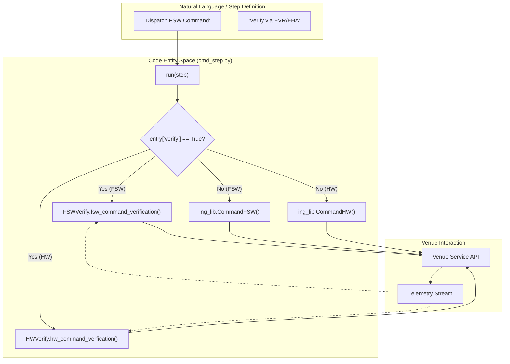
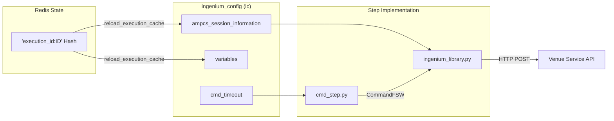

# Page: Command Steps

# Command Steps

Relevant source files

The following files were used as context for generating this wiki page:

- [image/ingenium_embedded/cmd_file_step.py](image/ingenium_embedded/cmd_file_step.py)
- [image/ingenium_embedded/cmd_scmf_step.py](image/ingenium_embedded/cmd_scmf_step.py)
- [image/ingenium_embedded/cmd_sse_step.py](image/ingenium_embedded/cmd_sse_step.py)
- [image/ingenium_embedded/cmd_step.py](image/ingenium_embedded/cmd_step.py)
- [image/ingenium_embedded/ingenium_library.py](image/ingenium_embedded/ingenium_library.py)

Command steps are responsible for dispatching instructions to Flight Software (FSW), Hardware (HW), or ground systems. These steps interface with the Venue Service to radiate commands and, optionally, perform verification via Event Records (EVR) or Engineering Health Analysis (EHA) telemetry.

## Overview of Command Dispatch

All command steps follow a common execution pattern:
1.  **Input Deep Copy**: The step creates a deep copy of `execution_user_input` to manage results locally without mutating the original input structure [image/ingenium_embedded/cmd_step.py:17-24]().
2.  **Data Path Validation**: Every command requires a `data_path` to identify the target session or venue [image/ingenium_embedded/cmd_step.py:26-40]().
3.  **Iterative Dispatch**: Steps iterate through a list of `entries`. If any entry fails (based on radiation or verification status), the loop breaks, and the step is marked as `FAIL` [image/ingenium_embedded/cmd_step.py:42-164]().
4.  **Verification Logic**: Commands can be dispatched in "fire-and-forget" mode or with active verification using the `FSWVerify` or `HWVerify` classes [image/ingenium_embedded/cmd_step.py:57-123]().

### Command Execution Flow

The following diagram illustrates the transition from the high-level step definition to the low-level dispatch and verification logic.

**Command Dispatch and Verification Flow**

Sources: [image/ingenium_embedded/cmd_step.py:11-164](), [image/ingenium_embedded/ingenium_library.py:131-139]()

---

## Implementation Details

### 1. Standard Command Step (`cmd_step.py`)
This step handles standard FSW and HW commands. It utilizes `verification_lib.py` classes to perform complex telemetry checks after radiation.

*   **Key Functions**: `run(step)` [image/ingenium_embedded/cmd_step.py:12]() and `run_dummy(step)` [image/ingenium_embedded/cmd_step.py:167]().
*   **Verification Classes**:
    *   `FSWVerify`: Orchestrates FSW command radiation and subsequent EVR/EHA checks [image/ingenium_embedded/cmd_step.py:60]().
    *   `HWVerify`: Orchestrates HW command radiation and verification [image/ingenium_embedded/cmd_step.py:93]().
*   **Status Determination**: Uses `determine_cmd_failure` to evaluate if a command entry passed based on the `radiated` and `verified` flags [image/ingenium_embedded/ingenium_library.py:131-139]().

### 2. Binary File Step (`cmd_file_step.py`)
Used for uploading binary files to a target (e.g., onboard file system).

*   **Logic**: It validates that the `file_type` can be converted to an integer as required by the Venue Service [image/ingenium_embedded/cmd_file_step.py:44-61]().
*   **Verification**: Uses `BinaryFileVerify` from `verification_lib` [image/ingenium_embedded/cmd_file_step.py:80]().
*   **Dispatch**: Calls `ing_lib.CommandBinaryFile` when verification is disabled [image/ingenium_embedded/cmd_file_step.py:97-100]().

### 3. SCMF Step (`cmd_scmf_step.py`)
Dispatches Spacecraft Command Message Files (SCMF).

*   **Implementation**: Iterates through entries and calls `ing_lib.CommandSCMF` [image/ingenium_embedded/cmd_scmf_step.py:49]().
*   **Note**: Currently, `disable_checks` is hardcoded to `True` for SCMF commands [image/ingenium_embedded/cmd_scmf_step.py:49]().
*   **Result Tracking**: Captures the `scmf_name` and `dispatchTime` returned by the venue [image/ingenium_embedded/cmd_scmf_step.py:83-89]().

### 4. SSE Step (`cmd_sse_step.py`)
Dispatches Special Support Equipment (SSE) commands as raw strings.

*   **Implementation**: Calls `ing_lib.CommandSSE` [image/ingenium_embedded/cmd_sse_step.py:54]().
*   **Data Flow**: Maps the raw `cmd_string` from the user input to the dispatch call [image/ingenium_embedded/cmd_sse_step.py:40-54]().

---

## Data Flow and Session Management

Command steps rely on the `ingenium_config` (ic) global state, which is often populated from Redis via the `store_execution_cache` and `reload_execution_cache` mechanisms in `ingenium_library.py`.

**Session and State Data Flow**

Sources: [image/ingenium_embedded/ingenium_library.py:171-186](), [image/ingenium_embedded/cmd_step.py:127-128]()

### Comparison of Command Step Types

| Step Type | Implementation File | Verification Class | Primary Library Call |
| :--- | :--- | :--- | :--- |
| **FSW/HW** | `cmd_step.py` | `FSWVerify` / `HWVerify` | `CommandFSW` / `CommandHW` |
| **Binary File** | `cmd_file_step.py` | `BinaryFileVerify` | `CommandBinaryFile` |
| **SCMF** | `cmd_scmf_step.py` | N/A | `CommandSCMF` |
| **SSE** | `cmd_sse_step.py` | N/A | `CommandSSE` |

Sources: [image/ingenium_embedded/cmd_step.py:8,60,93](), [image/ingenium_embedded/cmd_file_step.py:7,80](), [image/ingenium_embedded/cmd_scmf_step.py:49](), [image/ingenium_embedded/cmd_sse_step.py:54]()

## Error Handling

Command steps implement a standardized error reporting pattern using `create_step_error` and `return_step_with_error`.

1.  **User Input Errors**: Triggered if `data_path` is missing or `file_type` is invalid [image/ingenium_embedded/cmd_file_step.py:27-39]().
2.  **Dispatch Errors**: Triggered when the Venue Service returns a non-200 response or the connection fails. These are caught as `StepExecutionError` [image/ingenium_embedded/cmd_step.py:129-143]().
3.  **Timeout Errors**: Inherited from the global `ic.cmd_timeout` if not specified per-entry [image/ingenium_embedded/cmd_step.py:128]().

Sources: [image/ingenium_embedded/cmd_step.py:129-143](), [image/ingenium_embedded/cmd_file_step.py:27-39](), [image/ingenium_embedded/ingenium_library.py:24-44]()
