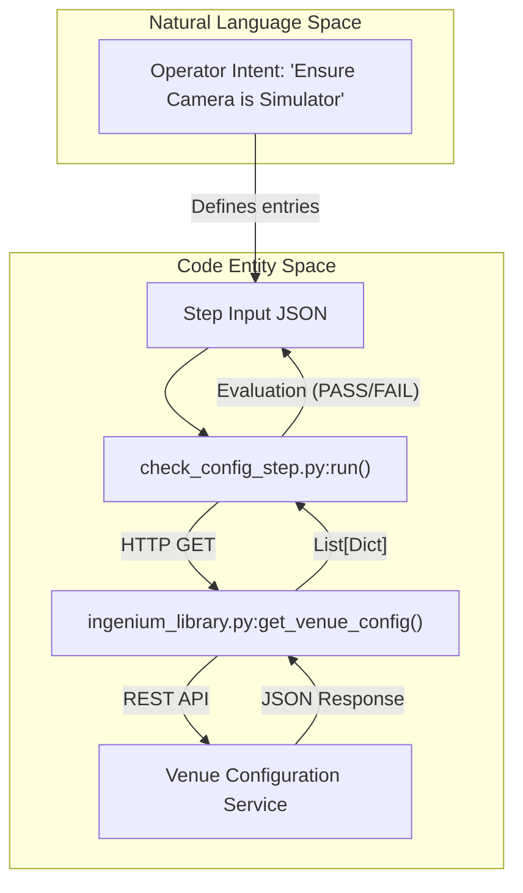
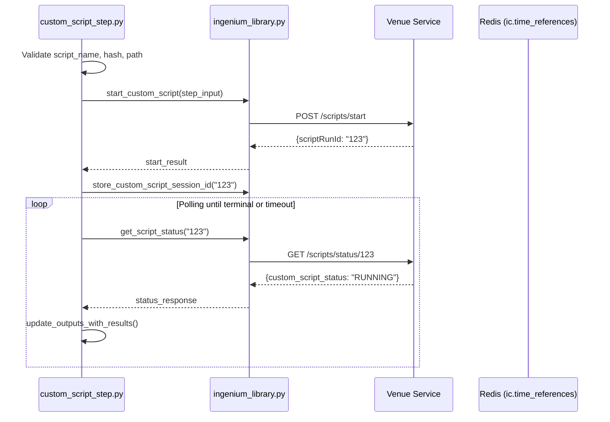

# Page: Configuration, Data Products, and Utility Steps

# Configuration, Data Products, and Utility Steps

Relevant source files

The following files were used as context for generating this wiki page:

- [image/ingenium_embedded/check_config_step.py](image/ingenium_embedded/check_config_step.py)
- [image/ingenium_embedded/custom_script_step.py](image/ingenium_embedded/custom_script_step.py)
- [image/ingenium_embedded/get_config_step.py](image/ingenium_embedded/get_config_step.py)
- [image/ingenium_embedded/list_data_products_step.py](image/ingenium_embedded/list_data_products_step.py)
- [image/ingenium_embedded/time_reference_step.py](image/ingenium_embedded/time_reference_step.py)
- [image/ingenium_embedded/update_config_step.py](image/ingenium_embedded/update_config_step.py)
- [image/ingenium_embedded/wait_data_products_step.py](image/ingenium_embedded/wait_data_products_step.py)
- [image/ingenium_embedded/wait_step.py](image/ingenium_embedded/wait_step.py)

This section covers the "Utility" tier of the Ingenium Embedded Step Library. These steps handle environmental configuration (CRUD operations on venue hardware/software states), data product availability queries, time synchronization, and the execution of arbitrary external scripts.

## Venue Configuration Steps

Venue configuration steps interact with the `VENUE_CONFIGURATION` service to manage the state of elements within a test venue (e.g., whether a specific instrument is a "SIMULATOR" or "FLIGHT" model).

### GetConfig and CheckConfig
*   **GetConfig** [image/ingenium_embedded/get_config_step.py:9-104](): Queries the venue for specific configuration elements or the entire venue state if `get_all` is true. It maps results to a standardized dictionary containing `type`, `status`, and `serial` [image/ingenium_embedded/get_config_step.py:111-112]().
*   **CheckConfig** [image/ingenium_embedded/check_config_step.py:10-156](): Performs a "Query and Verify" pattern. It retrieves the venue configuration via `ing_lib.get_venue_config()` [image/ingenium_embedded/check_config_step.py:93]() and evaluates specific fields against user-provided conditions (`EQUAL`, `NOT_EQUAL`) [image/ingenium_embedded/check_config_step.py:145-154]().

### UpdateConfig
*   **UpdateConfig** [image/ingenium_embedded/update_config_step.py:10-87](): Modifies the state of venue elements. It iterates through provided entries and calls `ing_lib.update_venue_config(entry)` [image/ingenium_embedded/update_config_step.py:29]().

### Configuration Flow Logic
Title: Venue Configuration Data Flow

Sources: [image/ingenium_embedded/check_config_step.py:9-156](), [image/ingenium_embedded/get_config_step.py:9-104](), [image/ingenium_embedded/update_config_step.py:10-87]()

---

## Data Product Steps

These steps allow sequences to query the availability and status of science or engineering data products stored in the `data_path` [image/ingenium_embedded/list_data_products_step.py:47-49]().

### ListDataProducts
This step performs a one-time query. It validates time ranges (SCET/SCLK) using `validate_times` [image/ingenium_embedded/list_data_products_step.py:26]() and executes a `DataProductsQuery` [image/ingenium_embedded/list_data_products_step.py:88-94](). It verifies the `total_count` of products against a `verification_condition` [image/ingenium_embedded/list_data_products_step.py:120-149]().

### WaitDataProducts
Unlike the list step, `WaitDataProducts` [image/ingenium_embedded/wait_data_products_step.py:15-171]() implements a polling loop. It continues to query the venue until the verification condition (e.g., "Wait until APID 247 has 5 products") is met or the `timeout` is reached [image/ingenium_embedded/wait_data_products_step.py:113-146](). It uses `refresh_venue_tokens()` [image/ingenium_embedded/wait_data_products_step.py:115]() to ensure long-running polls do not expire.

Sources: [image/ingenium_embedded/list_data_products_step.py:14-155](), [image/ingenium_embedded/wait_data_products_step.py:15-171]()

---

## Utility and Timing Steps

### WaitStep
Implements delays based on two modes [image/ingenium_embedded/wait_step.py:21-86]():
1.  **DURATION**: Sleeps for a fixed number of seconds.
2.  **UNTIL**: Calculates the delta between `utcnow()` and a target timestamp.

The step provides intermediate progress updates to the Core every 1% of the duration (minimum 10 seconds) via `report_step_results` [image/ingenium_embedded/wait_step.py:89-102]().

### TimeReferenceStep
Captures the current UTC time and stores it in `ic.time_references` under a user-defined name [image/ingenium_embedded/time_reference_step.py:32-35](). This anchor can be used by subsequent steps (like `WaitDataProducts`) to define relative time windows.

Sources: [image/ingenium_embedded/wait_step.py:9-112](), [image/ingenium_embedded/time_reference_step.py:9-42]()

---

## Custom Script Execution

The `custom_script_step.py` allows the Execution Server to trigger arbitrary scripts on the Venue.

### Implementation and Verification
*   **Security**: The step requires a `hash` [image/ingenium_embedded/custom_script_step.py:44-58]() of the script to ensure the code being executed matches the version intended by the sequence author.
*   **Session Management**: When a script starts, it receives a `scriptRunId` [image/ingenium_embedded/custom_script_step.py:117](). This ID is cached via `ing_lib.store_custom_script_session_id` [image/ingenium_embedded/custom_script_step.py:120]() so that if the execution is halted, the server can signal the venue to terminate the specific script process.
*   **Polling**: The step polls `ing_lib.get_script_status(scriptRunId)` [image/ingenium_embedded/custom_script_step.py:153]() until the script reaches a terminal state or the timeout expires [image/ingenium_embedded/custom_script_step.py:147]().

Title: Custom Script Execution Lifecycle

Sources: [image/ingenium_embedded/custom_script_step.py:12-180](), [image/ingenium_embedded/ingenium_library.py:3-4]()
