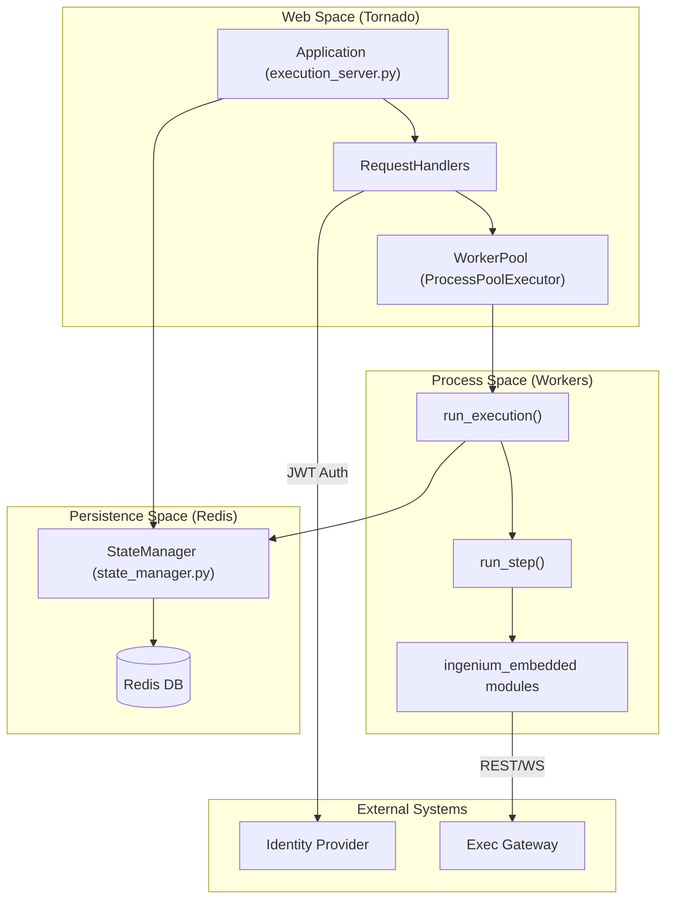
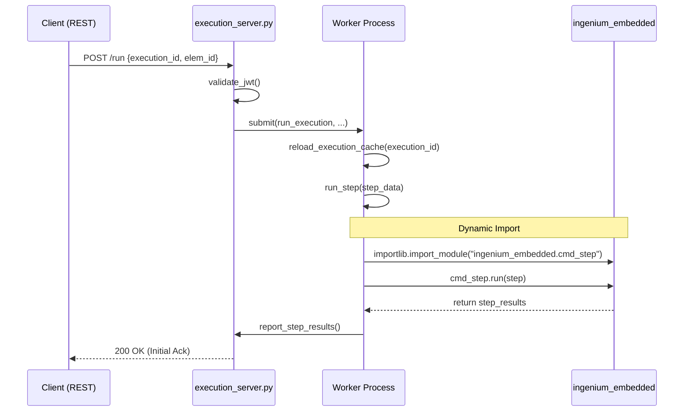

# Page: Core Architecture

# Core Architecture

Relevant source files

The following files were used as context for generating this wiki page:

- [image/config.ini](image/config.ini)
- [image/execution_server.py](image/execution_server.py)
- [image/run_step.py](image/run_step.py)
- [image/state_manager.py](image/state_manager.py)

The Ingenium Execution Server is a high-performance, asynchronous orchestration engine designed to manage and execute complex procedural steps. It utilizes a multi-process architecture to ensure that long-running or computationally intensive steps do not block the primary web server's responsiveness.

The system is built on four primary pillars:
1.  **Tornado Web Server**: Handles RESTful API requests and manages the lifecycle of execution jobs.
2.  **Worker Pool**: A `ProcessPoolExecutor` that offloads step execution to separate Python processes.
3.  **Redis State Manager**: Provides persistent, shared state across processes for execution metadata and variables.
4.  **Embedded Step Library**: A modular collection of execution logic (commands, telemetry verification, etc.) that is dynamically loaded and run within the workers.

### System Component Overview

The following diagram illustrates the high-level interaction between the core architectural components and their corresponding code entities.

**Diagram: Ingenium Component Interaction**

Sources: [image/execution_server.py:1-40](), [image/state_manager.py:8-12]()

---

### 2.1 Execution Server and Worker Pool
The heart of the system is the `Tornado` application defined in `execution_server.py`. It manages an internal `ProcessPoolExecutor` to handle step execution. The server supports three primary run modes: `AUTO` (continuous execution), `SYNC` (blocking single-step), and `ASYNC` (non-blocking). It also handles complex orchestration logic such as parent-child execution nesting and "halt" signals that trigger `SIGTERM` or `SIGKILL` on worker processes.

For details, see [Execution Server and Worker Pool](#2.1).

Sources: [image/execution_server.py:91-146](), [image/execution_server.py:181-220]()

---

### 2.2 State Management with Redis
The `StateManager` class provides a unified interface for persisting execution state in Redis. It uses a hash-based schema (e.g., `execution_id:{id}`) to store configuration values, manual input variables, and execution status. This shared state allows the main server process and the distributed worker processes to maintain a synchronized view of an execution's progress and data.

For details, see [State Management with Redis](#2.2).

Sources: [image/state_manager.py:8-55](), [image/config.ini:17-20]()

---

### 2.3 Security and Authentication
The server implements a JWT-based security model. Most API endpoints are protected by the `@exec_api` decorator, which validates RS256-signed tokens against a public key. The system supports fine-grained authorization through `required_scopes` and manages "venue tokens" to allow the execution server to communicate securely with downstream gateways on behalf of the user.

For details, see [Security and Authentication](#2.3).

Sources: [image/execution_server.py:48-59](), [image/execution_server.py:68-69]()

---

### 2.4 Logging Infrastructure
The server uses a structured JSON logging approach to facilitate integration with log aggregation tools. The configuration is managed via `json_log_config.py` and supports dynamic log-level updates at runtime through a dedicated `/logging` endpoint. Logs include standardized metadata such as `EventName`, `ErrorType`, and `username` context to ensure traceability across the distributed execution environment.

For details, see [Logging Infrastructure](#2.4).

Sources: [image/execution_server.py:43-46](), [image/execution_server.py:94-95]()

---

### Execution Flow: From Request to Step
The following diagram bridges the gap between the REST API and the actual code execution within the `ingenium_embedded` library.

**Diagram: Request to Step Execution Flow**

Sources: [image/execution_server.py:65-90](), [image/execution_server.py:121-124](), [image/run_step.py:29-41]()
