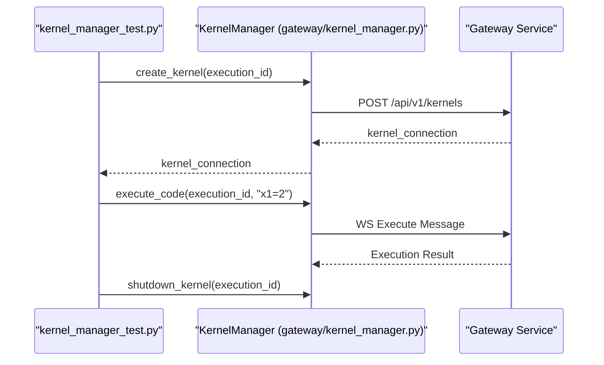
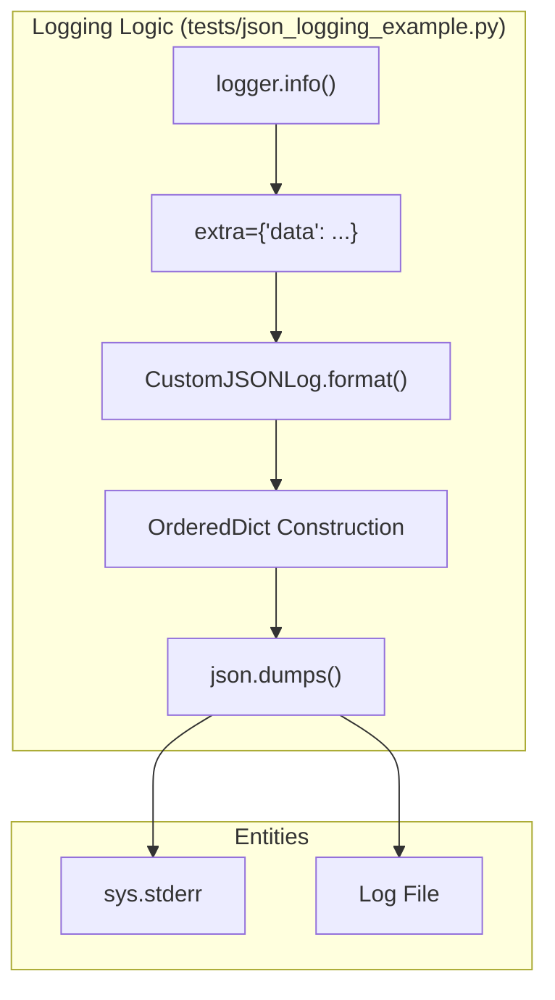

# Page: Developer Examples and Exploratory Scripts

# Developer Examples and Exploratory Scripts

Relevant source files

The following files were used as context for generating this wiki page:

- [tests/asyncio_example.py](tests/asyncio_example.py)
- [tests/config_param_example.py](tests/config_param_example.py)
- [tests/decorator_example.py](tests/decorator_example.py)
- [tests/exception_example.py](tests/exception_example.py)
- [tests/halt_example.py](tests/halt_example.py)
- [tests/ingenium_step_test.py](tests/ingenium_step_test.py)
- [tests/json_logging_example.py](tests/json_logging_example.py)
- [tests/jwt_example.py](tests/jwt_example.py)
- [tests/kernel_manager_interrupt_test.py](tests/kernel_manager_interrupt_test.py)
- [tests/kernel_manager_test.py](tests/kernel_manager_test.py)
- [tests/lamda_example.py](tests/lamda_example.py)
- [tests/log_stuff.py](tests/log_stuff.py)
- [tests/log_stuff2.py](tests/log_stuff2.py)
- [tests/logging_example.py](tests/logging_example.py)
- [tests/ppe_test.py](tests/ppe_test.py)
- [tests/redis_example.py](tests/redis_example.py)
- [tests/regex_example.py](tests/regex_example.py)
- [tests/restore_kernel_example.py](tests/restore_kernel_example.py)

The `tests/` directory contains a variety of scripts that are not part of the continuous integration (CI) suite. These scripts serve as development aids, architectural proofs-of-concept, and debugging tools for exploring the behavior of underlying libraries such as `asyncio`, `redis`, `tornado`, and the Ingenium Step SDK.

## Asynchronous and Execution Patterns

Several scripts demonstrate the asynchronous nature of the server and how execution flow is managed.

### Asyncio and Threading
The `asyncio_example.py` script explores the behavior of `asyncio.gather` and `asyncio.run` to validate timing and concurrency models used in the server's non-blocking I/O operations [tests/asyncio_example.py:5-23](). `lamda_example.py` demonstrates the use of closures for state management, specifically for creating cleanup functions that remove items from a mapping after execution [tests/lamda_example.py:5-19]().

### Kernel Management
The `kernel_manager_test.py` and `kernel_manager_interrupt_test.py` scripts are used to verify the lifecycle of execution kernels via the `KernelManager` class. They demonstrate creating kernels, executing arbitrary Python code strings, and shutting down kernels using the Tornado I/O loop [tests/kernel_manager_test.py:21-70]().

**Kernel Execution Flow**

Sources: `[tests/kernel_manager_test.py:21-60]()`, `[tests/kernel_manager_interrupt_test.py:21-60]()`

## Security and Decorator Examples

These scripts explore the implementation of the `exec_api` and `require_jwt` patterns used to secure the REST API.

### JWT and Scopes
`jwt_example.py` demonstrates how the server validates RS256 signed tokens using a public key (`PUBLIC_PEM`). It simulates the logic found in the server's authentication layer, including scope intersection checks to ensure a user has the required permissions (e.g., `admin`, `execution`) [tests/jwt_example.py:18-52]().

### Decorator Logic
`decorator_example.py` provides a simplified version of the scope-checking decorator. It shows how `functools.wraps` is used to preserve function metadata while enforcing argument-based requirements before the decorated function is allowed to execute [tests/decorator_example.py:3-17]().

Sources: `[tests/jwt_example.py:18-52]()`, `[tests/decorator_example.py:3-17]()`

## Logging and Debugging Tools

The server uses structured JSON logging. These scripts allow developers to test log formatting and level propagation without running the full server stack.

### Structured Logging
`json_logging_example.py` defines a `CustomJSONLog` formatter that inherits from `logging.Formatter`. It demonstrates how to map Python log records to an `OrderedDict` to ensure consistent JSON output fields like `timestamp`, `level`, `message`, and `data` [tests/json_logging_example.py:19-64]().

### Exception Handling
`exception_example.py` is a utility for testing how the server captures and formats stack traces. It explores the difference between `traceback.format_exc()` and `str(e)` when handling nested exceptions [tests/exception_example.py:5-27]().

**Logging Data Flow**

Sources: `[tests/json_logging_example.py:19-85]()`, `[tests/log_stuff.py:1-11]()`

## Step and State Exploration

These scripts focus on the interaction between the execution server and the Redis state store, as well as testing individual step implementations.

### Step SDK Testing
`ingenium_step_test.py` provides a template for testing a single step (e.g., `get_config_step`) in isolation. It mocks the `step` JSON structure and uses `ingenium_step_sdk` to perform a standalone run, bypassing the full `WorkerPool` orchestration [tests/ingenium_step_test.py:18-95]().

### State and Configuration
*   **`redis_example.py`**: Explores direct interaction with the Redis backend for state persistence.
*   **`config_param_example.py`**: Demonstrates retrieving specific configuration values (like `ampcs_session_information`) for a given `execution_id` using the `KernelTest` base class [tests/config_param_example.py:7-19]().
*   **`halt_example.py`**: A script that performs a live test of the `/halt` endpoint. It acquires a JWT via a login request and then issues a POST request to stop a specific kernel [tests/halt_example.py:11-31]().

**Step Testing Interaction**

| Script | Primary Entity Tested | Purpose |
| :--- | :--- | :--- |
| `ingenium_step_test.py` | `ingenium_embedded.ingenium_step_sdk` | Standalone step execution and SDK login verification. |
| `config_param_example.py` | `StateManager` / `shared_dict` | Verifying retrieval of execution-specific parameters. |
| `halt_example.py` | `ExecutionServer.halt_execution` | End-to-end testing of the halt REST endpoint. |
| `restore_kernel_example.py` | `KernelManager` | Testing state recovery for interrupted kernels. |

Sources: `[tests/ingenium_step_test.py:18-95]()`, `[tests/config_param_example.py:7-19]()`, `[tests/halt_example.py:24-31]()`
