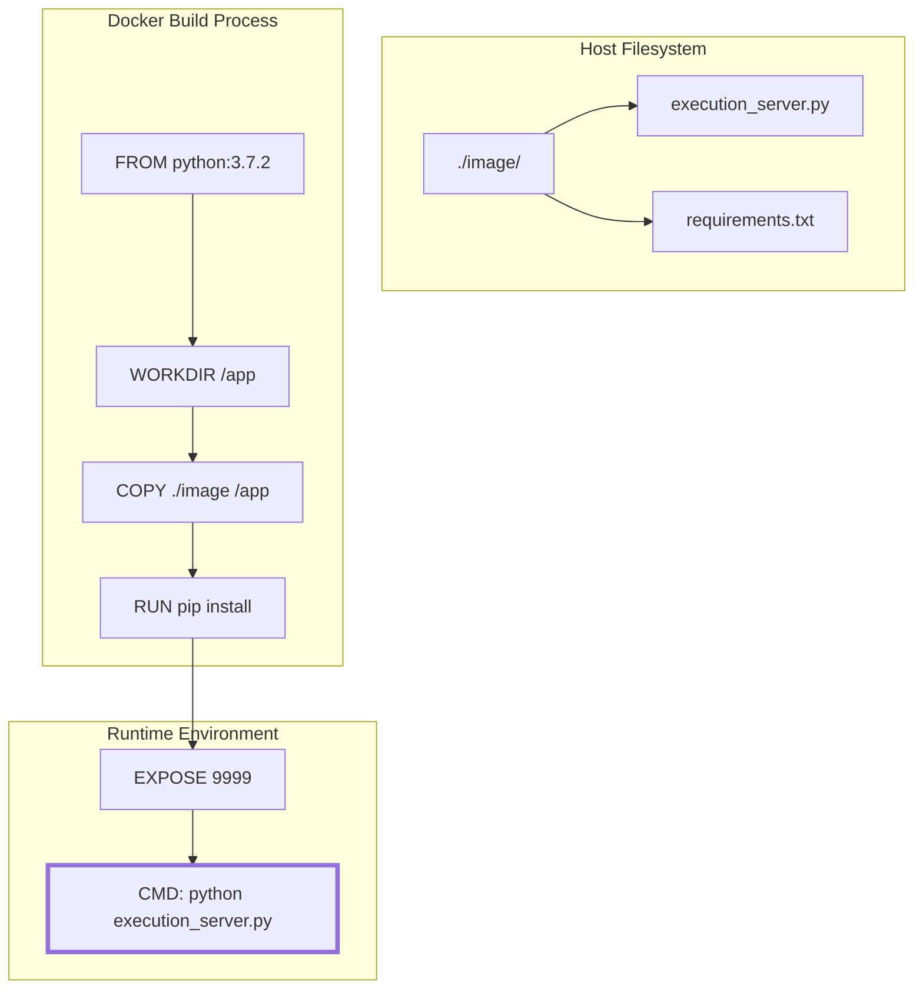
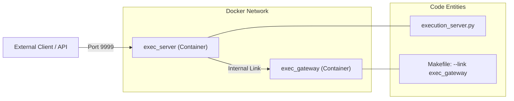

# Page: Docker Containerization

# Docker Containerization

Relevant source files

The following files were used as context for generating this wiki page:

- [Dockerfile](Dockerfile)
- [Makefile](Makefile)
- [image/requirements.txt](image/requirements.txt)

The Ingenium Execution Server is designed to run as a containerized microservice. This ensures a consistent runtime environment across development, testing (CI/CD), and production deployments by encapsulating the Python interpreter, system dependencies, and application code into a single immutable image.

## Dockerfile Build Phases

The `Dockerfile` defines a multi-step process to construct the execution environment. It utilizes the JPL CAE Artifactory as the source for base images and Python packages to comply with institutional security and networking requirements.

### 1. Base Image
The server starts from a verified Python 3.7.2 base image hosted on the JPL Artifactory: `cae-artifactory.jpl.nasa.gov:17001/python:3.7.2` [Dockerfile:1-1](). This specific version ensures compatibility with the `tornado` and `cffi` libraries used throughout the codebase.

### 2. Dependency Installation
The build process installs necessary Python libraries defined in `image/requirements.txt` [image/requirements.txt:1-15](). 
- **Artifactory Index**: It uses an internal PyPI mirror for package resolution [image/requirements.txt:1-1]().
- **Key Dependencies**:
    - `tornado==5.1.1`: The primary web server framework.
    - `redis==2.10.6`: Client for state persistence.
    - `PyJWT==1.7.0` & `cryptography==2.4.2`: For RS256 token validation.
    - `json-logging==1.2.0`: For structured logging output.
    - `psutil==5.9.4`: For managing worker processes in the `WorkerPool`.

### 3. Image Layout
The application code and configuration are structured within the container's filesystem as follows:
- **Work Directory**: `/app` is set as the primary working directory [Dockerfile:4-4]().
- **Code Transfer**: The contents of the local `./image` directory are copied into the container's `/app` directory [Dockerfile:5-5](). This directory typically contains the `execution_server.py` entry point and the `ingenium_embedded/` package.

### Build and Entrypoint Flow
The following diagram illustrates the transition from the host filesystem to the running containerized process.

**Container Initialization Flow**

**Sources:** [Dockerfile:1-11](), [image/requirements.txt:1-15]()

---

## Networking and Port Exposure

The Execution Server communicates with the rest of the Ingenium ecosystem via a REST API.
- **Internal Port**: The container exposes port `9999` [Dockerfile:9-9]().
- **Application Entry**: Upon startup, the container executes `python execution_server.py` [Dockerfile:10-10](), which initializes the Tornado `Application` and begins listening for requests on the exposed port.

**Sources:** [Dockerfile:9-10]()

---

## Makefile Automation

A `Makefile` is provided to standardize container management tasks. This simplifies the workflow for developers and CI/CD pipelines.

| Target | Command | Description |
| :--- | :--- | :--- |
| `build` | `docker build -t $(IMAGE) .` | Builds the image using the local `Dockerfile` [Makefile:8-9](). |
| `run` | `docker run --rm --link exec_gateway:exec_gateway ...` | Starts the container in detached mode, mapping port 9999 [Makefile:11-12](). |
| `stop` | `docker stop $(CONTAINER_NAME)` | Stops the running `exec_server` container [Makefile:15-16](). |

### Gateway Link Dependency
A critical component of the `run` target is the `--link exec_gateway:exec_gateway` flag [Makefile:12-12](). 
- **Purpose**: This allows the Execution Server to resolve and communicate with the `exec_gateway` container using its name as a hostname.
- **Context**: In the Ingenium architecture, the gateway often handles request routing or authentication pre-processing before reaching the execution server.

**Infrastructure Linkage Diagram**

**Sources:** [Makefile:1-17](), [Dockerfile:10-10]()

---

## Summary of Configuration

The container is identified by the image name `lmestar/ingenium-exec-server` [Makefile:3-3]() and is assigned the container name `exec_server` [Makefile:4-4]() when running. The use of the `--rm` flag in the `run` target ensures that the container instance is cleaned up automatically upon exit, maintaining a stateless environment for subsequent executions [Makefile:12-12]().

**Sources:** [Makefile:3-16]()
